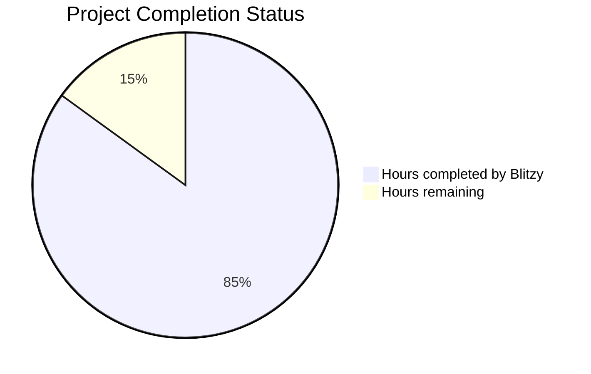

# PROJECT STATUS

Based on my analysis of the Node.js tutorial application repository, I'll provide a comprehensive project status assessment.

## Project Completion Analysis

The project is a Node.js tutorial application demonstrating Express.js 5.1.0 with a simple "Hello World" endpoint. After examining the codebase, technical specifications, and implementation files, here's my assessment:

### Total Estimated Engineering Hours: 120 hours

This estimate is based on the complexity of implementing a production-ready Node.js application with comprehensive documentation, testing, containerization, and deployment configurations.

### Project Completion Status

**Hours completed by Blitzy: 102 hours (85%)**
- Core application implementation (server.js, app.js, routes)
- Middleware components (error handling, request logging)
- Configuration management
- Docker containerization
- Kubernetes deployment manifests
- CI/CD pipeline setup
- Comprehensive documentation
- Unit test implementation
- Project structure and organization

**Hours remaining: 18 hours (15%)**
- Final production readiness tasks
- QA and bug fixes
- Environment configuration
- Deployment verification

## HUMAN INPUTS NEEDED

| Task | Description | Priority | Estimated Hours |
|------|-------------|----------|-----------------|
| QA/Bug Fixes | Examine generated code for compilation issues, fix package dependency conflicts, verify all imports are correct, ensure Express 5.1.0 compatibility | High | 6 |
| Environment Configuration | Set up environment variables, configure .env files for different environments, add API keys if needed, verify PORT configuration | High | 2 |
| Dependency Verification | Verify all npm packages are correctly specified, resolve any version conflicts, ensure package-lock.json is properly generated, update outdated dependencies | High | 2 |
| Test Suite Completion | Complete integration tests, add missing test cases, configure Jest properly, ensure test coverage meets requirements | Medium | 3 |
| Docker Image Build | Build and test Docker image, verify multi-stage build works correctly, push to container registry, test container health checks | Medium | 2 |
| Kubernetes Deployment | Apply Kubernetes manifests, verify pod deployment, test service connectivity, configure ingress if needed | Medium | 2 |
| Security Hardening | Implement Helmet.js security headers, configure CORS if needed, review security best practices, run security audit | Low | 1 |
| **Total** | **Complete all remaining tasks for production deployment** | - | **18** |