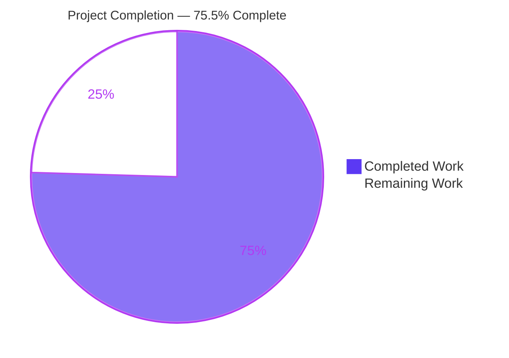
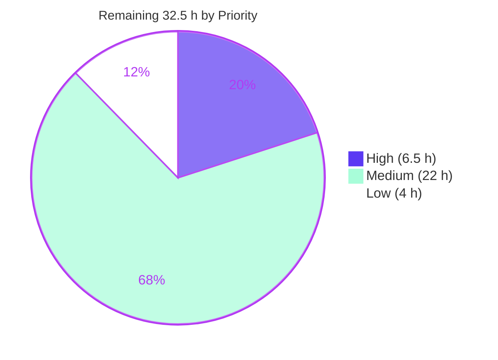
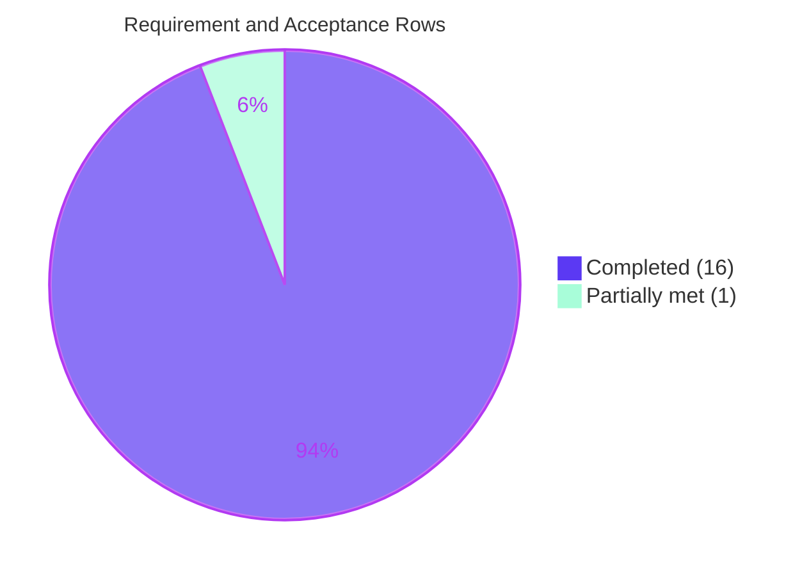

# 1. Executive Summary

## 1.1 Project Overview

A teaching-grade Node.js and Express application whose product surface is one HTTP endpoint: `GET /hello`, answering with the exact 11-byte body `Hello world`. Its audience is a learner who installs it, runs it, calls the endpoint, and reads documentation that matches the code. The router and the response literal were already here, but the server required a composition root that did not exist, so nothing could boot. That root now exists, installation and testing are reproducible, both run modes and the container path work, and the instructions match the program.

## 1.2 Completion Status


```mermaid
%%{init: {'theme':'base','themeVariables':{'pie1':'#5B39F3','pie2':'#FFFFFF','pieStrokeColor':'#B23AF2','pieOuterStrokeColor':'#B23AF2','pieSectionTextColor':'#B23AF2','pieTitleTextSize':'16px'}}}%%
pie title Project Completion — 75.5% Complete
    "Completed Work" : 100
    "Remaining Work" : 32.5
```

| Metric | Value |
|---|---|
| **Total Hours** | **132.5 h** |
| Completed Hours (AI + Manual) | 100 h (AI 100 h · Manual 0 h) |
| Remaining Hours | 32.5 h |
| **Percent Complete** | **75.5 %** (100 ÷ 132.5) |

Completed = `#5B39F3` · Remaining = `#FFFFFF`.

## 1.3 Key Accomplishments

- ✅ `GET /hello` → 200, `text/html; charset=utf-8`, `Content-Length: 11`, body `Hello world`.
- ✅ The application boots: `src/backend/app.js` mounts logging → routes at `/` → the error handler.
- ✅ Exactly one registered route; HEAD and OPTIONS as the framework intends, everything else 404s.
- ✅ Importing `server.js` binds no port and installs no process handler.
- ✅ `npm test` is a real gate: 4 suites, 119 cases, 100 % coverage against a 90 % threshold.
- ✅ `npm ci` is reproducible: 402 packages, 0 vulnerabilities, byte-stable lockfile.
- ✅ Both run modes work — `npm start`, and `npm run dev` restarting on an edit.
- ✅ The local image builds, runs non-root as uid/gid 1001 with production dependencies only, and reports `healthy`.

## 1.4 Critical Unresolved Issues

**1 of the 17 requirement and acceptance rows — scope control — is only partially met**: 25 files changed where 18 were planned (Section 5.2). **28 items remain open**, all outside the planned scope; none stops the endpoint working. The groups below total 24.5 h; Section 2.2's other 8 h is scope settlement and release verification.

| Issue | Impact | Owner | ETA |
|---|---|---|---|
| Repository hygiene the plan excluded — **5 items**: `src/backend/.env` is tracked and carries a placeholder `SESSION_SECRET`; both `.gitignore` files assure the reader that credentials cannot be committed, which is untrue of an already-tracked file; no ignore boundary is declared for the Docker build context; the licence signal is ambiguous (manifest ISC, README prose MIT, no `LICENSE`) | Release hygiene and legal clarity. No runtime effect — nothing reads the file and every value has a default | Repository owner | 5 h |
| Deployment and CI assets never exercised — **5 items**: `infrastructure/scripts/deploy.sh` targets a container named `backend` while `infrastructure/kubernetes/deployment.yaml:101` defines `nodejs-tutorial-app-backend`; that manifest also advertises `prometheus.io/path: "/metrics"` with no such route; `service.yaml`, `cd.yml` and `ci.yml` carry claims and commentary beyond this tutorial | A deployment run from these files as they stand would not match the manifest. They were never applied or executed | Platform owner | 4 h |
| Compose and container lifecycle — **4 items**: obsolete top-level `version` key; 21 injected environment keys of which 5 are consumed; the service's `npm run dev` command needs nodemon, which the production image deliberately omits; nothing handles `SIGTERM`, so `docker stop` exits 1 | Local orchestration, and clean shutdown under an orchestrator | Platform owner | 4.5 h |
| Dependency hygiene, development-only — **3 items**: `supertest` pinned at the deprecated `7.1.1`; `dotenv` a major behind its published range; deprecated `glob`/`inflight` transitives | None today — all are absent from the production image and `npm audit` reports zero advisories on both trees | Backend owner | 3 h |
| Documentation and comments outside the mapped set — **5 items**: `docs/README.md` stale versions including a `v22.16.01` typo and an expired LTS assertion; `docs/setup/deployment.md` pins `node:22.16.0-alpine`; `docs/api/hello.md` points at a specification path that does not exist; stale headers in `.eslintrc.js` and `config/index.js`; placeholder labels in the archived specification | A reader outside the seven verified documents can still meet a stale figure | Docs owner | 3 h |
| Accepted with a caveat, no action needed for the endpoint — **6 items**: the error handler's client-address lookup can throw when invoked with a bare mock (unreachable over HTTP); `HOST` is read and printed but never bound; no lint or format gate although both tools are configured; `/hello` renders in Quirks Mode; Jest's always-on coverage prints a 0 % table in a watch run; restored teaching material shows `lint` scripts the project does not declare | Cosmetic or latent. Recorded so none is met as a surprise | Backend owner | 5 h |

## 1.5 Access Issues

Nothing blocks build, test, run or container validation: the registry answers, no token or secret is required, and Docker is available locally.

| System / Resource | Type of Access | Issue Description | Resolution Status | Owner |
|---|---|---|---|---|
| `registry.npmjs.org` | Package install | None. `npm ci` completes and `npm audit` reports 0 vulnerabilities | ✅ No issue | — |
| `www.npmjs.com` (package web pages) | Documentation links | Returns 403 to command-line HTTP clients from this environment (bot mitigation); the same pages answer normally in a browser | ⚠ Environmental, non-blocking | Docs owner |
| Container registry / Kubernetes cluster | Image push, deploy | Never attempted — deployment assets are outside the delivered scope and no credentials exist for either | ⚠ Not required to release the tutorial | Platform owner |
| Application credentials / secrets | Runtime | None needed. No module reads a secret; the tracked `.env` carries placeholders only | ✅ No issue | — |

## 1.6 Recommended Next Steps

1. **[High]** Untrack `src/backend/.env` and correct the two `.gitignore` claims about it.
2. **[High]** Declare a build-context boundary so a non-BuildKit build stops sending the repository root.
3. **[High]** Settle the two scope questions: the extra `src/backend/server.js` changes, and the seven unplanned paths.
4. **[Medium]** Reconcile or plainly label the deployment assets, and state the licence.
5. **[Medium]** Run the existing pipeline on this branch, then re-walk the acceptance matrix.

# 2. Project Hours Breakdown

## 2.1 Completed Work Detail

Every row traces to a requirement or acceptance criterion in the delivered scope. All 100 hours were delivered autonomously; no manual engineering hours were spent.

| Component | Hours | Description |
|---|---|---|
| Express composition root | 3 | `src/backend/app.js` created — Express instantiated, `x-powered-by` disabled, request logger mounted, the route aggregator mounted at `/`, the four-argument error handler mounted last, the app exported. This is the change that turned a repository that could not boot into a running tutorial. |
| Server startup and import/execute boundary | 8 | `src/backend/server.js` — named logger import, the HTTP server exported, and `listen` plus both process-level handlers moved behind `require.main === module`, so importing the module binds no port. Includes the startup banner and the startup-failure surface (port-in-use diagnostic with a derived alternate port, unusable-port report, exit 1, no stack trace). |
| Endpoint contract and method semantics | 4 | The single route and the response literal preserved byte-for-byte while the contract was proven end to end: status, media type, length, exact bytes, absent framework fingerprint, framework HEAD/OPTIONS behaviour and 404 for every other method and path. Inline documentation in `src/backend/routes/hello.js` corrected without touching a line of its executable code. |
| Test harness, dependency and coverage contract | 5 | `package.json` gained `jest@30.4.2` as its only new dependency plus three real test scripts; `package-lock.json` regenerated from the revised manifest; `jest.config.js` given positive coverage includes for `routes/**` and `middleware/**` with four 90 % thresholds. |
| Automated test suites | 26 | Four suites, 119 cases: the endpoint unit suite, an integration suite driving the exported server (contract, composition order, import isolation, route equivalence, method semantics), and two new middleware suites covering every body form, every log-neutralisation rule, the 500 envelope and the diagnostic record. 100 % statements, branches, functions and lines on all four measured modules. |
| Log-output neutralisation | 10 | The request logger records the pathname only; the error handler records a bounded pathname, a query-parameter count and allow-listed headers. Every value is escaped to printable ASCII and bounded at 256 characters with the number of dropped characters stated, so no request can forge a log line, address the terminal reading it, or cost an unbounded amount of log. The client-facing 500 envelope is unchanged and now carries `X-Content-Type-Options: nosniff`. |
| Development loop | 2 | `nodemon.json` rebased onto the package directory — recursive watch, `js,json` extensions, and four ignore entries so test edits and the lockfile do not trigger restarts. |
| Local container and Compose path | 9 | `Dockerfile` corrected to copy manifests from `src/backend`, install production dependencies in the runtime stage only, copy six named source paths, and run as uid/gid 1001; the never-consumed builder install removed, cutting a cold build from 402 discarded packages to none. The Compose healthcheck rewritten to shell form so a healthy container is reported healthy. |
| Learner and contributor documentation | 22 | Seven documents plus the environment templates and the setup script's output aligned with the running program: route path, method behaviour, media type, available commands, startup transcripts, logging and configuration claims, the guarded environment-file step, portable port-conflict instructions, and operational-safety recipes (name-based process termination removed, certificate verification restored, image pruning narrowed). |
| Environment and reproducible install verification | 3 | Toolchain pinned and confirmed (Node v22.23.2, npm 11.18.0); `npm ci` reproducibility, the byte-stable lockfile, the exact five-package top level, and a clean audit on both the full and production trees. |
| Acceptance-criteria execution | 8 | The eight acceptance criteria driven end to end: install, endpoint contract, single-route and method matrix, development loop, both test commands, the container build-run-health cycle, the tutorial-accuracy searches, and the scope audit over the changed and protected file sets. |
| **Total** | **100** | |

## 2.2 Remaining Work Detail

| Category | Hours | Priority |
|---|---|---|
| Untrack `src/backend/.env` and correct the two ignore-file assurances | 1.5 | High |
| Declare a build-context boundary for the container build | 1.5 | High |
| Settle the `server.js` scope divergence (keep or revert the three extra changes; re-sync the two documents quoting the banner) | 2 | High |
| Reconcile the scope record for the seven paths changed outside the planned map | 1.5 | High |
| Error-handler client-address null-safety | 1 | Medium |
| Licence decision: choose it, add `LICENSE`, align the manifest with the prose | 2 | Medium |
| Dependency hygiene: move `supertest` off the deprecated pin, decide the `dotenv` range, regenerate the lockfile, re-audit | 3 | Medium |
| Kubernetes / CD / deploy reconciliation (container name, metrics annotation, overstated pipeline commentary) | 4 | Medium |
| Compose hygiene (obsolete `version` key, 16 inert environment keys, the dev command's dependency requirement) | 2 | Medium |
| Container lifecycle for deployment: `SIGTERM` handling and the `HOST` binding decision | 2.5 | Medium |
| Documentation accuracy sweep over the files outside the mapped set | 3 | Medium |
| Pipeline run-through on this branch | 1.5 | Medium |
| Final release verification and merge readiness | 3 | Medium |
| Lint and format toolchain activation and a formatted tree | 4 | Low |
| **Total** | **32.5** | |

## 2.3 Hours Reconciliation

| Check | Result |
|---|---|
| Section 2.1 completed hours | 100 h |
| Section 2.2 remaining hours | 32.5 h |
| 2.1 + 2.2 = Total Project Hours (Section 1.2) | 100 + 32.5 = **132.5 h** ✅ |
| Completion percentage | 100 ÷ 132.5 × 100 = **75.5 %** ✅ (identical in Sections 1.2, 7 and 8) |
| Section 7 pie chart values | Completed 100 · Remaining 32.5 ✅ |

Confidence: **high** on the application, test, configuration and container rows — each has execution evidence behind it. **Medium** on the Kubernetes/CD reconciliation and the lint/format activation, both of which depend on decisions the owner has not yet made and could widen; and on the licence item, which is a decision rather than an engineering task.

# 3. Test Results

`CI=true npm test` from `src/backend` exits 0: **4 suites, 119 cases, 119 passed, 0 failed**, in 0.72 s with no open-handle or port-conflict warnings. `npm run test:coverage` exits 0 at **100 % statements, branches, functions and lines** on all four measured modules against the configured 90 % threshold. Coverage is scoped by `jest.config.js` to `routes/**/*.js` and `middleware/**/*.js`. Every figure below was observed on this branch.

| Area / Category | Framework | Tests | Passed | Failed | Coverage | What This Proves |
|---|---|---|---|---|---|---|
| Endpoint contract — unit (`tests/unit/hello.test.js`) | Jest 30.4.2 + Supertest 7.1.1 | 2 | 2 | 0 | `routes/hello.js` 100 % | The route answers 200 with the exact body when driven through the composed app. |
| Endpoint, composition and lifecycle — integration (`tests/integration/hello.test.js`) | Jest 30.4.2 + Supertest 7.1.1 | 29 | 29 | 0 | `routes/index.js` 100 % | The wire contract holds through the real exported HTTP server — status, media type, `Content-Length: 11`, byte-exact body — the three middleware stages run in the required order, importing the entry point binds no port and installs no process handler, and HEAD/OPTIONS/unmatched-method behaviour is pinned. |
| Request logging (`tests/unit/requestLogger.test.js`) | Jest 30.4.2 | 37 | 37 | 0 | `middleware/requestLogger.js` 100 % | One line per request, logged before the request moves on; every body form normalised; the query string and fragment never reach the log; non-printable characters escaped and every value bounded; the response object untouched. |
| Terminal error handling (`tests/unit/errorHandler.test.js`) | Jest 30.4.2 | 51 | 51 | 0 | `middleware/errorHandler.js` 100 % | A forwarded error yields exactly one 500 with the four-key envelope and `nosniff`, the status is what the client would actually receive, `next` is never called, and the diagnostic record carries a bounded pathname, a query count and allow-listed headers rather than credentials or caller text. |
| Coverage gate | Jest thresholds | — | — | — | 90 % required · 100 % achieved | `npm test` fails the build if any of the four metrics drops below 90 % on routes or middleware. |
| **Total** | | **119** | **119** | **0** | **100 % on 4 modules** | |

**Not Covered.** These were delivered and verified by other means, but no automated test exercises them. A human should cover them before treating the suite as a complete release gate:

- **`src/backend/app.js` and `src/backend/server.js`** carry no coverage instrumentation, because the measured scope is deliberately `routes/**` and `middleware/**`. Their behaviour is asserted indirectly by the integration suite (mount order, import isolation, the wire contract), but a change to either module registers no coverage signal.
- **The fatal-error paths in `server.js`** — the `unhandledRejection` and `uncaughtException` handlers and the generic branch of the server `error` listener. All three end in `process.exit(1)` and sit behind the direct-execution guard that Jest never loads. The port-in-use branch was driven manually; the generic branch was not.
- **`src/backend/config/index.js` and `src/backend/utils/logger.js`** are exercised transitively by every suite and every start, but hold no direct assertions. The `PORT` coercion, the environment-dependent log prefixes and the startup summary were checked by running them, not by a test.
- **The container path** — `infrastructure/docker/Dockerfile` and `docker-compose.yml`. Builds, the container endpoint, the non-root identity, the production-only dependency closure and the healthcheck were all driven by hand, and the image digest reproduces exactly; nothing in the pipeline re-checks any of it.
- **`infrastructure/scripts/setup.sh`** has no harness. It was run end to end and its output compared line by line with the documented sample, but a future edit is unguarded.
- **All Markdown documentation.** Claims were checked against observed behaviour and every relative link and anchor resolves, but no test will catch future drift — and the files outside the verified set already carry stale figures (Section 1.4).
- **Windows-only troubleshooting recipes** in `docs/setup/development.md` cannot be executed on this platform; they are labelled Windows-only rather than presented as verified.

# 4. Runtime Validation & UI Verification

The application was started and driven on this branch — on the host through `npm start` and `npm run dev`, and in a container built from the repository root. This project has no user interface: the product surface is a single HTTP response, and the repository contains no frontend, template, stylesheet, asset or component library.

- ✅ **Start-up (`npm start`)** — the configuration summary prints, then five banner lines ending `⚡ Node.js v22.23.2 | Express 5.2.1 | Environment: development`. Both version tokens are read at runtime, so the banner cannot drift from the installed packages.
- ✅ **`GET /hello`** — 200, `Content-Type: text/html; charset=utf-8`, `Content-Length: 11`, body `Hello world` measured at exactly 11 bytes with no trailing newline. `X-Powered-By` absent.
- ✅ **Single-route surface** — `/`, `/health`, `/metrics`, `/api/hello` and `/nonexistent` all 404; `POST`, `PUT`, `PATCH`, `DELETE` and `TRACE` on `/hello` all 404, never 405; `HEAD` 200; `OPTIONS` 200 with `Allow: GET, HEAD`.
- ✅ **Request logging** — one line per request, for every method including HEAD and OPTIONS. A request to `/hello?password=…&token=…` logged `Path: /hello` with no trace of either value anywhere in the captured output.
- ✅ **Error handling** — a forwarded failure returns 500 with `nosniff` and exactly `error`, `status`, `timestamp`, `path`; the diagnostic records a bounded pathname, a query-parameter count and only allow-listed headers, with no credential and no stack frames outside development.
- ✅ **Development loop (`npm run dev`)** — nodemon 3.1.14 starts `node server.js` exactly once, watching `js,json`. A real source edit produced exactly one restart and the endpoint served the contract again; a test-file edit produced none; the edited file was restored byte-identical.
- ✅ **Reproducible install** — `npm ci` exits 0 with 402 packages, 0 vulnerabilities and a byte-stable lockfile; the top level is exactly `express@5.2.1`, `dotenv@16.6.1`, `jest@30.4.2`, `nodemon@3.1.14`, `supertest@7.1.1`.
- ✅ **Container** — `docker build --check` reports no warnings; the root-context build exits 0 and reproduces image digest `sha256:5690479da856…`. The container answers the exact contract, runs as `uid=1001(nodejs) gid=1001(nodejs)`, carries only `express` and `dotenv`, ships no tests, environment file or tooling configuration, and its `HEALTHCHECK` reached `healthy` on the first probe with exit code 0.
- ⚠ **Compose and shutdown** — `docker compose config` exits 0 with the healthcheck in shell form, and a healthy service now reports healthy; one reproduced warning remains, the obsolete top-level `version` key. Separately, `docker stop` returns exit code 1 because nothing handles `SIGTERM` — documented behaviour today, which an orchestrator reads as an unclean termination.
- ❌ **Never exercised at runtime** — the Kubernetes manifests, `infrastructure/scripts/deploy.sh` and the deployment workflow were never applied, invoked or run, on this branch or any other. They are unverified, and `deploy.sh` targets a container name the manifest does not define. Nothing about them should be treated as working.

# 5. Compliance & Quality Review

## 5.1 Compliance Matrix

Where each deliverable stands now, against the quality benchmarks that apply to it.

| # | Deliverable | Benchmark | Status | Progress | Evidence |
|---|---|---|---|---|---|
| 1 | Tutorial usable end to end | Install, start two ways, call, test — all from documented commands | ✅ PASS | 100 % | `npm ci` → `npm start` / `npm run dev` → `curl` → `npm test`, each executed |
| 2 | One registered application route | No second route, alias, health or metrics path | ✅ PASS | 100 % | One route registration in the tree; `/health`, `/metrics`, `/api/hello`, `/` all 404 |
| 3 | Exact response body | `Hello world`, 11 bytes, no envelope, no trailing newline | ✅ PASS | 100 % | `src/backend/routes/hello.js:34`, byte-identical to the scaffold; measured on the wire |
| 4 | HTTP response to the client | 200 with `text/html; charset=utf-8` and `Content-Length: 11` | ✅ PASS | 100 % | Asserted in the integration suite and observed by hand and in-container |
| 5 | Application composition | CommonJS root mounting logger → routes at `/` → error handler last | ✅ PASS | 100 % | `src/backend/app.js`; mount order asserted behaviourally, not by reading |
| 6 | Startup / import boundary | Importing the entry point binds no port and installs no process handler | ✅ PASS | 100 % | `src/backend/server.js:130,145`; import-isolation case in the integration suite |
| 7 | Reproducible verification | Real test scripts, valid lockfile, coverage gate on routes and middleware | ✅ PASS | 100 % | `jest@30.4.2` as the only dependency addition; 4 suites / 119 cases; 100 % against a 90 % gate |
| 8 | Documented run modes | `npm run dev` restarts on change; local image builds and serves | ✅ PASS | 100 % | One start and one restart observed; image digest reproduced; container `healthy` |
| 9 | Tutorial accuracy | No instruction contradicts the running program | ✅ PASS | 100 % | Seven documents aligned; no active `/api/hello`, `/health`, `text/plain`, 405 or undeclared-script instruction remains |
| 10 | Environment and install | Pinned toolchain; strict install reproducible; clean audit | ✅ PASS | 100 % | Node v22.23.2 / npm 11.18.0; 402 packages, 0 vulnerabilities, byte-stable lockfile |
| 11 | Container hygiene | Production-only runtime, non-root, healthcheck on the endpoint | ✅ PASS | 100 % | `express` + `dotenv` only; `uid=1001(nodejs) gid=1001(nodejs)`; `HEALTHCHECK` exit 0 |
| 12 | Scope control | Only the planned paths change; no dependency, engine, licence or literal moves | ⚠ PARTIAL | 80 % | Every substantive prohibition holds and 14 protected files are byte-identical, but 25 files changed against 18 planned — see 5.2 |

## 5.2 AAP & Rule Divergences and Gaps

No user-specified rules exist for this project, so there are no rule divergences to report; every item below is a departure from the plan. There are eight.

| # | What the Plan Required | What Was Delivered Instead | Why It Diverged | Impact | Remediation |
|---|---|---|---|---|---|
| 1 | Exactly three changes to `src/backend/server.js`: the named logger import, the server export, the direct-execution guard | Six: those three plus a runtime read of the installed Express version, an unusable-port branch, and a `try`/`catch` around `listen` | The frozen banner hard-coded `Express 5.1.0` while the lockfile installs 5.2.1, and a port outside 0–65535 reached `listen` and threw a raw `RangeError`; neither could be answered inside the three authorised edits | None on behaviour; the delivered file is wider than agreed | Keep and record as sanctioned, or revert and re-sync the two documents quoting the banner (2 h) |
| 2 | `middleware/requestLogger.js` and `middleware/errorHandler.js` marked reference-only, no edit | Both carry a ~30-line log sanitiser and call it at every log site | The two log sites that wrote query values and unbounded caller text live in these files, and a sanitising wrapper elsewhere would have added the security middleware the plan forbids | Positive: query values and control characters no longer reach the log. ~30 lines duplicated across the two modules | Move both files from reference-only to changed in the scope record (part of 1.5 h) |
| 3 | `infrastructure/docker/docker-compose.yml` marked reference-only, no edit | Its healthcheck line changed to shell form, plus a comment | The exec-array form passed the shell operators to `wget` as arguments, so the service showed unhealthy on every probe while the endpoint answered 200 | Positive: a healthy service now reports healthy. One line and a comment changed | Record the file as changed; no code action (part of 1.5 h) |
| 4 | Four further paths outside the planned map left untouched | `config/index.js` (one comment), `src/backend/.env` and `.env.example` (comment headers), `infrastructure/scripts/setup.sh` (version output) all changed | Each carried a statement no in-scope file could correct, and the plan's exclusion list names the deploy script rather than the setup script | None. Every variable assignment and the port coercion are byte-identical | Record as changed (part of 1.5 h) |
| 5 | Documentation edits limited to install/start/test commands and the endpoint contract | Logging, configuration, operational-safety and supply-chain guidance were corrected too | Each of those instructions was false or actively unsafe as written, and only the document carrying it could say otherwise | Positive: no document teaches a dangerous or untrue step | None required |
| 6 | The builder-stage development install preserved byte-exact | Deleted; the runtime `npm ci --omit=dev` is now the only install | Nothing in the builder stage consumed it, so every build installed a full dependency graph only to discard it | Positive: a cold build drops from 402 discarded packages to none; the shipped image is unchanged | None required |
| 7 | Only the planned file count may change | A build-context boundary was implemented and verified, then removed to hold that count — so no ignore file applies to the build | Closing it needs one new path the plan does not list, and holding the count was ruled the higher obligation | A non-BuildKit build transmits the whole repository root; the default path transmits 5.91 kB | Authorise `infrastructure/docker/Dockerfile.dockerignore` (1.5 h) |
| 8 | Package corroboration through one nominated research domain | Executed for all 387 installed pairs, but its answers proved unreliable in detail | That domain answers 403 to command-line clients behind a managed challenge; the mechanism only works from a browser | None. First-party advisory data is what settles the question | Prefer a first-party advisory source or a local scanner (part of 3 h) |

**1 — `server.js` is wider than the three authorised changes.** The plan named exactly three edits and froze the five startup log lines, including a hard-coded `Express 5.1.0`. The delivered file also reads `express/package.json` at line 28, adds an unusable-port branch at line 91, and wraps `listen` in a `try`/`catch` at line 192. The frozen shape could not state two things truthfully: the version actually installed, which the lockfile pins at 5.2.1, and a readable diagnostic for a port outside 0–65535, which otherwise surfaces as a raw `RangeError`. The two documents quoting the banner were corrected alongside, so nothing quotes output the program cannot produce. Nothing behaves worse, but the reader agreed to a narrower change.

**2 — the two middleware modules were edited although marked reference-only.** `src/backend/middleware/requestLogger.js` and `middleware/errorHandler.js` were to be read, not written. Both now carry a sanitiser — a 256-character bound, an escape of every non-printable character, and a path-only extractor — and call it at every log site. The reason is structural: the logger wrote `req.originalUrl` verbatim, so `/hello?token=…` put the token in the log, and the error handler copied whole header, query and parameter collections. Those are the only two log sites in the tree, and a wrapper in `app.js` would have added the security middleware the plan forbids. Export shapes, arity, mount order and the client response are unchanged, and both copies are covered at 100 %.

**3 — the Compose file was edited although marked reference-only.** `infrastructure/docker/docker-compose.yml:125` previously expressed its healthcheck as an exec array ending in shell operators. With no shell to interpret them, `wget` received those tokens as further targets and failed with `wget: bad address` on every probe, so a learner following the Compose path saw the service marked unhealthy indefinitely while `curl` on the same container returned 200. That line is the only place the behaviour originates, so it became shell form, mirroring the image's own working `HEALTHCHECK`. The service definition, ports, networks and build context are untouched; `docker compose config` exits 0 and a healthy service now reports healthy.

**4 — four more paths outside the planned map changed.** `src/backend/config/index.js` received one comment correction; `src/backend/.env` and `.env.example` had their header comments corrected, because they instructed the reader to do the opposite of what the repository does; and `infrastructure/scripts/setup.sh` now derives the declared range and the installed version at runtime instead of printing a stale literal. Each carried a false statement that no in-scope file could remove. The plan's exclusion list names the deploy script, not the setup script, so `setup.sh` sat inside scope all along. Nothing executable moved: the port coercion at `config/index.js:71` and all 44 environment assignments across the two templates are byte-identical to the scaffold.

**5 — documentation edits went beyond the command-and-contract cap.** The plan limited documentation work to install, start and test commands plus the endpoint contract. The delivered documents also correct logging and configuration claims, and they replace guidance that was actively unsafe: killing processes by name, disabling TLS certificate verification in a copy-paste configuration, reaching for a force-kill first, pruning every unused image on a shared host, and silently switching the package supply source. Port-conflict instructions now use a probe that works without `lsof` or `netstat`, both of which exit 127 here. Every one of those instructions was false or dangerous as written, and no correction changed program behaviour. No action is needed.

**6 — the builder-stage install was deleted although marked preserve-byte-exact.** `infrastructure/docker/Dockerfile` previously ran a full development install in its builder stage. Nothing in that stage consumed it: only the two manifests and five named source paths are forwarded, and no later instruction copies `node_modules` from the builder. Every documented build therefore installed 402 packages purely to discard them, adding roughly eleven seconds to a cold build. It was removed rather than narrowed, because narrowing would have left the same dead work in smaller form. The runtime `npm ci --omit=dev` remains the only install. The shipped image is unchanged — a rebuild reproduces digest `sha256:5690479da856…` — and the container is healthy with production-only dependencies.

**7 — the build has no declared context boundary.** The container build takes the repository root as its context, and the only ignore file in the tree sits at `infrastructure/docker/.dockerignore`, which a root-context build never reads. A boundary was implemented and measured — transfer fell to 690 B — then removed, because it needed a path the plan does not list and the file count was held instead. The exposure is narrower than it looks: with BuildKit, the default, only the paths the `COPY` instructions name are transferred, measured at 5.91 kB. The legacy builder would transmit the whole root, including a 137 MB history. Closing this needs `infrastructure/docker/Dockerfile.dockerignore`, the only filename that takes effect here and can be committed.

**8 — the nominated corroboration mechanism proved unreliable.** The plan restricted external package corroboration to one research domain. That domain answers 403 to command-line HTTP clients because a managed challenge requires a browser, so it cannot be driven from a command line at all. It was exercised in full over all 387 installed package/version pairs, and its answers cannot be relied on in detail: several cited advisories whose fixed version is the version installed, one attributed a CVE to the wrong package, and two named identifiers that do not exist. First-party data settles the question instead — a batch advisory query over all 387 pairs returning nothing, and `npm audit` reporting zero on both trees.

# 6. Risk Assessment

These are forward-looking: what could still go wrong for whoever owns this codebase next.

| # | Risk | Category | Severity | Probability | Mitigation | Status |
|---|---|---|---|---|---|---|
| 1 | Deployment assets do not match the application — `infrastructure/scripts/deploy.sh` targets a container named `backend` while `infrastructure/kubernetes/deployment.yaml:101` defines `nodejs-tutorial-app-backend`, and that manifest advertises a `/metrics` path no route serves. Nothing has ever applied or executed them | Integration | **High** | High, if anyone runs them as they stand | Reconcile the container name and the annotation, or mark the whole set explicitly illustrative until a deployment change owns it | Open |
| 2 | Tracked environment file — `src/backend/.env` is committed with a placeholder `SESSION_SECRET`, and both `.gitignore` files still assure the reader that credentials cannot be committed. Nothing reads the file and every value has a default, but the pattern invites a real secret next | Security | Medium | Medium | `git rm --cached src/backend/.env`, keep `.env.example` as the template, and correct the two ignore-file claims | Open |
| 3 | No declared build-context boundary — no ignore file applies to the root-context build, so a legacy (non-BuildKit) build transmits the full `.git` history and the 59 MB host `node_modules`. The default BuildKit path transfers 5.91 kB and the shipped image is unaffected | Security | Medium | Medium | Add the one publishable ignore path and pin the build to the eight files it needs | Open |
| 4 | Ambiguous licence signal — the manifest declares ISC, the root README prose says MIT, and no `LICENSE` file exists, so a consumer cannot determine the terms of reuse | Operational | Medium | High | The owner states the intended licence, then the manifest, the prose and a `LICENSE` file are aligned in one change | Open |
| 5 | No graceful shutdown — nothing handles `SIGTERM`, so the listener is never closed on stop. In-flight requests are dropped and `docker stop` returns exit code 1, which an orchestrator reads as an unclean termination | Operational | Medium | Medium | Close the exported server on `SIGTERM`/`SIGINT` before exit | Open |
| 6 | Deprecated development dependencies with no upgrade path inside the current pins — `supertest` at a deprecated release, deprecated `glob`/`inflight` transitives, and `dotenv` a major behind. All four are development-only and absent from the shipped image, and both trees audit clean today | Technical | Low | Medium | A dependency pass that moves `supertest` forward, decides the `dotenv` range, regenerates the lockfile and re-audits | Open |
| 7 | No style or static-analysis gate — `.eslintrc.js` and `.prettierrc` are committed but neither tool is installed, no lint script exists, and the tree is not formatter-clean, so anything the 119-test suite does not assert is caught only by human review | Technical | Low | High | Activate the toolchain as its own change and format the tree in one pass | Open |
| 8 | Documentation drift outside the verified set — the seven verified documents match the program, but `docs/README.md`, `docs/setup/deployment.md` and a dead specification reference still carry stale versions and an expired support claim, and nothing in the pipeline checks documents or links | Operational | Low | Medium | An accuracy sweep over the unmapped files plus a link check in the pipeline | Open |

# 7. Visual Project Status

**Hours split** — Completed = Dark Blue `#5B39F3` · Remaining = White `#FFFFFF`.


```mermaid
%%{init: {'theme':'base','themeVariables':{'pie1':'#5B39F3','pie2':'#FFFFFF','pieStrokeColor':'#B23AF2','pieOuterStrokeColor':'#B23AF2','pieSectionTextColor':'#B23AF2','pieTitleTextSize':'16px'}}}%%
pie title Project Hours Breakdown — 132.5 h total
    "Completed Work" : 100
    "Remaining Work" : 32.5
```

**Remaining work by priority** — 32.5 h in total: High 6.5 h, Medium 22 h, Low 4 h.


```mermaid
%%{init: {'theme':'base','themeVariables':{'pie1':'#5B39F3','pie2':'#A8FDD9','pie3':'#FFFFFF','pieStrokeColor':'#B23AF2','pieOuterStrokeColor':'#B23AF2','pieSectionTextColor':'#B23AF2','pieTitleTextSize':'16px'}}}%%
pie title Remaining 32.5 h by Priority
    "High (6.5 h)" : 6.5
    "Medium (22 h)" : 22
    "Low (4 h)" : 4
```

**Requirement status** — 17 requirement and acceptance rows in the delivered scope: 16 complete, 1 partially met (scope control).


```mermaid
%%{init: {'theme':'base','themeVariables':{'pie1':'#5B39F3','pie2':'#A8FDD9','pieStrokeColor':'#B23AF2','pieOuterStrokeColor':'#B23AF2','pieSectionTextColor':'#B23AF2','pieTitleTextSize':'16px'}}}%%
pie title Requirement and Acceptance Rows
    "Completed (16)" : 16
    "Partially met (1)" : 1
```

| Remaining category | Hours | Share of 32.5 h |
|---|---|---|
| Deployment, Compose and container lifecycle | 8.5 | 26 % |
| Scope settlement and release verification | 8 | 25 % |
| Repository and licence hygiene | 5 | 15 % |
| Documentation accuracy outside the verified set | 3 | 9 % |
| Dependency hygiene | 3 | 9 % |
| Lint and format activation | 4 | 12 % |
| Error-handler null-safety | 1 | 3 % |
| **Total** | **32.5** | **100 %** |

# 8. Summary & Recommendations

**What was delivered.** The thing the project was asked for works and is proven to work. `GET /hello` answers 200 with `text/html; charset=utf-8`, `Content-Length: 11` and the exact eleven bytes `Hello world`, and it is the only registered application route — every other path and every other explicit method returns 404, while HEAD and OPTIONS behave the way the framework intends. Reaching that point required one file that did not exist: `src/backend/app.js`, the composition root the server had always required. Around it, installation became reproducible, the test script became a real gate, both documented run modes were restored, the local image was corrected, and the tutorial's own instructions were brought into line with the program a learner actually runs. The route registration and the response literal were never touched: `src/backend/routes/hello.js` has zero executable difference from the scaffold.

**What proves it.** `CI=true npm test` gives 4 suites and 119 passing cases, and `npm run test:coverage` reports 100 % statements, branches, functions and lines on all four measured modules against a 90 % threshold. Beyond the suite, the application was started and driven: the endpoint contract measured byte-for-byte, the twelve-target method and path matrix walked, a secret-bearing query confirmed to leave nothing in the log, the development loop observed starting once and restarting once on a real edit, and the container built, run, probed and stopped — reproducing image digest `sha256:5690479da856…`, running as `uid=1001(nodejs) gid=1001(nodejs)` with `express` and `dotenv` as its only dependencies, and reporting `healthy` on its first probe. Section 3 names what no test covers, and Section 4 names what was never exercised at runtime at all.

**Where the gaps are.** At **75.5 % complete — 100 of 132.5 hours** — the remaining 32.5 hours are almost entirely hygiene, scope settlement and release preparation rather than missing behaviour. Sixteen of the seventeen requirement and acceptance rows in the delivered scope are met; the seventeenth, scope control, is only partially met because twenty-five files changed where eighteen were planned. Each of those seven extra paths has a reason in Section 5.2 and none of them is a defect, but the reader agreed to a narrower change and owns the decision to sanction or reverse it. Twenty-eight further items sit open in areas the plan explicitly placed out of scope — a tracked environment file, an undeclared build-context boundary, an ambiguous licence, deployment assets that disagree with each other, and documentation outside the seven verified files.

**The critical path to production.** Three things first, and none of them touches application code: untrack `src/backend/.env` and correct the two ignore-file claims that describe it wrongly; declare a build-context boundary so a non-BuildKit build stops shipping the whole repository root; and record a decision on the two scope questions. Then the integration risk, which is the one genuinely high-severity item here: the deployment script and the Kubernetes manifest disagree on the container name, the manifest advertises a metrics path no route serves, and none of it has ever been executed. Reconcile it or label it plainly before anyone reaches for it. After that, state the licence, run the existing pipeline once on this branch, and re-walk the acceptance matrix on the release candidate.

**Production readiness.** For the purpose it was built for — a learner installing, running and reading a single-endpoint tutorial — this is ready now, and the success metrics are unambiguous: install exits 0 with zero advisories, 119 tests pass, the endpoint returns eleven exact bytes, and the container reports healthy. For deployment as a service, two gaps matter beyond the list above: nothing handles `SIGTERM`, so stops are unclean and `docker stop` exits 1; and `HOST` is read and printed but never bound, so a configured interface has no effect. Both are small and both were deliberately outside the delivered scope. Treat the tutorial as complete, and treat the deployment surface as unverified until someone owns it.

# 9. Development Guide

Every command below was executed on this branch and produced the output shown.

## 9.1 System Prerequisites

| Requirement | Verified version | Notes |
|---|---|---|
| Node.js | **v22.23.2** | The manifest declares `>=18.0.0`, but the development tooling is narrower: Jest 30 and nodemon's dependency tree require Node 20 or 22, so use 22.x. |
| npm | **11.18.0** | The manifest declares `>=8.0.0`. |
| Docker Engine | 29.7.0 (overlay2) | Optional — needed only for the container walkthrough. |
| Docker Compose plugin | v5.3.1 | Optional. Use `docker compose`, not the legacy script. |
| Operating system | Linux (verified), macOS or Windows | A couple of troubleshooting recipes are Windows-only and are labelled as such. |
| Services | **None** | No database, cache, broker or proxy. No environment variable or secret is required. |

```bash
node --version     # v22.23.2
npm --version      # 11.18.0
docker --version   # optional
```

## 9.2 Environment Setup

This is a single-package project. Every npm command runs from `src/backend`.

```bash
cd src/backend

# The environment file is committed and already correct. Guard the copy so you
# do not replace it — an unguarded copy loses APP_NAME and changes the startup banner.
[ -f .env ] || cp .env.example .env

# If you have already overwritten it:
git checkout -- src/backend/.env
```

`src/backend/config/index.js` is the only module that reads `process.env`, and it defaults every value, so the application starts with no configuration at all. It reads nine variables and acts on five:

| Variable | Default | Effect |
|---|---|---|
| `PORT` | `3000` | The listening port. Coerced with `parseInt(…) \|\| 3000`, so `PORT=0` and `PORT=abc` both resolve to 3000. |
| `NODE_ENV` | `development` | Selects the `[INFO]:` / `[ERROR]:` log prefixes and whether the configuration summary prints. |
| `APP_NAME` | `node-tutorial-app` | Shown in the configuration summary. An empty value falls back to the default. |
| `ENABLE_LOGGING` | enabled | Any value other than the string `false` leaves logging on. |
| `TRUST_PROXY` | `false` | Express proxy trust. |
| `HOST`, `AUTO_RESTART`, `JSON_LIMIT`, `URLENCODED_LIMIT` | — | Read into the configuration object but not acted on. `HOST` is printed in the summary and is **not** passed to `server.listen`, so it cannot change the bind address. |

## 9.3 Dependency Installation

```bash
cd src/backend
npm ci
```

Expected: exit 0, `added 402 packages, and audited 403 packages`, `found 0 vulnerabilities`. One informational warning is expected and harmless — `npm warn allow-scripts … unrs-resolver@1.12.2 (postinstall)`, a development-only transitive whose install script npm's gate leaves unapproved. `package-lock.json` is not rewritten by this command.

```bash
npm ls --depth=0
# dotenv@16.6.1  express@5.2.1  jest@30.4.2  nodemon@3.1.14  supertest@7.1.1

npm audit          # found 0 vulnerabilities
```

## 9.4 Application Startup

```bash
cd src/backend

npm start          # production-style start: node server.js
# — or —
npm run dev        # nodemon; restarts on any .js/.json change outside tests/
```

Expected output from `npm start` (`PORT` unset, so 3000):

```text
📊 Configuration loaded successfully:
   🚀 App Name: nodejs-tutorial-hello-world
   🌐 Host: localhost
   📡 Port: 3000
   🔧 Environment: development
   📝 Logging: enabled
[INFO]: 🚀 HTTP Server successfully started and listening on port 3000
[INFO]: 🌐 Server is ready to accept HTTP requests
[INFO]: 📍 Local development URL: http://localhost:3000
[INFO]: ⚡ Node.js v22.23.2 | Express 5.2.1 | Environment: development
[INFO]: 🎯 Tutorial application initialized successfully
```

Both version tokens are read at runtime, so they will show whatever you actually have installed. Stop the server with `Ctrl+C`.

## 9.5 Verification Steps

```bash
# 1. The endpoint
curl -i http://localhost:3000/hello
# HTTP/1.1 200 OK
# Content-Type: text/html; charset=utf-8
# Content-Length: 11
# Hello world

# 2. Exactly eleven bytes, no trailing newline
curl -s http://localhost:3000/hello | wc -c   # 11
curl -s http://localhost:3000/hello | od -c   # H e l l o   w o r l d

# 3. One route only — every line below prints 404
for p in / /health /metrics /api/hello /nonexistent; do
  curl -s -o /dev/null -w "%{http_code} $p\n" "http://localhost:3000$p"
done

# 4. Method semantics — 404 for each, never 405
for m in POST PUT PATCH DELETE TRACE; do
  curl -s -o /dev/null -w "%{http_code} $m\n" -X "$m" http://localhost:3000/hello
done
curl -s -o /dev/null -w "%{http_code} HEAD\n" -I http://localhost:3000/hello   # 200
curl -si -X OPTIONS http://localhost:3000/hello | grep -i '^Allow'             # Allow: GET, HEAD

# 5. The suite
CI=true npm test          # 4 suites, 119 tests, 0 failures
npm run test:coverage     # 100% on routes/** and middleware/** vs a 90% gate
```

## 9.6 Example Usage

```bash
# Plain request
curl http://localhost:3000/hello
# Hello world

# The query string never reaches the log — the server records "Path: /hello"
curl -s "http://localhost:3000/hello?greeting=world&token=secret" > /dev/null

# Alternate port
PORT=8080 npm start && curl http://localhost:8080/hello
```

```javascript
// From Node, against a running server
const res = await fetch('http://localhost:3000/hello');
console.log(res.status, res.headers.get('content-type'), await res.text());
// 200 text/html; charset=utf-8 Hello world
```

## 9.7 Container Walkthrough

Run these from the **repository root** — the build context is the root, not `src/backend`.

```bash
docker build --check -f infrastructure/docker/Dockerfile .   # Check complete, no warnings found.
docker build -t nodejs-tutorial-app -f infrastructure/docker/Dockerfile .

docker run -d --name hello-tutorial -p 3000:3000 nodejs-tutorial-app
curl -i http://localhost:3000/hello                                  # 200, 11 bytes

docker inspect --format '{{.State.Health.Status}}' hello-tutorial    # healthy
docker exec hello-tutorial id                                        # uid=1001(nodejs) gid=1001(nodejs)
docker exec hello-tutorial npm ls --depth=0                          # dotenv + express only

docker stop hello-tutorial && docker rm hello-tutorial
```

The image is roughly 171 MB on `node:22-alpine`. `docker stop` currently returns exit code 1, because nothing handles `SIGTERM` — expected today, and noted as a gap in Section 6.

## 9.8 Troubleshooting

| Symptom | Cause | Resolution |
|---|---|---|
| `Error: Cannot find module './app'` | Running from the wrong directory | `cd src/backend` first. Every npm command is package-relative. |
| Startup prints a port-in-use diagnostic and exits 1 | Another process holds the port | The message suggests a free alternative — use it, or `PORT=8080 npm start`. |
| `lsof`, `ss`, `netstat`, `fuser` exit 127 | Not installed on this image | Probe with Node instead: `node -e "const s=require('net').createServer();s.once('error',()=>{console.log('in use');process.exit(0)});s.once('listening',()=>{console.log('free');s.close()});s.listen(3000)"` |
| Startup reports "not a usable port number" and exits 1 | `PORT` outside 0–65535 | Set a port in range. The configuration layer warns first; the startup path then reports and exits cleanly. |
| `npm warn allow-scripts … unrs-resolver` | A development-only transitive with an unapproved install script | Expected. `npm ci` still exits 0 and the package is absent from the shipped image. |
| Compose warns that `version` is obsolete | The Compose file still carries a top-level `version` key | Cosmetic. Listed in Section 1.4 for removal. |
| `npm test` prints a 0 % coverage table in watch mode | Coverage collection is always on, which a watch run cannot populate | Expected. Use `npm test` or `npm run test:coverage` for real figures. |
| `/hello` shows a Quirks Mode notice in browser devtools | A string response is served as `text/html` with no doctype | Expected. The response contract is fixed at exactly eleven bytes. |
| Startup banner shows `node-tutorial-app` instead of `nodejs-tutorial-hello-world` | The committed `.env` was overwritten by an unguarded copy | `git checkout -- src/backend/.env` |

# 10. Appendices

## A. Command Reference

All npm commands run from `src/backend`; all Docker commands run from the repository root.

| Command | Purpose | Verified result |
|---|---|---|
| `npm ci` | Strict install from the lockfile | Exit 0 · 402 packages · 0 vulnerabilities · lockfile unchanged |
| `npm ls --depth=0` | Confirm the direct dependency set | `dotenv@16.6.1`, `express@5.2.1`, `jest@30.4.2`, `nodemon@3.1.14`, `supertest@7.1.1` |
| `npm audit` | Advisory check | 0 vulnerabilities (full and production-only trees) |
| `npm start` | Run the server (`node server.js`) | Configuration summary + five banner lines |
| `npm run dev` | Watch mode (`nodemon server.js`) | Starts once; one restart per `.js`/`.json` change outside `tests/` |
| `CI=true npm test` | Full suite | Exit 0 · 4 suites · 119 tests · 0 failures |
| `npm run test:coverage` | Suite with a coverage report | Exit 0 · 100 % on all four measured modules vs a 90 % gate |
| `npm run test:watch` | Interactive watch run | Interactive; do not use in a pipeline |
| `docker build --check -f infrastructure/docker/Dockerfile .` | Lint the Dockerfile | "Check complete, no warnings found." |
| `docker build -t nodejs-tutorial-app -f infrastructure/docker/Dockerfile .` | Build the image | Exit 0 · ~171 MB · digest `sha256:5690479da856…` |
| `docker compose -f infrastructure/docker/docker-compose.yml config` | Validate the Compose file | Exit 0 (one obsolete-`version` warning) |

## B. Port Reference

| Port | Used by | Notes |
|---|---|---|
| 3000 | The application, by default | Set by `PORT` via `src/backend/config/index.js`; also the container's internal port and the target of both healthchecks |
| Ephemeral (0) | The integration suite | The suite opens its own listener on port 0 so it never collides with a running server |
| Any | Override | `PORT=8080 npm start`. Out-of-range values are reported and the process exits 1 |

## C. Key File Locations

| Path | Role |
|---|---|
| `src/backend/app.js` | Express composition root — disables `x-powered-by`, mounts the request logger, the route aggregator at `/`, then the error handler |
| `src/backend/server.js` | HTTP entry point; exports the server and binds only on direct execution |
| `src/backend/routes/index.js` | Route aggregator; mounts the endpoint router at `/hello` (line 104) |
| `src/backend/routes/hello.js` | The only application route handler; the response literal is at line 34 |
| `src/backend/middleware/requestLogger.js` | One log line per request — method, pathname, body — escaped and bounded |
| `src/backend/middleware/errorHandler.js` | Terminal four-argument handler; the 500 envelope and the bounded diagnostic record |
| `src/backend/config/index.js` | The only reader of `process.env`; supplies the port default |
| `src/backend/utils/logger.js` | Console wrapper; prefixes depend on `NODE_ENV` |
| `src/backend/jest.config.js` | Test discovery, coverage scope and the four 90 % thresholds |
| `src/backend/nodemon.json` | Watch root, extensions and the four ignore entries |
| `src/backend/tests/` | `unit/hello`, `unit/requestLogger`, `unit/errorHandler`, `integration/hello` |
| `infrastructure/docker/Dockerfile` | Two-stage build; runtime installs production dependencies only and runs as uid/gid 1001 |
| `infrastructure/docker/docker-compose.yml` | Local orchestration with a shell-form healthcheck on `/hello` |
| `.github/workflows/ci.yml` | Node 22.x → `npm ci` → `npm audit` → `npm test` |
| `docs/api/hello.md`, `docs/architecture/overview.md`, `docs/setup/development.md` | The endpoint contract, the architecture, and the local setup guide |

## D. Technology Versions

| Component | Declared | Resolved / verified |
|---|---|---|
| Node.js | `>=18.0.0` (tooling needs 20 or 22) | v22.23.2 |
| npm | `>=8.0.0` | 11.18.0 |
| Express | `^5.1.0` | 5.2.1 |
| dotenv | `^16.3.1` | 16.6.1 |
| Jest | `30.4.2` (exact) | 30.4.2 |
| nodemon | `^3.0.0` | 3.1.14 |
| Supertest | `7.1.1` (exact) | 7.1.1 |
| Base image | `node:22-alpine` | ~171 MB final image |
| Docker Engine / Compose | — | 29.7.0 / v5.3.1 |

## E. Environment Variable Reference

Nothing is required — `src/backend/config/index.js` defaults every value.

| Variable | Default | Acted on? |
|---|---|---|
| `PORT` | `3000` | Yes — the listening port (`parseInt(…) \|\| 3000`) |
| `NODE_ENV` | `development` | Yes — log prefixes and the configuration summary |
| `APP_NAME` | `node-tutorial-app` | Yes — shown in the summary; an empty value falls back |
| `ENABLE_LOGGING` | enabled | Yes — only the literal string `false` disables |
| `TRUST_PROXY` | `false` | Yes — Express proxy trust |
| `HOST` | `localhost` | No — printed only; never passed to `server.listen` |
| `AUTO_RESTART`, `JSON_LIMIT`, `URLENCODED_LIMIT` | — | No — read into configuration, unused |

The committed `src/backend/.env` carries about forty keys, most of which nothing reads. Section 1.4 recommends untracking it.

## F. Developer Tools Guide

| Tool | State |
|---|---|
| Jest 30.4.2 | Installed and wired. `npm test` is a genuine gate — it exits non-zero on a failure or a coverage shortfall. |
| Supertest 7.1.1 | Installed; drives both the composed app and the exported server. Pinned at a deprecated release — see Section 6. |
| nodemon 3.1.14 | Installed. Watches the package directory for `.js`/`.json`, ignoring `tests/`, `node_modules/`, `coverage/` and the lockfile. |
| ESLint / Prettier | **Configured but not installed.** `.eslintrc.js` and `.prettierrc` are committed, no lint or format script exists, and the tree is not formatter-clean. Activating them is a task of its own (Section 2.2). |
| Docker / Compose | Available. The image build and run are exercised by hand; nothing in the pipeline re-checks them. |
| `infrastructure/scripts/setup.sh` | Runs end to end: checks prerequisites, installs, optionally builds the image, and prints the versions it actually installed. |

## G. Glossary

| Term | Meaning here |
|---|---|
| Composition root | `src/backend/app.js` — the single place the Express app is assembled and its middleware order is fixed |
| Route aggregator | `src/backend/routes/index.js`, mounted at `/`, which owns the `/hello` mount so the leaf router registers only `GET /` |
| Frozen contract | The route path `/hello` and the response body `Hello world`, which must not change; `routes/hello.js` has zero executable difference from the scaffold |
| Direct-execution guard | The `require.main === module` block in `server.js` holding `listen` and the process-level handlers, so importing the module has no side effects |
| Log neutralisation | Cutting the query and fragment off a logged target, escaping every non-printable character, and bounding each value at 256 characters with the number of dropped characters stated |
| Coverage scope | `routes/**/*.js` and `middleware/**/*.js` — the only files Jest measures, each gated at 90 % |
| Framework-generated method | A response the framework produces for a method with no handler of its own — `HEAD` and `OPTIONS` on the registered `GET` route |
