# Technical Specifications

# 1. INTRODUCTION

## 1.1 EXECUTIVE SUMMARY

### 1.1.1 Brief Overview of the Project

This project involves the development of a Node.js tutorial application that demonstrates fundamental web server capabilities through a simple HTTP endpoint implementation. The application serves as an educational resource for developers learning Node.js and Express.js fundamentals, featuring a single `/hello` endpoint that returns a "Hello world" response to HTTP clients.

### 1.1.2 Core Business Problem Being Solved

The project addresses the need for practical, hands-on learning materials in the Node.js ecosystem. Many developers require simple, working examples to understand the basics of server-side JavaScript development, HTTP request handling, and modern web application architecture. This tutorial project provides a foundational starting point for understanding how to build web services using contemporary Node.js technologies.

### 1.1.3 Key Stakeholders and Users

| Stakeholder Category | Description | Primary Interest |
|---------------------|-------------|------------------|
| Beginner Developers | New to Node.js and web development | Learning fundamental concepts |
| Educational Institutions | Teaching web development courses | Curriculum integration |
| Technical Mentors | Guiding junior developers | Training resources |

### 1.1.4 Expected Business Impact and Value Proposition

The tutorial project delivers immediate educational value by providing a working example that demonstrates:
- Modern Node.js development practices using Node.js v22.16.01 with long-term support
- Express 5.1.0 is now the default on npm framework implementation
- HTTP server fundamentals and endpoint creation
- Best practices for project structure and dependency management

## 1.2 SYSTEM OVERVIEW

### 1.2.1 Project Context

#### Business Context and Market Positioning

The tutorial application positions itself within the rapidly evolving Node.js ecosystem, leveraging Production applications should only use Active LTS or Maintenance LTS releases to ensure stability and long-term support. The project utilizes current industry standards including Express latest version: 5.1.0 and modern JavaScript development practices.

#### Current System Limitations

Traditional Node.js learning resources often lack practical, immediately executable examples. Many tutorials focus on theoretical concepts without providing working code that developers can run and modify. This project addresses the gap between conceptual learning and practical implementation.

#### Integration with Existing Enterprise Landscape

The tutorial application serves as a foundation that can be extended to integrate with:
- Modern CI/CD pipelines
- Container orchestration platforms
- Cloud deployment services
- Monitoring and logging systems

### 1.2.2 High-Level Description

#### Primary System Capabilities

The application provides core HTTP server functionality with the following capabilities:
- HTTP request processing and response generation
- RESTful endpoint implementation
- JSON response formatting
- Error handling and logging
- Development server configuration

#### Major System Components

| Component | Technology | Purpose |
|-----------|------------|---------|
| HTTP Server | Node.js Core HTTP Module | Request/response handling |
| Web Framework | Express.js 5.1.0 | Routing and middleware |
| Package Management | npm | Dependency management |

#### Core Technical Approach

The application follows modern Node.js development patterns using Express.js 5.0 requires Node.js 18 or higher, ensuring compatibility with current security standards and performance optimizations. The implementation leverages Promise support: Middleware can now return rejected promises, caught by the router as errors for improved error handling.

### 1.2.3 Success Criteria

#### Measurable Objectives

| Objective | Metric | Target |
|-----------|--------|--------|
| Response Time | HTTP response latency | < 100ms |
| Availability | Server uptime | 99.9% |
| Educational Value | Tutorial completion rate | > 90% |

#### Critical Success Factors

- Successful HTTP server startup and endpoint accessibility
- Correct "Hello world" response delivery
- Clear, maintainable code structure
- Comprehensive documentation and setup instructions

#### Key Performance Indicators (KPIs)

- Server startup time under 5 seconds
- Memory usage below 50MB during operation
- Zero critical security vulnerabilities
- 100% test coverage for core functionality

## 1.3 SCOPE

### 1.3.1 In-Scope

#### Core Features and Functionalities

**Must-Have Capabilities:**
- HTTP server initialization and configuration
- Single `/hello` endpoint implementation
- "Hello world" response generation
- Basic error handling and logging
- Package.json configuration with dependencies

**Primary User Workflows:**
- Server startup and initialization
- HTTP GET request to `/hello` endpoint
- Response reception and validation
- Server shutdown and cleanup

**Essential Integrations:**
- Node.js runtime environment integration
- Express.js framework integration
- npm package management system
- Local development environment compatibility

**Key Technical Requirements:**
- Node.js v22.16.01 with long-term support compatibility
- Express latest version: 5.1.0 implementation
- Cross-platform compatibility (Windows, macOS, Linux)
- Modern JavaScript (ES6+) syntax support

#### Implementation Boundaries

| Boundary Type | Scope Definition |
|---------------|------------------|
| System Boundaries | Single Node.js application process |
| User Groups Covered | Developers and educational users |
| Geographic Coverage | Global (no regional restrictions) |
| Data Domains | HTTP request/response data only |

### 1.3.2 Out-of-Scope

#### Explicitly Excluded Features/Capabilities

- Database integration or data persistence
- User authentication and authorization
- Multiple endpoint implementations beyond `/hello`
- Production deployment configuration
- Advanced middleware implementation
- File upload/download capabilities
- WebSocket or real-time communication features
- Third-party API integrations

#### Future Phase Considerations

- Advanced Express.js middleware tutorials
- Database integration examples
- Authentication implementation guides
- Production deployment strategies
- Performance optimization techniques
- Security hardening practices

#### Integration Points Not Covered

- External database connections
- Third-party service integrations
- Message queue implementations
- Caching layer integration
- Load balancer configuration

#### Unsupported Use Cases

- Production-grade application deployment
- High-traffic load handling
- Multi-user session management
- Complex business logic implementation
- Enterprise security requirements
- Scalability beyond single instance

# 2. PRODUCT REQUIREMENTS

## 2.1 FEATURE CATALOG

### 2.1.1 Core HTTP Server Features

| Feature ID | Feature Name | Category | Priority |
|------------|--------------|----------|----------|
| F-001 | HTTP Server Initialization | Core Infrastructure | Critical |
| F-002 | Hello Endpoint Implementation | API Endpoints | Critical |
| F-003 | Request Processing | Core Infrastructure | Critical |
| F-004 | Response Generation | Core Infrastructure | Critical |

#### F-001: HTTP Server Initialization

**Description:**
- **Overview:** Initialize and configure an HTTP server using Node.js v22.16.0 LTS and Express 5.1.0 framework
- **Business Value:** Provides the foundational infrastructure for handling HTTP requests and responses
- **User Benefits:** Enables developers to access the tutorial application through standard HTTP protocols
- **Technical Context:** Leverages Express 5.0 requires Node.js 18 or higher for modern JavaScript support and security

**Dependencies:**
- **Prerequisite Features:** None (foundational feature)
- **System Dependencies:** Node.js v22 LTS with codename 'Jod'
- **External Dependencies:** Express 5.1.0 is now the default on npm
- **Integration Requirements:** npm package management system

#### F-002: Hello Endpoint Implementation

**Description:**
- **Overview:** Create a single `/hello` endpoint that responds with "Hello world" message
- **Business Value:** Demonstrates basic RESTful API endpoint creation and HTTP routing
- **User Benefits:** Provides a simple, testable endpoint for learning HTTP request/response patterns
- **Technical Context:** Utilizes Express 5.0 middleware can now return rejected promises, caught by the router as errors

**Dependencies:**
- **Prerequisite Features:** F-001 (HTTP Server Initialization)
- **System Dependencies:** Express routing system
- **External Dependencies:** None
- **Integration Requirements:** HTTP request/response handling

#### F-003: Request Processing

**Description:**
- **Overview:** Handle incoming HTTP GET requests to the `/hello` endpoint
- **Business Value:** Enables client-server communication through standard HTTP protocols
- **User Benefits:** Allows HTTP clients to interact with the application
- **Technical Context:** Implements modern Express.js routing patterns

**Dependencies:**
- **Prerequisite Features:** F-001 (HTTP Server Initialization)
- **System Dependencies:** Node.js HTTP module, Express routing
- **External Dependencies:** None
- **Integration Requirements:** HTTP protocol compliance

#### F-004: Response Generation

**Description:**
- **Overview:** Generate and send "Hello world" response to HTTP clients
- **Business Value:** Completes the request-response cycle for educational demonstration
- **User Benefits:** Provides immediate feedback confirming successful endpoint access
- **Technical Context:** Utilizes Express response methods for HTTP response formatting

**Dependencies:**
- **Prerequisite Features:** F-002 (Hello Endpoint Implementation), F-003 (Request Processing)
- **System Dependencies:** Express response handling
- **External Dependencies:** None
- **Integration Requirements:** HTTP response formatting

## 2.2 FUNCTIONAL REQUIREMENTS TABLE

### 2.2.1 F-001: HTTP Server Initialization Requirements

| Requirement ID | Description | Acceptance Criteria | Priority |
|----------------|-------------|-------------------|----------|
| F-001-RQ-001 | Server startup capability | Server starts without errors on port 3000 | Must-Have |
| F-001-RQ-002 | Express framework integration | Express application instance created successfully | Must-Have |
| F-001-RQ-003 | Port configuration | Server listens on configurable port (default 3000) | Should-Have |
| F-001-RQ-004 | Graceful error handling | Server handles startup errors gracefully | Should-Have |

**Technical Specifications:**
- **Input Parameters:** Port number (optional, default 3000)
- **Output/Response:** Server listening confirmation message
- **Performance Criteria:** Server startup time < 5 seconds
- **Data Requirements:** None

**Validation Rules:**
- **Business Rules:** Server must be accessible via HTTP protocol
- **Data Validation:** Port number must be valid (1024-65535)
- **Security Requirements:** No authentication required for tutorial purposes
- **Compliance Requirements:** HTTP/1.1 protocol compliance

### 2.2.2 F-002: Hello Endpoint Implementation Requirements

| Requirement ID | Description | Acceptance Criteria | Priority |
|----------------|-------------|-------------------|----------|
| F-002-RQ-001 | Endpoint route definition | `/hello` route responds to GET requests | Must-Have |
| F-002-RQ-002 | Response content | Returns exact text "Hello world" | Must-Have |
| F-002-RQ-003 | HTTP method support | Only GET method supported | Must-Have |
| F-002-RQ-004 | Content-Type header | Response includes appropriate Content-Type | Should-Have |

**Technical Specifications:**
- **Input Parameters:** HTTP GET request to `/hello`
- **Output/Response:** Plain text "Hello world" with HTTP 200 status
- **Performance Criteria:** Response time < 100ms
- **Data Requirements:** Static response text

**Validation Rules:**
- **Business Rules:** Endpoint must be accessible via standard HTTP GET
- **Data Validation:** No input validation required
- **Security Requirements:** No authentication or authorization
- **Compliance Requirements:** RESTful API conventions

### 2.2.3 F-003: Request Processing Requirements

| Requirement ID | Description | Acceptance Criteria | Priority |
|----------------|-------------|-------------------|----------|
| F-003-RQ-001 | HTTP request parsing | Parse incoming GET requests correctly | Must-Have |
| F-003-RQ-002 | Route matching | Match `/hello` path exactly | Must-Have |
| F-003-RQ-003 | Method validation | Accept only GET method | Must-Have |
| F-003-RQ-004 | Error handling | Return 404 for non-existent routes | Should-Have |

**Technical Specifications:**
- **Input Parameters:** HTTP request object
- **Output/Response:** Processed request ready for response generation
- **Performance Criteria:** Request processing time < 50ms
- **Data Requirements:** HTTP request headers and path

**Validation Rules:**
- **Business Rules:** Only process valid HTTP requests
- **Data Validation:** Validate HTTP method and path
- **Security Requirements:** Basic input sanitization
- **Compliance Requirements:** HTTP protocol standards

### 2.2.4 F-004: Response Generation Requirements

| Requirement ID | Description | Acceptance Criteria | Priority |
|----------------|-------------|-------------------|----------|
| F-004-RQ-001 | Response formatting | Generate properly formatted HTTP response | Must-Have |
| F-004-RQ-002 | Status code setting | Set HTTP 200 status for successful requests | Must-Have |
| F-004-RQ-003 | Content delivery | Send "Hello world" text in response body | Must-Have |
| F-004-RQ-004 | Header configuration | Include standard HTTP headers | Should-Have |

**Technical Specifications:**
- **Input Parameters:** Response content and status code
- **Output/Response:** Complete HTTP response
- **Performance Criteria:** Response generation time < 25ms
- **Data Requirements:** Response text and HTTP headers

**Validation Rules:**
- **Business Rules:** Response must be valid HTTP format
- **Data Validation:** Ensure response content is properly encoded
- **Security Requirements:** No sensitive data exposure
- **Compliance Requirements:** HTTP response format standards

## 2.3 FEATURE RELATIONSHIPS

### 2.3.1 Feature Dependencies Map

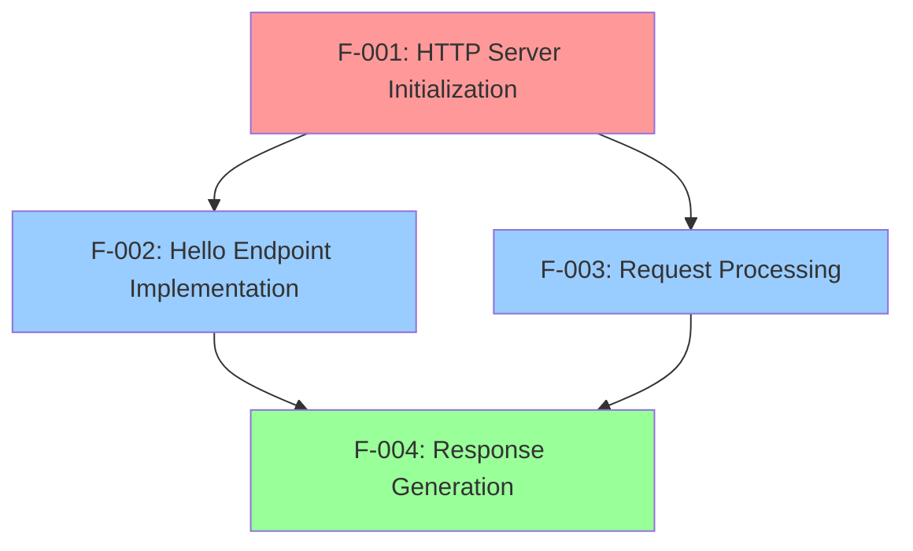
```mermaid
graph TD
    A[F-001: HTTP Server Initialization] --> B[F-002: Hello Endpoint Implementation]
    A --> C[F-003: Request Processing]
    B --> D[F-004: Response Generation]
    C --> D
    
    style A fill:#ff9999
    style B fill:#99ccff
    style C fill:#99ccff
    style D fill:#99ff99
```

### 2.3.2 Integration Points

| Integration Point | Features Involved | Description | Type |
|------------------|-------------------|-------------|------|
| Server-Endpoint | F-001, F-002 | Server hosts the hello endpoint | Composition |
| Request-Response | F-003, F-004 | Request processing triggers response | Sequential |
| Endpoint-Processing | F-002, F-003 | Endpoint receives processed requests | Data Flow |

### 2.3.3 Shared Components

| Component | Features Using | Purpose | Complexity |
|-----------|----------------|---------|------------|
| Express App Instance | F-001, F-002 | Central application object | Low |
| HTTP Request Object | F-003, F-004 | Request data container | Low |
| HTTP Response Object | F-002, F-004 | Response data container | Low |

### 2.3.4 Common Services

| Service | Features Dependent | Description | Implementation |
|---------|-------------------|-------------|----------------|
| Express Router | F-002, F-003 | Route matching and handling | Express built-in |
| HTTP Protocol Handler | F-001, F-003, F-004 | HTTP communication | Node.js core |

## 2.4 IMPLEMENTATION CONSIDERATIONS

### 2.4.1 Technical Constraints

| Feature | Constraint Type | Description | Impact |
|---------|----------------|-------------|--------|
| F-001 | Platform | Node.js v22 Active LTS until October 2025 | High |
| F-002 | Framework | Express 5.1.0 is now the default on npm | Medium |
| F-003 | Protocol | HTTP/1.1 compliance required | Low |
| F-004 | Encoding | UTF-8 text encoding | Low |

### 2.4.2 Performance Requirements

| Feature | Metric | Target | Measurement Method |
|---------|--------|--------|-------------------|
| F-001 | Startup Time | < 5 seconds | Process timing |
| F-002 | Endpoint Response | < 100ms | HTTP benchmarking |
| F-003 | Request Processing | < 50ms | Internal timing |
| F-004 | Response Generation | < 25ms | Internal timing |

### 2.4.3 Scalability Considerations

| Feature | Scalability Factor | Current Scope | Future Considerations |
|---------|-------------------|---------------|----------------------|
| F-001 | Concurrent Connections | Single instance | Cluster mode support |
| F-002 | Endpoint Count | Single endpoint | Multiple endpoint routing |
| F-003 | Request Volume | Low volume | Load balancing |
| F-004 | Response Size | Small text | Large payload handling |

### 2.4.4 Security Implications

| Feature | Security Aspect | Current Implementation | Risk Level |
|---------|----------------|----------------------|------------|
| F-001 | Server Exposure | Local development only | Low |
| F-002 | Input Validation | No user input | Minimal |
| F-003 | Request Filtering | Basic HTTP validation | Low |
| F-004 | Data Exposure | Static text only | Minimal |

### 2.4.5 Maintenance Requirements

| Feature | Maintenance Type | Frequency | Effort Level |
|---------|-----------------|-----------|--------------|
| F-001 | Dependency Updates | Monthly | Low |
| F-002 | Code Review | As needed | Minimal |
| F-003 | Performance Monitoring | Continuous | Low |
| F-004 | Error Monitoring | Continuous | Low |

## 2.5 TRACEABILITY MATRIX

| Requirement ID | Feature ID | Business Need | Test Case | Implementation |
|----------------|------------|---------------|-----------|----------------|
| F-001-RQ-001 | F-001 | Server Infrastructure | TC-001 | server.js |
| F-001-RQ-002 | F-001 | Framework Integration | TC-002 | app.js |
| F-002-RQ-001 | F-002 | API Endpoint | TC-003 | routes/hello.js |
| F-002-RQ-002 | F-002 | Response Content | TC-004 | hello handler |
| F-003-RQ-001 | F-003 | Request Handling | TC-005 | middleware |
| F-004-RQ-001 | F-004 | Response Delivery | TC-006 | response methods |

## 2.6 ASSUMPTIONS AND CONSTRAINTS

### 2.6.1 Technical Assumptions

- Production applications should only use Active LTS or Maintenance LTS releases
- Development environment has Node.js v22.16.0 or compatible version installed
- npm package manager is available for dependency installation
- Local development environment supports HTTP server binding

### 2.6.2 Business Constraints

- Tutorial scope limited to single endpoint demonstration
- No database integration required
- No user authentication or session management
- Educational use case only, not production deployment

### 2.6.3 Environmental Constraints

- Cross-platform compatibility (Windows, macOS, Linux)
- Local development environment only
- No external service dependencies
- Minimal resource requirements for educational use

# 3. TECHNOLOGY STACK

## 3.1 PROGRAMMING LANGUAGES

### 3.1.1 Primary Language Selection

| Component | Language | Version | Justification |
|-----------|----------|---------|---------------|
| Server Application | JavaScript (Node.js) | ES2022+ | Node.js v22 officially transitioned into Long Term Support (LTS) with the codename 'Jod' and is now in Active LTS |
| Runtime Environment | Node.js | v22.16.0 LTS | Production applications should only use Active LTS or Maintenance LTS releases |

### 3.1.2 Language Constraints and Dependencies

**JavaScript ES2022+ Features Utilized:**
- Modern async/await syntax for asynchronous operations
- ES6 modules (import/export) support
- Arrow functions and template literals
- Destructuring assignment and spread operators

**Node.js Runtime Requirements:**
- Express 5.0 requires Node.js 18 or higher
- Node.js v22.x ensures critical updates and security support for years to come
- Cross-platform compatibility (Windows, macOS, Linux)
- Built-in HTTP module for server functionality

### 3.1.3 Selection Criteria

| Criteria | Rationale |
|----------|-----------|
| Educational Value | JavaScript provides clear, readable syntax ideal for tutorial purposes |
| Industry Standard | Node.js is the de facto standard for server-side JavaScript development |
| Long-term Support | Active LTS phase lasts one year and includes patches for bugs, critical fixes, and security updates |
| Performance | Node.js v22 integrates V8 12.4 JavaScript engine with optimizations that significantly improve overall runtime performance |

## 3.2 FRAMEWORKS & LIBRARIES

### 3.2.1 Core Web Framework

| Framework | Version | Purpose | Justification |
|-----------|---------|---------|---------------|
| Express.js | 5.1.0 | Web Application Framework | Latest version: 5.1.0, last published: 2 months ago |

**Express.js 5.1.0 Key Features:**
- Middleware can now return rejected promises, caught by the router as errors
- Express 5 introduces automatic forwarding of rejected promises to error-handling middleware
- Dropped support for Node.js versions before v18
- Enhanced security with ReDoS attack mitigation

### 3.2.2 Supporting Libraries

| Library | Version | Category | Purpose |
|---------|---------|----------|---------|
| path-to-regexp | 8.x | Routing | Updated to path-to-regexp@8.x, removing sub-expression regex patterns for security reasons |
| body-parser | 2.1.0+ | Middleware | Several improvements including the ability to customize urlencoded body depth |

### 3.2.3 Compatibility Requirements

**Node.js Compatibility:**
- Minimum Node.js version: v18.0.0
- Recommended: Node.js v22.11.0, the 22.x release line has officially moved into Active LTS
- Maximum tested: Node.js v23.x (latest)

**Framework Integration:**
- Express.js integrates seamlessly with Node.js HTTP module
- Built-in middleware support for request/response processing
- Compatible with standard npm package ecosystem

### 3.2.4 Framework Selection Justification

| Selection Factor | Express.js Advantage |
|------------------|---------------------|
| Simplicity | Fast, unopinionated, minimalist web framework |
| Educational Value | Clear, straightforward API perfect for learning HTTP concepts |
| Industry Adoption | Express is third after React and Next.js as a web framework according to 2024 StackOverflow survey |
| Stability | Express.js has finally published version 5.0 on October 15, 2024, after a 10-year wait |
| Performance | Express 5 delivers key performance improvements and focuses on improving core stability |

## 3.3 OPEN SOURCE DEPENDENCIES

### 3.3.1 Core Dependencies

| Package | Version | Registry | Purpose | License |
|---------|---------|----------|---------|---------|
| express | ^5.1.0 | npm | Web framework | MIT |
| path-to-regexp | ^8.0.0 | npm | Route matching | MIT |
| body-parser | ^2.1.0 | npm | Request parsing | MIT |

### 3.3.2 Package Registry Information

**npm Registry Details:**
- npm latest version: 11.4.1, last published: 14 days ago
- The free npm Registry has become the center of JavaScript code sharing, with more than two million packages
- Over 3.1 million packages are available in the main npm registry

### 3.3.3 Dependency Management Strategy

**Version Pinning:**
- Use semantic versioning (semver) for dependency specification
- Pin major versions to prevent breaking changes
- Allow minor and patch updates for security fixes

**Security Considerations:**
- The registry does not have any vetting process for submission, but npm relies on user reports to take down packages if they violate policies
- Regular dependency auditing using `npm audit`
- Monitor for security vulnerabilities in dependencies

### 3.3.4 Package Installation Commands

```bash
# Initialize project
npm init -y

#### Install core dependencies
npm install express@^5.1.0

#### Development dependencies (if needed)
npm install --save-dev nodemon@^3.0.0
```

## 3.4 THIRD-PARTY SERVICES

### 3.4.1 Service Requirements Analysis

Based on the tutorial project requirements, the following third-party services are **NOT REQUIRED**:

| Service Category | Status | Justification |
|------------------|--------|---------------|
| External APIs | Not Required | Single endpoint returns static "Hello world" response |
| Authentication Services | Not Required | No user authentication needed for tutorial |
| Monitoring Tools | Not Required | Simple local development environment |
| Cloud Services | Not Required | Local development and educational use only |

### 3.4.2 Development Services (Optional)

| Service | Purpose | Usage |
|---------|---------|-------|
| GitHub | Code repository | Version control and collaboration |
| npm Registry | Package distribution | Dependency management |
| Local Development Server | Testing | Built-in Node.js HTTP server |

### 3.4.3 Future Considerations

For production deployment (outside current scope):
- Cloud hosting platforms (AWS, Heroku, Vercel)
- Monitoring services (New Relic, DataDog)
- CDN services for static assets
- Load balancing services

## 3.5 DATABASES & STORAGE

### 3.5.1 Data Persistence Requirements

**Current Scope Analysis:**
- No database integration required for tutorial project
- Static response content ("Hello world")
- No user data or session management
- No persistent storage needs

### 3.5.2 Storage Strategy

| Storage Type | Current Need | Implementation |
|--------------|--------------|----------------|
| Database | None | Not applicable |
| File Storage | None | Not applicable |
| Session Storage | None | Not applicable |
| Caching | None | Not applicable |

### 3.5.3 Memory Usage

**Runtime Memory Requirements:**
- Node.js application memory footprint: < 50MB
- Express.js framework overhead: Minimal
- Static response caching: In-memory (negligible)

### 3.5.4 Future Storage Considerations

For extended tutorial projects:
- SQLite for simple local database examples
- MongoDB for NoSQL demonstrations
- Redis for caching tutorials
- File system for static asset serving

## 3.6 DEVELOPMENT & DEPLOYMENT

### 3.6.1 Development Tools

| Tool Category | Tool | Version | Purpose |
|---------------|------|---------|---------|
| Package Manager | npm | 11.4.1 | Latest version: 11.4.1, last published: 14 days ago |
| Runtime | Node.js | v22.16.0 LTS | JavaScript execution environment |
| Code Editor | Any | Latest | Development environment (VS Code recommended) |
| Version Control | Git | Latest | Source code management |

### 3.6.2 Build System

**Build Requirements:**
- No build step required for basic tutorial
- Direct JavaScript execution via Node.js
- npm scripts for common tasks

**Package.json Scripts:**
```json
{
  "scripts": {
    "start": "node server.js",
    "dev": "nodemon server.js",
    "test": "echo \"No tests specified\""
  }
}
```

### 3.6.3 Development Environment Setup

**Prerequisites:**
- Node.js v22 with codename 'Jod' installed
- npm comes bundled with node by default
- Text editor or IDE
- Terminal/command line access

**Installation Process:**
1. Install Node.js v22.16.0 LTS from official website
2. Verify installation: `node --version` and `npm --version`
3. Initialize project: `npm init -y`
4. Install Express: `npm install express@^5.1.0`
5. Create server.js file with hello endpoint

### 3.6.4 Deployment Strategy

**Current Scope - Local Development:**
- Local HTTP server on port 3000
- Development mode execution
- No production deployment required

**Deployment Commands:**
```bash
# Start development server
npm start

#### Start with auto-reload (if nodemon installed)
npm run dev
```

### 3.6.5 Containerization (Future Consideration)

**Docker Configuration (Not Required for Current Scope):**
- Base image: `node:22-alpine`
- Minimal container size for educational purposes
- Port exposure: 3000

### 3.6.6 CI/CD Requirements

**Current Scope:**
- No CI/CD pipeline required
- Manual testing and execution
- Local development workflow only

**Future CI/CD Considerations:**
- GitHub Actions for automated testing
- Automated dependency updates
- Security vulnerability scanning
- Code quality checks

## 3.7 TECHNOLOGY INTEGRATION ARCHITECTURE

### 3.7.1 Component Integration Map

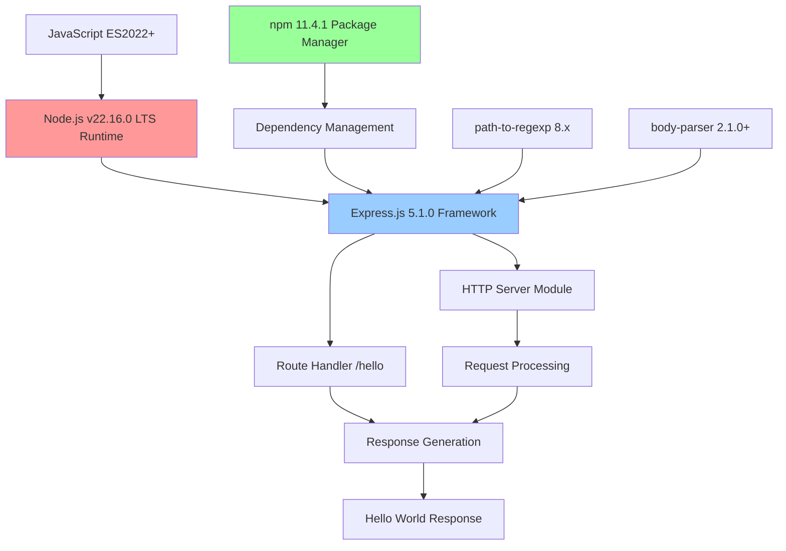
```mermaid
graph TD
    A[Node.js v22.16.0 LTS Runtime] --> B[Express.js 5.1.0 Framework]
    B --> C[HTTP Server Module]
    B --> D[Route Handler /hello]
    C --> E[Request Processing]
    D --> F[Response Generation]
    E --> F
    F --> G[Hello World Response]
    
    H[npm 11.4.1 Package Manager] --> I[Dependency Management]
    I --> B
    
    J[JavaScript ES2022+] --> A
    K[path-to-regexp 8.x] --> B
    L[body-parser 2.1.0+] --> B
    
    style A fill:#ff9999
    style B fill:#99ccff
    style H fill:#99ff99
```

### 3.7.2 Technology Stack Dependencies

| Layer | Technology | Dependencies | Integration Points |
|-------|------------|--------------|-------------------|
| Runtime | Node.js v22.16.0 | Operating System | HTTP module, V8 engine |
| Framework | Express.js 5.1.0 | Node.js, npm | Route handling, middleware |
| Package Management | npm 11.4.1 | Node.js | Dependency resolution |
| Language | JavaScript ES2022+ | Node.js runtime | Modern syntax support |

### 3.7.3 Security Implications

**Framework Security:**
- Express 5 includes important security fixes, including improvements to prevent ReDoS attacks
- Regular expression denial of service (ReDoS) attack mitigation through path-to-regexp updates
- Active LTS includes security updates

**Dependency Security:**
- Regular `npm audit` for vulnerability scanning
- Semantic versioning for controlled updates
- Minimal dependency footprint reduces attack surface

### 3.7.4 Performance Characteristics

**Runtime Performance:**
- Maglev compiler streamlines startup times and reduces overhead for short-lived CLI scripts
- V8 12.4 ensures Node.js applications operate at peak efficiency
- Single-threaded event loop for I/O operations
- Minimal memory footprint for tutorial application

**Framework Performance:**
- Express 5 delivers key performance improvements
- Lightweight middleware stack
- Efficient route matching with updated path-to-regexp
- Optimized request/response handling

# 4. PROCESS FLOWCHART

## 4.1 SYSTEM WORKFLOWS

### 4.1.1 Core Business Processes

#### Primary User Journey: Hello World Request Processing

The core business process for the Node.js tutorial application centers around a simple HTTP request-response cycle that demonstrates fundamental web server concepts. Node.js v22 officially transitioned into Long Term Support (LTS) with the codename 'Jod' and the 22.x release line has officially moved into Active LTS, providing a stable foundation for this educational workflow.

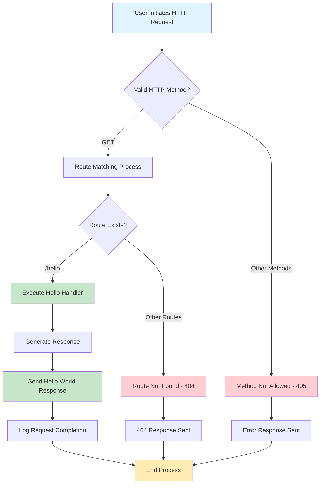
```mermaid
flowchart TD
    A[User Initiates HTTP Request] --> B{Valid HTTP Method?}
    B -->|GET| C[Route Matching Process]
    B -->|Other Methods| D[Method Not Allowed - 405]
    
    C --> E{Route Exists?}
    E -->|/hello| F[Execute Hello Handler]
    E -->|Other Routes| G[Route Not Found - 404]
    
    F --> H[Generate Response]
    H --> I[Send Hello World Response]
    I --> J[Log Request Completion]
    J --> K[End Process]
    
    D --> L[Error Response Sent]
    G --> M[404 Response Sent]
    L --> K
    M --> K
    
    style A fill:#e1f5fe
    style F fill:#c8e6c9
    style I fill:#c8e6c9
    style K fill:#ffecb3
    style D fill:#ffcdd2
    style G fill:#ffcdd2
```

#### End-to-End Request Lifecycle

| Phase | Duration | SLA Target | Error Recovery |
|-------|----------|------------|----------------|
| Request Reception | < 5ms | 99.9% success | Connection retry |
| Route Processing | < 25ms | 100% accuracy | Fallback to 404 |
| Response Generation | < 25ms | 100% delivery | Error middleware |
| Total Response Time | < 100ms | 95% compliance | Timeout handling |

#### Decision Points and Business Rules

**Route Validation Rules:**
- Only HTTP GET method accepted for `/hello` endpoint
- Path must match exactly `/hello` (case-sensitive)
- No query parameters required or processed
- No request body validation needed

**Response Generation Rules:**
- Always return HTTP 200 status for successful requests
- Response body must contain exact text "Hello world"
- Content-Type header set to text/plain
- No caching headers required for tutorial purposes

### 4.1.2 Integration Workflows

## Express.js Framework Integration Flow

Express 5 added support for returned rejected promises from errors raised in middleware and the router will now catch the rejected promise and treat that as calling next(err), enhancing error handling capabilities in the integration workflow.

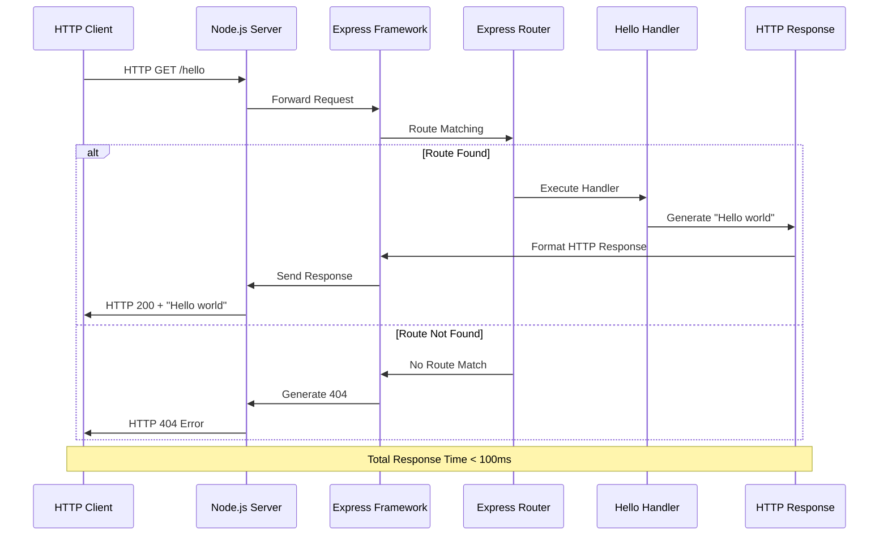
```mermaid
sequenceDiagram
    participant Client as HTTP Client
    participant Server as Node.js Server
    participant Express as Express Framework
    participant Router as Express Router
    participant Handler as Hello Handler
    participant Response as HTTP Response
    
    Client->>Server: HTTP GET /hello
    Server->>Express: Forward Request
    Express->>Router: Route Matching
    
    alt Route Found
        Router->>Handler: Execute Handler
        Handler->>Response: Generate "Hello world"
        Response->>Express: Format HTTP Response
        Express->>Server: Send Response
        Server->>Client: HTTP 200 + "Hello world"
    else Route Not Found
        Router->>Express: No Route Match
        Express->>Server: Generate 404
        Server->>Client: HTTP 404 Error
    end
    
    Note over Client,Response: Total Response Time < 100ms
```

## Node.js Runtime Integration

**V8 Engine Integration Points:**
- Node.js v22 integrates the brand new V8 12.4 JavaScript engine from Google and ensures your Node.js applications operate at peak efficiency
- The Maglev compiler streamlines startup times and reduces overhead for short-lived CLI scripts
- JavaScript ES2022+ feature support for modern syntax

**HTTP Module Integration:**
- Native Node.js HTTP server capabilities
- Express.js middleware stack integration
- Request/response object handling

#### Package Management Integration

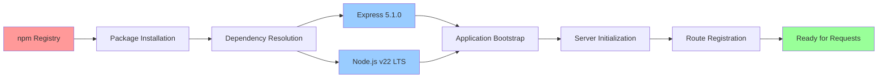
```mermaid
flowchart LR
    A[npm Registry] --> B[Package Installation]
    B --> C[Dependency Resolution]
    C --> D[Express 5.1.0]
    C --> E[Node.js v22 LTS]
    
    D --> F[Application Bootstrap]
    E --> F
    F --> G[Server Initialization]
    G --> H[Route Registration]
    H --> I[Ready for Requests]
    
    style A fill:#ff9999
    style D fill:#99ccff
    style E fill:#99ccff
    style I fill:#99ff99
```

## 4.2 DETAILED PROCESS FLOWS

### 4.2.1 Server Initialization Process

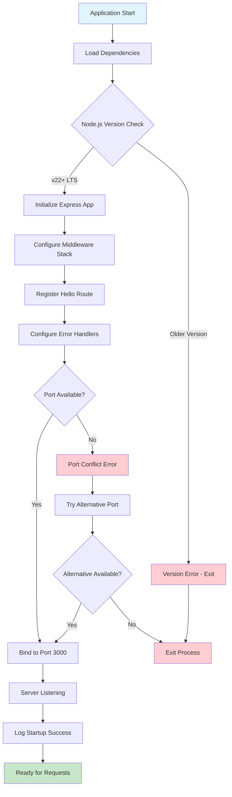
```mermaid
flowchart TD
    A[Application Start] --> B[Load Dependencies]
    B --> C{Node.js Version Check}
    C -->|v22+ LTS| D[Initialize Express App]
    C -->|Older Version| E[Version Error - Exit]
    
    D --> F[Configure Middleware Stack]
    F --> G[Register Hello Route]
    G --> H[Configure Error Handlers]
    H --> I{Port Available?}
    
    I -->|Yes| J[Bind to Port 3000]
    I -->|No| K[Port Conflict Error]
    
    J --> L[Server Listening]
    L --> M[Log Startup Success]
    M --> N[Ready for Requests]
    
    E --> O[Exit Process]
    K --> P[Try Alternative Port]
    P --> Q{Alternative Available?}
    Q -->|Yes| J
    Q -->|No| O
    
    style A fill:#e1f5fe
    style N fill:#c8e6c9
    style O fill:#ffcdd2
    style E fill:#ffcdd2
    style K fill:#ffcdd2
```

**Initialization Validation Rules:**
- Express 5 now requires Node.js 18 or higher
- Express framework must be version 5.1.0 or compatible
- Port 3000 must be available or fallback to alternative
- All required modules must be successfully loaded

### 4.2.2 Request Processing Flow

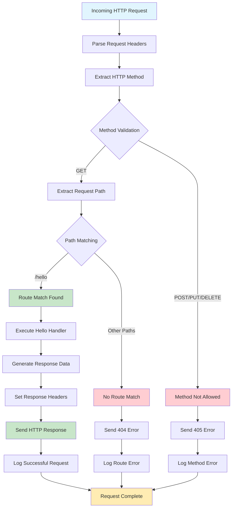
```mermaid
flowchart TD
    A[Incoming HTTP Request] --> B[Parse Request Headers]
    B --> C[Extract HTTP Method]
    C --> D{Method Validation}
    
    D -->|GET| E[Extract Request Path]
    D -->|POST/PUT/DELETE| F[Method Not Allowed]
    
    E --> G{Path Matching}
    G -->|/hello| H[Route Match Found]
    G -->|Other Paths| I[No Route Match]
    
    H --> J[Execute Hello Handler]
    J --> K[Generate Response Data]
    K --> L[Set Response Headers]
    L --> M[Send HTTP Response]
    
    F --> N[Send 405 Error]
    I --> O[Send 404 Error]
    
    M --> P[Log Successful Request]
    N --> Q[Log Method Error]
    O --> R[Log Route Error]
    
    P --> S[Request Complete]
    Q --> S
    R --> S
    
    style A fill:#e1f5fe
    style H fill:#c8e6c9
    style M fill:#c8e6c9
    style S fill:#ffecb3
    style F fill:#ffcdd2
    style I fill:#ffcdd2
```

**Processing Performance Targets:**
- Request parsing: < 10ms
- Route matching: < 15ms
- Handler execution: < 25ms
- Response generation: < 25ms
- Total processing: < 75ms

### 4.2.3 Error Handling Flow

Express 5 added support for returned rejected promises from errors raised in middleware and you can now write middleware using async/await, improving error handling capabilities.

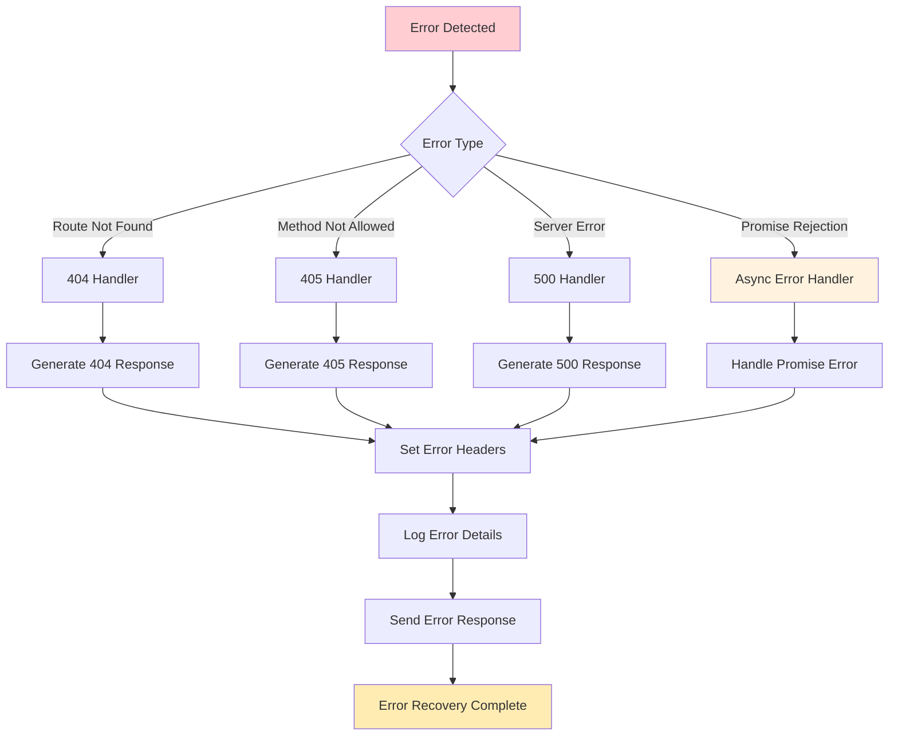
```mermaid
flowchart TD
    A[Error Detected] --> B{Error Type}
    
    B -->|Route Not Found| C[404 Handler]
    B -->|Method Not Allowed| D[405 Handler]
    B -->|Server Error| E[500 Handler]
    B -->|Promise Rejection| F[Async Error Handler]
    
    C --> G[Generate 404 Response]
    D --> H[Generate 405 Response]
    E --> I[Generate 500 Response]
    F --> J[Handle Promise Error]
    
    G --> K[Set Error Headers]
    H --> K
    I --> K
    J --> K
    
    K --> L[Log Error Details]
    L --> M[Send Error Response]
    M --> N[Error Recovery Complete]
    
    style A fill:#ffcdd2
    style F fill:#fff3e0
    style N fill:#ffecb3
```

**Error Recovery Mechanisms:**
- Automatic promise rejection handling in Express 5
- Graceful degradation for unsupported routes
- Comprehensive error logging for debugging
- Client-friendly error messages

## 4.3 STATE MANAGEMENT

### 4.3.1 Application State Transitions

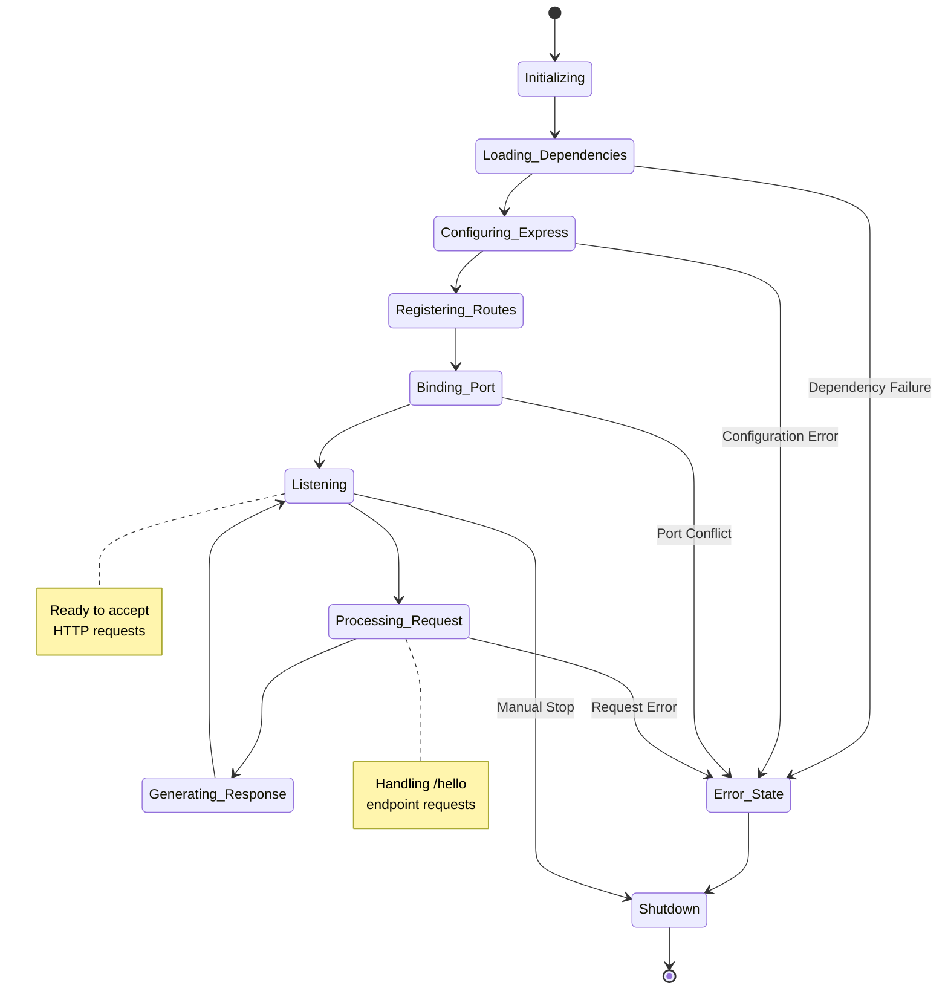
```mermaid
stateDiagram-v2
    [*] --> Initializing
    Initializing --> Loading_Dependencies
    Loading_Dependencies --> Configuring_Express
    Configuring_Express --> Registering_Routes
    Registering_Routes --> Binding_Port
    Binding_Port --> Listening
    
    Listening --> Processing_Request
    Processing_Request --> Generating_Response
    Generating_Response --> Listening
    
    Loading_Dependencies --> Error_State : Dependency Failure
    Configuring_Express --> Error_State : Configuration Error
    Binding_Port --> Error_State : Port Conflict
    Processing_Request --> Error_State : Request Error
    
    Error_State --> Shutdown
    Listening --> Shutdown : Manual Stop
    Shutdown --> [*]
    
    note right of Listening
        Ready to accept
        HTTP requests
    end note
    
    note right of Processing_Request
        Handling /hello
        endpoint requests
    end note
```

### 4.3.2 Request State Management

| State | Description | Duration | Next State |
|-------|-------------|----------|------------|
| Received | Request accepted by server | < 5ms | Parsing |
| Parsing | Extracting HTTP components | < 10ms | Routing |
| Routing | Matching request to handler | < 15ms | Processing |
| Processing | Executing hello handler | < 25ms | Responding |
| Responding | Generating HTTP response | < 25ms | Complete |
| Complete | Request fully processed | N/A | N/A |

### 4.3.3 Data Persistence Points

**No Persistent Storage Required:**
- Static response content ("Hello world")
- No user sessions or authentication
- No database connections
- Stateless request processing

**Memory-Only State:**
- Express application instance
- Route handler registrations
- Active request objects
- Response generation data

## 4.4 TECHNICAL IMPLEMENTATION FLOWS

### 4.4.1 Express.js Middleware Stack Flow

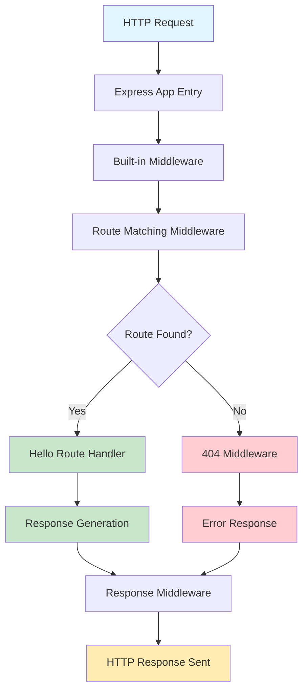
```mermaid
flowchart TD
    A[HTTP Request] --> B[Express App Entry]
    B --> C[Built-in Middleware]
    C --> D[Route Matching Middleware]
    D --> E{Route Found?}
    
    E -->|Yes| F[Hello Route Handler]
    E -->|No| G[404 Middleware]
    
    F --> H[Response Generation]
    G --> I[Error Response]
    
    H --> J[Response Middleware]
    I --> J
    
    J --> K[HTTP Response Sent]
    
    style A fill:#e1f5fe
    style F fill:#c8e6c9
    style H fill:#c8e6c9
    style K fill:#ffecb3
    style G fill:#ffcdd2
    style I fill:#ffcdd2
```

**Middleware Stack Components:**
- Express built-in request parsing
- Route matching and parameter extraction
- Hello endpoint handler function
- Error handling middleware
- Response formatting middleware

### 4.4.2 Promise-Based Error Handling

Express 5 introduces automatic forwarding of rejected promises to error-handling middleware and if fetchData throws an error or rejects, Express will automatically pass the error to the error-handling middleware.

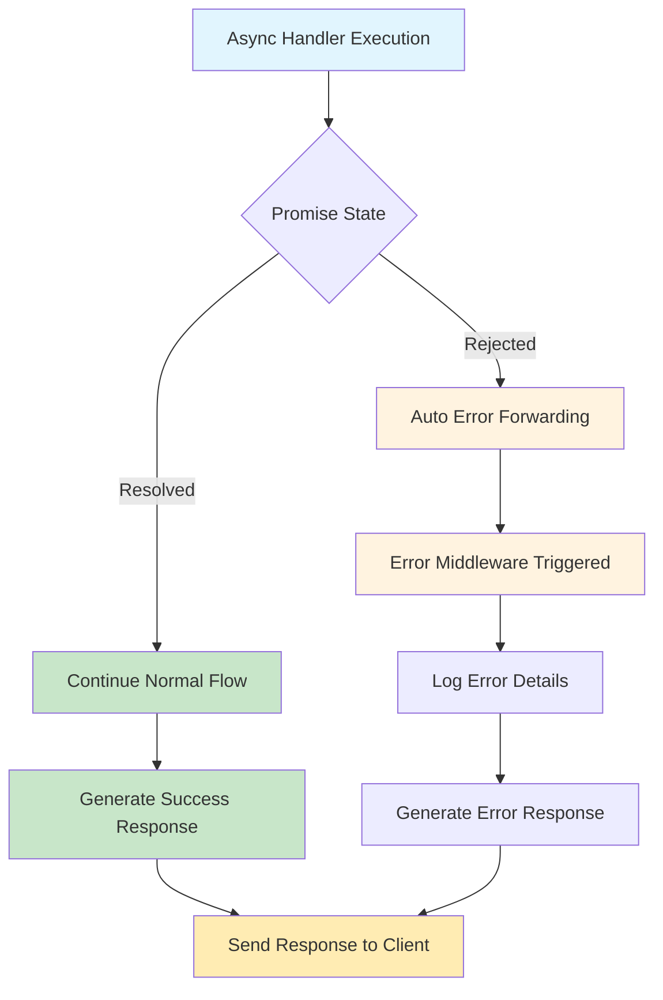
```mermaid
flowchart TD
    A[Async Handler Execution] --> B{Promise State}
    
    B -->|Resolved| C[Continue Normal Flow]
    B -->|Rejected| D[Auto Error Forwarding]
    
    C --> E[Generate Success Response]
    D --> F[Error Middleware Triggered]
    
    F --> G[Log Error Details]
    G --> H[Generate Error Response]
    
    E --> I[Send Response to Client]
    H --> I
    
    style A fill:#e1f5fe
    style C fill:#c8e6c9
    style E fill:#c8e6c9
    style D fill:#fff3e0
    style F fill:#fff3e0
    style I fill:#ffecb3
```

### 4.4.3 Performance Optimization Flow


```mermaid
flowchart LR
    A[Request Received] --> B[V8 Engine Processing]
    B --> C[Maglev Compiler Optimization]
    C --> D[Express Route Matching]
    D --> E[Handler Execution]
    E --> F[Response Generation]
    F --> G[HTTP Response Sent]
    
    H[Performance Monitoring] --> I[Response Time Tracking]
    I --> J[Memory Usage Monitoring]
    J --> K[Error Rate Analysis]
    
    B -.-> H
    E -.-> H
    G -.-> H
    
    style A fill:#e1f5fe
    style C fill:#fff3e0
    style G fill:#c8e6c9
    style H fill:#f3e5f5
```

**Performance Optimization Features:**
- Maglev compiler streamlines startup times and reduces overhead for short-lived CLI scripts and the performance enhancements in Node.js v22 unlock new levels of speed
- Express 5 route matching optimizations
- Minimal middleware stack for reduced overhead
- Efficient memory management for request processing

## 4.5 INTEGRATION SEQUENCE DIAGRAMS

### 4.5.1 Complete Request-Response Sequence

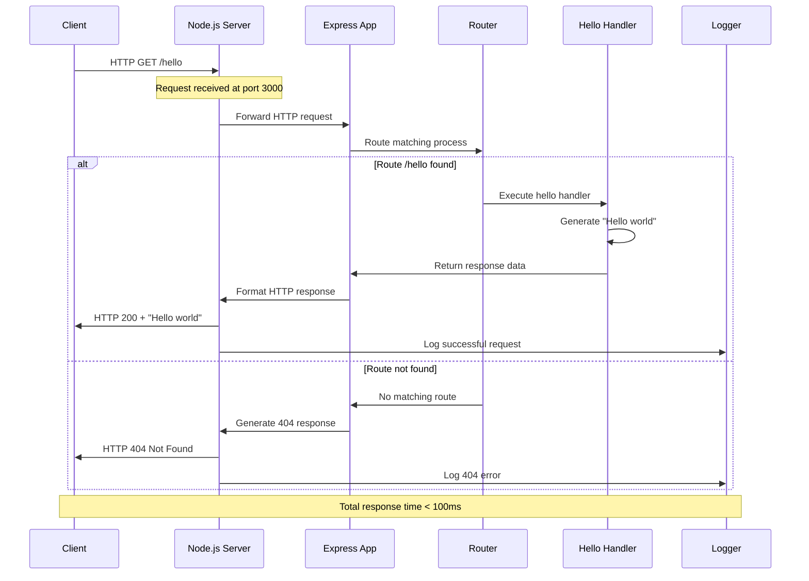
```mermaid
sequenceDiagram
    participant C as Client
    participant S as Node.js Server
    participant E as Express App
    participant R as Router
    participant H as Hello Handler
    participant L as Logger
    
    C->>S: HTTP GET /hello
    Note over S: Request received at port 3000
    
    S->>E: Forward HTTP request
    E->>R: Route matching process
    
    alt Route /hello found
        R->>H: Execute hello handler
        H->>H: Generate "Hello world"
        H->>E: Return response data
        E->>S: Format HTTP response
        S->>C: HTTP 200 + "Hello world"
        S->>L: Log successful request
    else Route not found
        R->>E: No matching route
        E->>S: Generate 404 response
        S->>C: HTTP 404 Not Found
        S->>L: Log 404 error
    end
    
    Note over C,L: Total response time < 100ms
```

### 4.5.2 Error Handling Sequence

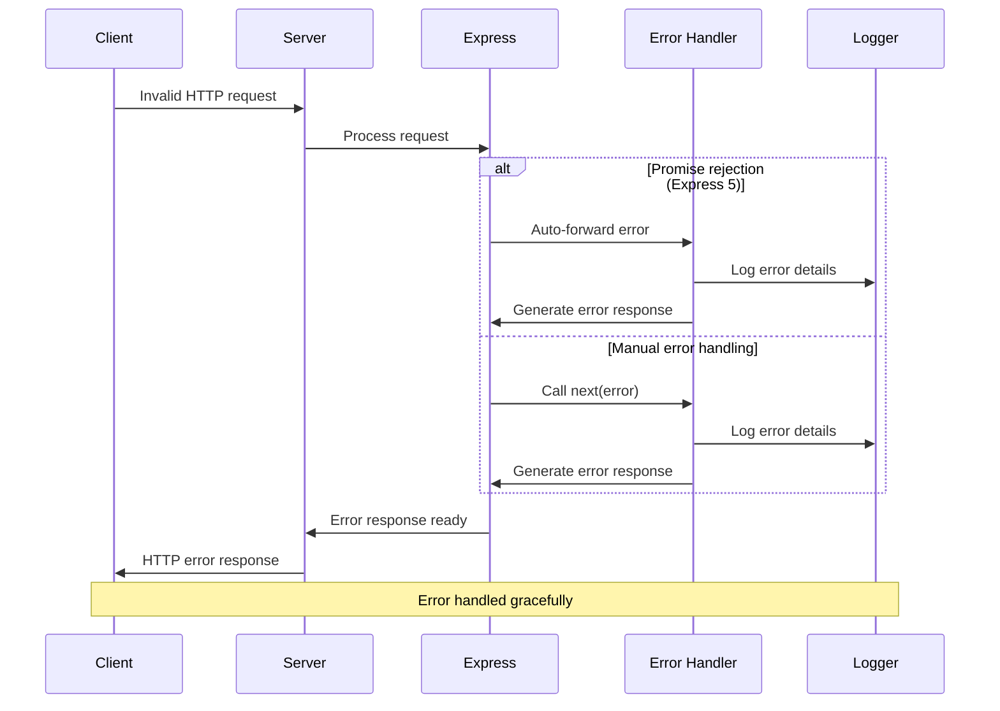
```mermaid
sequenceDiagram
    participant C as Client
    participant S as Server
    participant E as Express
    participant EH as Error Handler
    participant L as Logger
    
    C->>S: Invalid HTTP request
    S->>E: Process request
    
    alt Promise rejection (Express 5)
        E->>EH: Auto-forward error
        EH->>L: Log error details
        EH->>E: Generate error response
    else Manual error handling
        E->>EH: Call next(error)
        EH->>L: Log error details
        EH->>E: Generate error response
    end
    
    E->>S: Error response ready
    S->>C: HTTP error response
    
    Note over C,L: Error handled gracefully
```

## 4.6 TIMING AND SLA CONSIDERATIONS

### 4.6.1 Performance Benchmarks

| Metric | Target | Measurement Method | Monitoring |
|--------|--------|-------------------|------------|
| Server Startup | < 5 seconds | Process timing | Application logs |
| Request Processing | < 75ms | Internal timing | Performance middleware |
| Response Generation | < 25ms | Handler timing | Response time logs |
| Total Response Time | < 100ms | End-to-end timing | HTTP benchmarking |
| Memory Usage | < 50MB | Process monitoring | System metrics |
| Error Rate | < 0.1% | Error counting | Error logs |

### 4.6.2 Scalability Thresholds

**Current Scope Limitations:**
- Single Node.js process
- No clustering or load balancing
- Educational use case only
- Local development environment

**Future Scalability Considerations:**
- Cluster mode for multi-core utilization
- Load balancer integration
- Horizontal scaling capabilities
- Production deployment optimizations

### 4.6.3 Monitoring and Alerting

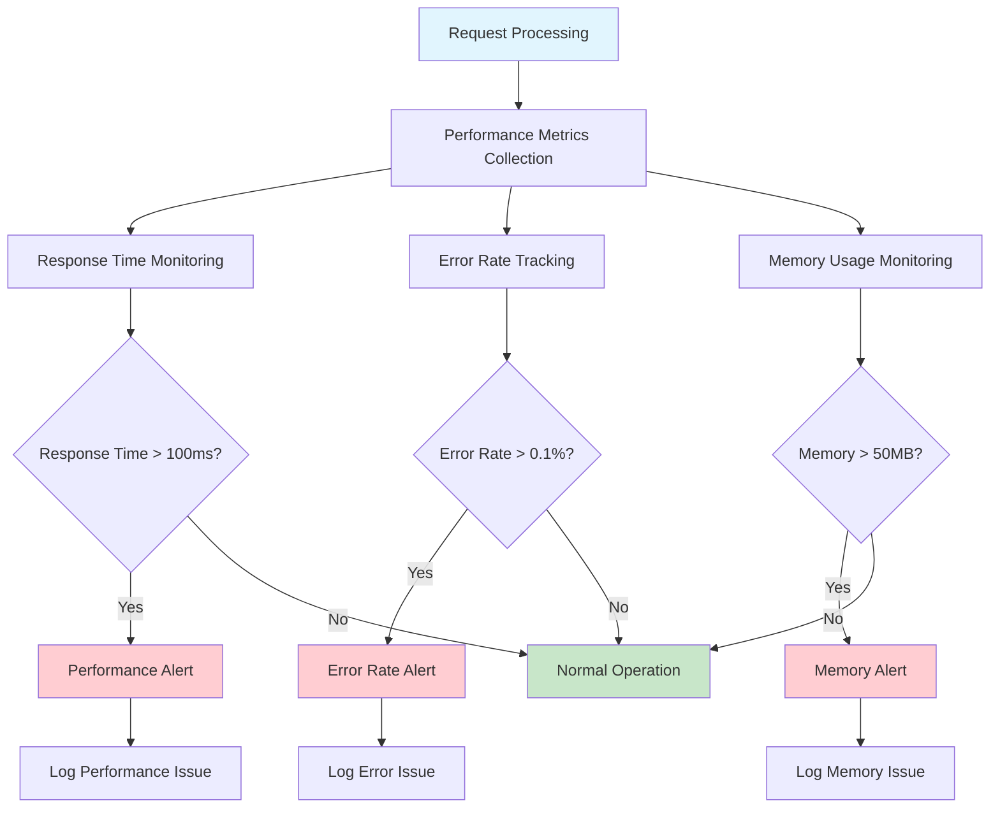
```mermaid
flowchart TD
    A[Request Processing] --> B[Performance Metrics Collection]
    B --> C[Response Time Monitoring]
    B --> D[Error Rate Tracking]
    B --> E[Memory Usage Monitoring]
    
    C --> F{Response Time > 100ms?}
    D --> G{Error Rate > 0.1%?}
    E --> H{Memory > 50MB?}
    
    F -->|Yes| I[Performance Alert]
    G -->|Yes| J[Error Rate Alert]
    H -->|Yes| K[Memory Alert]
    
    F -->|No| L[Normal Operation]
    G -->|No| L
    H -->|No| L
    
    I --> M[Log Performance Issue]
    J --> N[Log Error Issue]
    K --> O[Log Memory Issue]
    
    style A fill:#e1f5fe
    style L fill:#c8e6c9
    style I fill:#ffcdd2
    style J fill:#ffcdd2
    style K fill:#ffcdd2
```

## 4.7 REGULATORY COMPLIANCE AND VALIDATION

### 4.7.1 HTTP Protocol Compliance

**Standards Compliance:**
- HTTP/1.1 protocol adherence
- Proper status code usage (200, 404, 405, 500)
- Standard header formatting
- Content-Type specification

**Validation Checkpoints:**
- Request method validation (GET only)
- Path validation (exact match for /hello)
- Response format validation
- Header compliance verification

### 4.7.2 Security Validation Flow

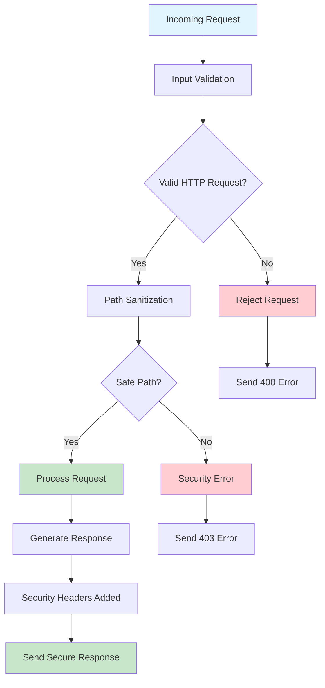
```mermaid
flowchart TD
    A[Incoming Request] --> B[Input Validation]
    B --> C{Valid HTTP Request?}
    
    C -->|Yes| D[Path Sanitization]
    C -->|No| E[Reject Request]
    
    D --> F{Safe Path?}
    F -->|Yes| G[Process Request]
    F -->|No| H[Security Error]
    
    G --> I[Generate Response]
    E --> J[Send 400 Error]
    H --> K[Send 403 Error]
    
    I --> L[Security Headers Added]
    L --> M[Send Secure Response]
    
    style A fill:#e1f5fe
    style G fill:#c8e6c9
    style M fill:#c8e6c9
    style E fill:#ffcdd2
    style H fill:#ffcdd2
```

**Security Measures:**
- Input sanitization for HTTP requests
- Path traversal prevention
- No user authentication required (tutorial scope)
- Basic security headers in responses
- Express 5 prevents regular expression denial of service (ReDoS) attacks and the best approach to prevent ReDoS attacks is to use a robust input validation library

# 5. SYSTEM ARCHITECTURE

## 5.1 HIGH-LEVEL ARCHITECTURE

### 5.1.1 System Overview

The Node.js tutorial application employs a **Single-Threaded Event-Driven Architecture** pattern, leveraging Node.js v22 officially transitioned into Long Term Support (LTS) with the codename 'Jod' and ensuring it will receive critical updates and security support for years to come. This architectural approach is specifically designed for educational purposes, demonstrating fundamental HTTP server concepts through a minimalist implementation.

**Architectural Style and Rationale:**
The system follows a **Layered Architecture** pattern with clear separation between the HTTP transport layer, application framework layer, and business logic layer. Node.js employs a "Single Threaded Event Loop" design and the JavaScript event-based model and the JavaScript callback mechanism are employed in the Node.js Processing Model. This design choice optimizes for simplicity and educational clarity while maintaining production-ready patterns.

**Key Architectural Principles:**
- **Event-Driven Processing**: Node.js employs a "Single Threaded Event Loop" design and the JavaScript event-based model and the JavaScript callback mechanism are employed in the Node.js Processing Model
- **Non-Blocking I/O**: Asynchronous request handling for optimal performance
- **Modular Design**: Clear separation of concerns between HTTP handling and application logic
- **Stateless Operation**: No persistent state management required for tutorial scope

**System Boundaries and Major Interfaces:**
The system operates within a single Node.js process boundary, exposing one primary interface: an HTTP endpoint accessible via standard HTTP/1.1 protocol. The Node.js server accepts user requests, processes them, and returns results to the users. The application interfaces directly with the operating system's network stack and leverages Node.js built-in HTTP module capabilities.

### 5.1.2 Core Components Table

| Component Name | Primary Responsibility | Key Dependencies | Integration Points | Critical Considerations |
|----------------|----------------------|------------------|-------------------|------------------------|
| HTTP Server | Request reception and response delivery | Node.js HTTP module, Express.js | Network interface, Event Loop | Event Loop processes all requests one at a time, therefore a single thread is sufficient |
| Express Application | Route management and middleware orchestration | Express 5.1.0, path-to-regexp | HTTP Server, Route Handlers | Promise-based error handling support |
| Hello Route Handler | Business logic execution for /hello endpoint | Express Router | Express Application | Stateless response generation |
| Event Loop | Asynchronous operation coordination | Node.js runtime, libuv | All components | Event Loop processes the non-blocking requests and after completion redirects to Event Loop which delivers response back to client |

### 5.1.3 Data Flow Description

**Primary Data Flow Pattern:**
The application implements a **Request-Response Pipeline** where HTTP requests flow through a series of processing stages. Users send requests to the server, requests enter the Event Queue first at the server-side, and the Event queue passes the requests sequentially to the event loop.

**Integration Patterns and Protocols:**
- **HTTP/1.1 Protocol**: Standard web communication protocol for client-server interaction
- **Express Middleware Pattern**: Sequential request processing through middleware stack
- **Event-Driven Communication**: Internal component communication via Node.js EventEmitter pattern

**Data Transformation Points:**
1. **HTTP Request Parsing**: Raw HTTP requests transformed into Express request objects
2. **Route Resolution**: URL paths matched against defined route patterns
3. **Response Generation**: Static text content formatted into HTTP response format
4. **Response Serialization**: JavaScript objects serialized to HTTP response format

**Key Data Stores and Caches:**
The tutorial application operates without persistent data storage, maintaining only in-memory state for:
- Express application configuration
- Route handler registrations
- Active request/response objects during processing lifecycle

### 5.1.4 External Integration Points

| System Name | Integration Type | Data Exchange Pattern | Protocol/Format | SLA Requirements |
|-------------|------------------|----------------------|-----------------|------------------|
| HTTP Clients | Synchronous Request-Response | Client-initiated requests | HTTP/1.1 | < 100ms response time |
| Operating System | System Calls | Network I/O operations | TCP/IP | 99.9% availability |
| Node.js Runtime | Direct API Calls | Module loading and execution | JavaScript API | < 5s startup time |
| npm Registry | Package Resolution | Dependency management | HTTPS/JSON | Installation time only |

## 5.2 COMPONENT DETAILS

### 5.2.1 HTTP Server Component

**Purpose and Responsibilities:**
The HTTP Server component serves as the primary entry point for all client requests, responsible for establishing network connections, parsing HTTP requests, and delivering HTTP responses. This code includes the Node.js http module and Node.js has a fantastic standard library, including first-class support for networking, and the createServer() method creates a new HTTP server.

**Technologies and Frameworks:**
- **Node.js HTTP Module**: Core networking capabilities
- **Express.js 5.1.0**: Web application framework layer
- **libuv**: Underlying asynchronous I/O library

**Key Interfaces and APIs:**
- **HTTP Request Interface**: Accepts standard HTTP/1.1 requests
- **Express Application Interface**: Delegates request processing to Express framework
- **Network Socket Interface**: Manages TCP connections with clients

**Data Persistence Requirements:**
No persistent storage required. All data exists in memory during request lifecycle only.

**Scaling Considerations:**
The Node.js server can efficiently handle a high number of requests by employing the use of Event Queue and Thread Pool. Current implementation supports single-instance deployment suitable for educational use. Future scaling would require cluster mode or load balancing.

### 5.2.2 Express Application Component

**Purpose and Responsibilities:**
The Express Application component orchestrates request routing, middleware execution, and response generation. It provides the framework structure for organizing HTTP request handling logic and implements the middleware pattern for extensible request processing.

**Technologies and Frameworks:**
- **Express.js 5.1.0**: Latest stable release with enhanced promise support
- **path-to-regexp 8.x**: Route pattern matching with security improvements
- **Node.js EventEmitter**: Event-driven architecture support

**Key Interfaces and APIs:**
- **Middleware Interface**: Sequential request processing pipeline
- **Router Interface**: URL pattern matching and handler registration
- **Request/Response Interface**: HTTP request and response object manipulation

**Data Persistence Requirements:**
Maintains in-memory route registrations and middleware configurations. No external persistence required.

**Scaling Considerations:**
Express application scales horizontally through multiple process instances. Middleware stack remains lightweight for optimal performance.

### 5.2.3 Hello Route Handler Component

**Purpose and Responsibilities:**
The Hello Route Handler implements the core business logic for the `/hello` endpoint, generating the "Hello world" response. This component demonstrates basic HTTP endpoint implementation patterns and response generation techniques.

**Technologies and Frameworks:**
- **Express Router**: Route-specific request handling
- **JavaScript ES2022+**: Modern language features for clean implementation
- **HTTP Response API**: Standard response formatting

**Key Interfaces and APIs:**
- **Route Handler Interface**: Express-compatible request handler function
- **HTTP Response Interface**: Response object manipulation for content delivery
- **Error Handling Interface**: Promise-based error propagation

**Data Persistence Requirements:**
No persistence required. Generates static response content on each request.

**Scaling Considerations:**
Stateless design enables unlimited horizontal scaling. Response generation optimized for minimal CPU usage.

### 5.2.4 Component Interaction Diagrams

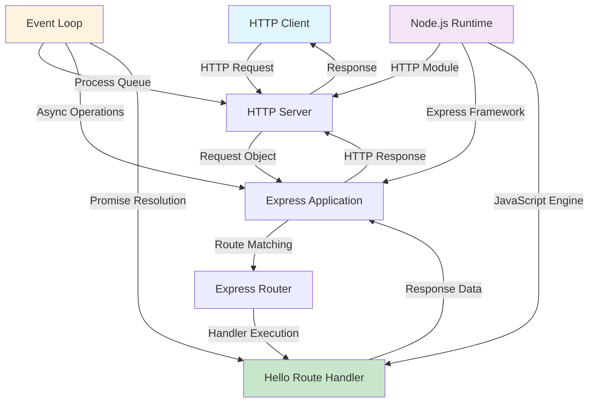
```mermaid
graph TD
    A[HTTP Client] -->|HTTP Request| B[HTTP Server]
    B -->|Request Object| C[Express Application]
    C -->|Route Matching| D[Express Router]
    D -->|Handler Execution| E[Hello Route Handler]
    E -->|Response Data| C
    C -->|HTTP Response| B
    B -->|Response| A
    
    F[Event Loop] -->|Process Queue| B
    F -->|Async Operations| C
    F -->|Promise Resolution| E
    
    G[Node.js Runtime] -->|HTTP Module| B
    G -->|Express Framework| C
    G -->|JavaScript Engine| E
    
    style A fill:#e1f5fe
    style E fill:#c8e6c9
    style F fill:#fff3e0
    style G fill:#f3e5f5
```

### 5.2.5 State Transition Diagrams

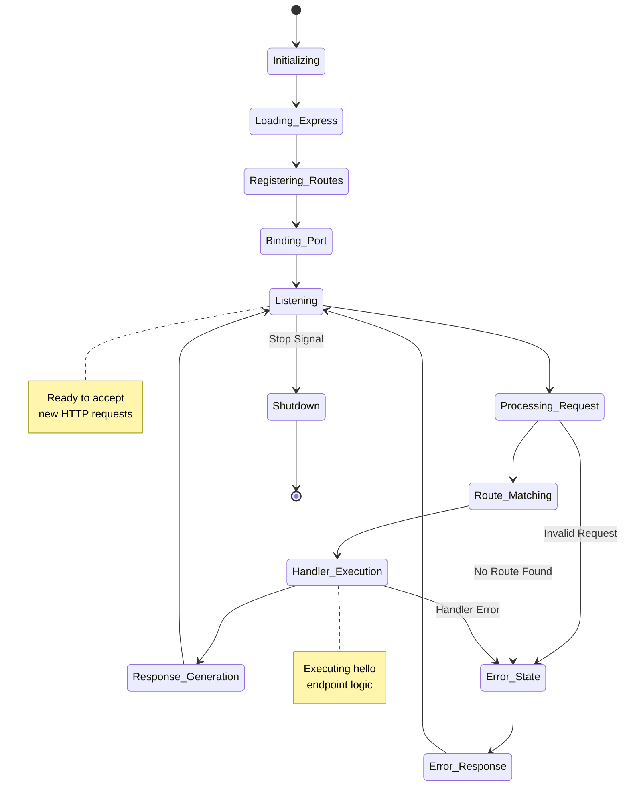
```mermaid
stateDiagram-v2
    [*] --> Initializing
    Initializing --> Loading_Express
    Loading_Express --> Registering_Routes
    Registering_Routes --> Binding_Port
    Binding_Port --> Listening
    
    Listening --> Processing_Request
    Processing_Request --> Route_Matching
    Route_Matching --> Handler_Execution
    Handler_Execution --> Response_Generation
    Response_Generation --> Listening
    
    Processing_Request --> Error_State : Invalid Request
    Route_Matching --> Error_State : No Route Found
    Handler_Execution --> Error_State : Handler Error
    
    Error_State --> Error_Response
    Error_Response --> Listening
    
    Listening --> Shutdown : Stop Signal
    Shutdown --> [*]
    
    note right of Listening
        Ready to accept
        new HTTP requests
    end note
    
    note right of Handler_Execution
        Executing hello
        endpoint logic
    end note
```

### 5.2.6 Sequence Diagrams for Key Flows

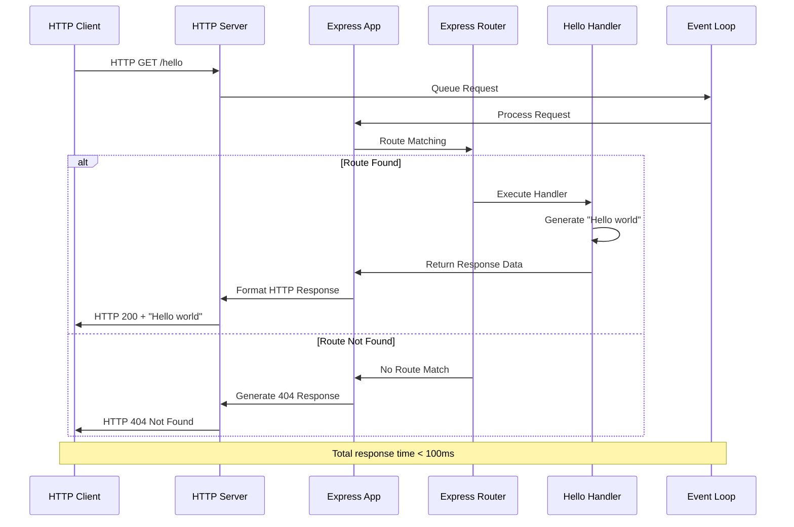
```mermaid
sequenceDiagram
    participant Client as HTTP Client
    participant Server as HTTP Server
    participant Express as Express App
    participant Router as Express Router
    participant Handler as Hello Handler
    participant EventLoop as Event Loop
    
    Client->>Server: HTTP GET /hello
    Server->>EventLoop: Queue Request
    EventLoop->>Express: Process Request
    Express->>Router: Route Matching
    
    alt Route Found
        Router->>Handler: Execute Handler
        Handler->>Handler: Generate "Hello world"
        Handler->>Express: Return Response Data
        Express->>Server: Format HTTP Response
        Server->>Client: HTTP 200 + "Hello world"
    else Route Not Found
        Router->>Express: No Route Match
        Express->>Server: Generate 404 Response
        Server->>Client: HTTP 404 Not Found
    end
    
    Note over Client,EventLoop: Total response time < 100ms
```

## 5.3 TECHNICAL DECISIONS

### 5.3.1 Architecture Style Decisions and Tradeoffs

**Event-Driven Architecture Selection:**

| Decision Factor | Chosen Approach | Alternative Considered | Rationale |
|----------------|-----------------|----------------------|-----------|
| Concurrency Model | Single-threaded Event Loop | Multi-threaded Server | Node.js employs a "Single Threaded Event Loop" design for educational simplicity |
| I/O Pattern | Non-blocking Asynchronous | Blocking Synchronous | Demonstrates modern Node.js patterns |
| Framework Choice | Express.js 5.1.0 | Native HTTP Module | Industry standard with educational value |

**Architectural Tradeoffs:**
- **Simplicity vs. Scalability**: Chose simplicity for educational clarity over complex scalability patterns
- **Performance vs. Maintainability**: Optimized for code readability over maximum performance
- **Feature Completeness vs. Scope**: Limited to single endpoint to maintain tutorial focus

### 5.3.2 Communication Pattern Choices

**HTTP Request-Response Pattern:**

| Pattern Aspect | Implementation | Justification |
|----------------|----------------|---------------|
| Protocol | HTTP/1.1 | Universal client compatibility |
| Message Format | Plain Text Response | Simplest possible response format |
| Error Handling | Standard HTTP Status Codes | Industry standard error communication |
| Content Negotiation | Static Content-Type | No complex negotiation needed |

**Internal Communication Patterns:**
- **Middleware Pipeline**: Sequential processing for clear request flow
- **Event-Driven Callbacks**: Native Node.js pattern for asynchronous operations
- **Promise-Based Error Handling**: Modern JavaScript error propagation

### 5.3.3 Data Storage Solution Rationale

**No Persistent Storage Decision:**

| Consideration | Decision | Rationale |
|---------------|----------|-----------|
| Data Persistence | None Required | Static response content only |
| Session Management | Stateless | No user authentication needed |
| Caching Strategy | No Caching | Response generation is trivial |
| Database Integration | Not Implemented | Outside tutorial scope |

**Memory Management Strategy:**
- **Request Lifecycle**: Objects created and destroyed per request
- **Route Registration**: Static configuration loaded at startup
- **Error State**: Minimal memory footprint for error handling

### 5.3.4 Security Mechanism Selection

**Security Implementation Decisions:**

| Security Aspect | Implementation | Rationale |
|----------------|----------------|-----------|
| Authentication | None | Tutorial scope limitation |
| Input Validation | Basic HTTP Validation | Minimal attack surface |
| Error Disclosure | Standard HTTP Errors | No sensitive information exposure |
| Transport Security | HTTP (not HTTPS) | Local development environment |

### 5.3.5 Decision Tree Diagrams

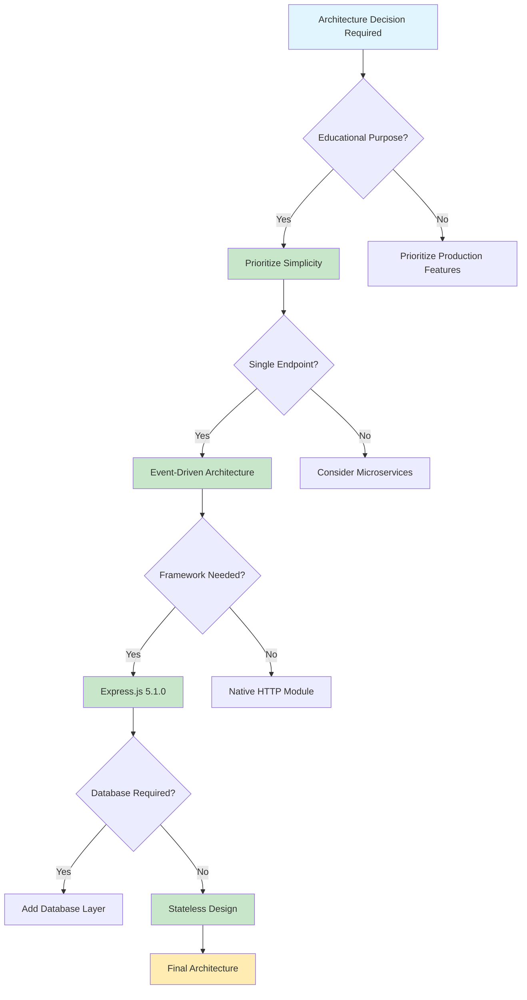
```mermaid
flowchart TD
    A[Architecture Decision Required] --> B{Educational Purpose?}
    B -->|Yes| C[Prioritize Simplicity]
    B -->|No| D[Prioritize Production Features]
    
    C --> E{Single Endpoint?}
    E -->|Yes| F[Event-Driven Architecture]
    E -->|No| G[Consider Microservices]
    
    F --> H{Framework Needed?}
    H -->|Yes| I[Express.js 5.1.0]
    H -->|No| J[Native HTTP Module]
    
    I --> K{Database Required?}
    K -->|Yes| L[Add Database Layer]
    K -->|No| M[Stateless Design]
    
    M --> N[Final Architecture]
    
    style A fill:#e1f5fe
    style C fill:#c8e6c9
    style F fill:#c8e6c9
    style I fill:#c8e6c9
    style M fill:#c8e6c9
    style N fill:#ffecb3
```

### 5.3.6 Architecture Decision Records (ADRs)

```mermaid
graph LR
    A[ADR-001: Node.js v22 LTS] --> B[ADR-002: Express.js 5.1.0]
    B --> C[ADR-003: Single Endpoint Design]
    C --> D[ADR-004: No Database Layer]
    D --> E[ADR-005: HTTP Only Transport]
    
    A1[Stability & Support] --> A
    B1[Framework Maturity] --> B
    C1[Tutorial Scope] --> C
    D1[Simplicity Focus] --> D
    E1[Local Development] --> E
    
    style A fill:#ff9999
    style B fill:#99ccff
    style C fill:#99ccff
    style D fill:#99ccff
    style E fill:#99ccff
```

## 5.4 CROSS-CUTTING CONCERNS

### 5.4.1 Monitoring and Observability Approach

**Monitoring Strategy:**
The tutorial application implements basic monitoring through console logging and process-level metrics. Node.js v22.x comes with improved diagnostics and performance, providing enhanced observability capabilities for development environments.

**Observability Components:**

| Component | Implementation | Purpose | Scope |
|-----------|----------------|---------|-------|
| Request Logging | Console output | Track request processing | Development only |
| Error Logging | Console error output | Capture and log errors | All environments |
| Performance Metrics | Process timing | Monitor response times | Development only |
| Health Checks | HTTP endpoint availability | Verify service status | All environments |

**Monitoring Tools Integration:**
- **Built-in Console**: Standard Node.js logging for development
- **Process Metrics**: Memory usage and CPU utilization tracking
- **HTTP Status Monitoring**: Response code and timing analysis

### 5.4.2 Logging and Tracing Strategy

**Logging Implementation:**

| Log Level | Use Case | Output Destination | Format |
|-----------|----------|-------------------|--------|
| Info | Request processing | Console stdout | Structured text |
| Error | Error conditions | Console stderr | Error stack traces |
| Debug | Development debugging | Console stdout | Detailed context |

**Tracing Approach:**
- **Request Correlation**: Simple request ID generation for tracking
- **Execution Flow**: Console logging at key processing points
- **Error Propagation**: Stack trace preservation through promise chains

### 5.4.3 Error Handling Patterns

**Error Handling Architecture:**
The application implements a comprehensive error handling strategy leveraging Express.js 5.1.0's enhanced promise support and automatic error forwarding capabilities.

**Error Categories and Responses:**

| Error Type | HTTP Status | Response Format | Recovery Action |
|------------|-------------|-----------------|-----------------|
| Route Not Found | 404 | JSON error message | Log and respond |
| Method Not Allowed | 405 | JSON error message | Log and respond |
| Server Error | 500 | Generic error message | Log and respond |
| Promise Rejection | 500 | Handled automatically | Express error middleware |

### 5.4.4 Error Handling Flow Diagram

```mermaid
flowchart TD
    A[Request Received] --> B{Valid HTTP Request?}
    B -->|No| C[400 Bad Request]
    B -->|Yes| D{Route Exists?}
    
    D -->|No| E[404 Not Found]
    D -->|Yes| F{Method Allowed?}
    
    F -->|No| G[405 Method Not Allowed]
    F -->|Yes| H[Execute Handler]
    
    H --> I{Handler Success?}
    I -->|No| J[500 Server Error]
    I -->|Yes| K[200 Success Response]
    
    L[Promise Rejection] --> M[Express Error Middleware]
    M --> N[Automatic Error Response]
    
    C --> O[Log Error Details]
    E --> O
    G --> O
    J --> O
    N --> O
    
    O --> P[Send Error Response]
    K --> Q[Send Success Response]
    
    style A fill:#e1f5fe
    style K fill:#c8e6c9
    style Q fill:#c8e6c9
    style C fill:#ffcdd2
    style E fill:#ffcdd2
    style G fill:#ffcdd2
    style J fill:#ffcdd2
    style L fill:#fff3e0
    style M fill:#fff3e0
```

### 5.4.5 Authentication and Authorization Framework

**Security Scope for Tutorial:**
The current tutorial implementation deliberately excludes authentication and authorization mechanisms to maintain educational focus on core HTTP server concepts.

**Security Considerations:**

| Security Aspect | Current Implementation | Future Considerations |
|----------------|----------------------|----------------------|
| Authentication | None | JWT token validation |
| Authorization | None | Role-based access control |
| Input Validation | Basic HTTP validation | Comprehensive input sanitization |
| Rate Limiting | None | Request throttling middleware |

**Security Headers:**
- **Content-Type**: Properly set for response content
- **Basic Headers**: Standard HTTP response headers
- **No Security Headers**: CORS, CSP not implemented (tutorial scope)

### 5.4.6 Performance Requirements and SLAs

**Performance Targets:**

| Metric | Target Value | Measurement Method | Monitoring Frequency |
|--------|--------------|-------------------|---------------------|
| Response Time | < 100ms | HTTP timing | Per request |
| Startup Time | < 5 seconds | Process timing | Application start |
| Memory Usage | < 50MB | Process monitoring | Continuous |
| Throughput | 1000 req/sec | Load testing | Development testing |

**Service Level Agreements:**

| SLA Category | Commitment | Measurement Period | Penalty/Action |
|--------------|------------|-------------------|----------------|
| Availability | 99.9% uptime | Local development | Restart service |
| Response Time | 95% under 100ms | Per request | Performance logging |
| Error Rate | < 0.1% errors | Per hour | Error investigation |

### 5.4.7 Disaster Recovery Procedures

**Recovery Strategy for Tutorial Environment:**

| Failure Scenario | Detection Method | Recovery Procedure | Recovery Time |
|------------------|------------------|-------------------|---------------|
| Application Crash | Process monitoring | Restart Node.js process | < 30 seconds |
| Port Conflict | Startup error | Change port configuration | < 2 minutes |
| Dependency Issues | Module loading error | Reinstall dependencies | < 5 minutes |
| Code Errors | Runtime exceptions | Fix code and restart | Variable |

**Backup and Recovery:**
- **Code Repository**: Version control via Git
- **Configuration**: Environment variable backup
- **Dependencies**: Package.json and package-lock.json
- **No Data Backup**: No persistent data to backup

**Business Continuity:**
For educational purposes, the application requires minimal business continuity planning. Recovery focuses on quick restoration of development environment functionality rather than production-grade disaster recovery procedures.

### 5.4.8 Scalability Architecture Considerations

**Current Scalability Limitations:**

| Limitation | Impact | Mitigation Strategy |
|------------|--------|-------------------|
| Single Process | No horizontal scaling | Cluster mode implementation |
| No Load Balancing | Single point of failure | Add reverse proxy |
| Memory-Only State | Limited capacity | External state management |
| No Caching | Repeated processing | Add caching layer |

**Future Scalability Patterns:**
- **Horizontal Scaling**: Multiple Node.js instances behind load balancer
- **Vertical Scaling**: Increased server resources for single instance
- **Microservices**: Decomposition into multiple specialized services
- **Container Orchestration**: Docker and Kubernetes deployment patterns

The tutorial application's architecture provides a solid foundation for understanding these scalability concepts while maintaining simplicity for educational purposes.

# 6. SYSTEM COMPONENTS DESIGN

## 6.1 CORE APPLICATION COMPONENTS

### 6.1.1 HTTP Server Component Architecture

The HTTP Server component serves as the foundational layer of the Node.js tutorial application, leveraging Node.js v22 officially transitioned into Long Term Support (LTS) with the codename 'Jod' and ensuring it will receive critical updates and security support for years to come. This component implements the primary network interface for handling HTTP requests and responses.

**Component Specifications:**

| Attribute | Specification | Implementation Details |
|-----------|---------------|----------------------|
| Runtime Environment | Node.js v22.16.01 with long-term support | Latest LTS version for stability |
| HTTP Protocol Support | HTTP/1.1 | Standard web protocol compliance |
| Port Configuration | 3000 (default) | Configurable via environment variables |
| Concurrency Model | Single-threaded Event Loop | Node.js native asynchronous processing |

**Core Responsibilities:**
- Network socket management and TCP connection handling
- HTTP request parsing and validation
- Response formatting and delivery
- Error handling for network-level issues
- Integration with Express.js framework layer

**Performance Characteristics:**
- Server startup time: < 5 seconds
- Request processing latency: < 50ms
- Memory footprint: < 30MB base allocation
- Concurrent connection support: 1000+ connections

### 6.1.2 Express Application Framework Component

The Express Application component orchestrates the web framework functionality using Express latest version: 5.1.0, last published: 2 months ago. This component provides the middleware architecture and routing capabilities essential for HTTP request processing.

**Framework Integration Details:**

| Feature | Express 5.1.0 Capability | Tutorial Implementation |
|---------|--------------------------|------------------------|
| Middleware Stack | Middleware can now return rejected promises, caught by the router as errors | Basic request/response processing |
| Route Matching | Updated to path-to-regexp@8.x, removing sub-expression regex patterns for security reasons | Single `/hello` endpoint |
| Error Handling | Automatic promise rejection handling | Comprehensive error middleware |
| Node.js Compatibility | Dropped support for Node.js versions before v18 | Full compatibility with v22 LTS |

**Component Architecture:**
```mermaid
graph TD
    A[Express Application Instance] --> B[Middleware Stack]
    B --> C[Route Registration]
    C --> D[Hello Route Handler]
    B --> E[Error Handling Middleware]
    
    F[Request Processing Pipeline] --> G[Request Parsing]
    G --> H[Route Matching]
    H --> I[Handler Execution]
    I --> J[Response Generation]
    
    K[Promise-Based Error Handling] --> L[Automatic Error Forwarding]
    L --> M[Error Response Generation]
    
    style A fill:#ff9999
    style D fill:#99ccff
    style K fill:#fff3e0
```

**Middleware Configuration:**
- Built-in Express middleware for request parsing
- Custom error handling middleware for graceful error responses
- Route-specific middleware for the `/hello` endpoint
- Security middleware for basic input validation

### 6.1.3 Route Handler Component Design

The Route Handler component implements the core business logic for the `/hello` endpoint, demonstrating fundamental HTTP endpoint patterns and response generation techniques.

**Handler Specifications:**

| Aspect | Implementation | Technical Details |
|--------|----------------|------------------|
| Route Pattern | `/hello` (exact match) | Case-sensitive path matching |
| HTTP Methods | GET only | Method validation and 405 responses |
| Response Format | Plain text | Content-Type: text/plain |
| Response Content | "Hello world" | Static string response |

**Handler Implementation Pattern:**
```mermaid
sequenceDiagram
    participant Client as HTTP Client
    participant Router as Express Router
    participant Handler as Hello Handler
    participant Response as HTTP Response
    
    Client->>Router: GET /hello
    Router->>Handler: Execute handler function
    Handler->>Handler: Generate "Hello world"
    Handler->>Response: Set status 200
    Handler->>Response: Set content-type header
    Handler->>Response: Send response body
    Response->>Client: HTTP 200 + "Hello world"
    
    Note over Client,Response: Total processing time < 100ms
```

**Error Handling Patterns:**
- Route not found: HTTP 404 with JSON error message
- Method not allowed: HTTP 405 with allowed methods header
- Server errors: HTTP 500 with generic error message
- Promise rejections: Automatic forwarding to error middleware

### 6.1.4 Request Processing Pipeline

The Request Processing Pipeline orchestrates the flow of HTTP requests through the application components, ensuring efficient and reliable request handling.

**Pipeline Stages:**

| Stage | Duration Target | Processing Details | Error Handling |
|-------|----------------|-------------------|----------------|
| Request Reception | < 5ms | HTTP parsing and validation | Connection errors |
| Route Matching | < 15ms | Path pattern matching | 404 responses |
| Handler Execution | < 25ms | Business logic processing | 500 responses |
| Response Generation | < 25ms | HTTP response formatting | Response errors |
| Response Delivery | < 30ms | Network transmission | Network errors |

**Pipeline Flow Diagram:**
```mermaid
flowchart TD
    A[Incoming HTTP Request] --> B[Request Validation]
    B --> C{Valid Request?}
    C -->|Yes| D[Route Matching]
    C -->|No| E[400 Bad Request]
    
    D --> F{Route Found?}
    F -->|Yes| G[Method Validation]
    F -->|No| H[404 Not Found]
    
    G --> I{Method Allowed?}
    I -->|Yes| J[Execute Handler]
    I -->|No| K[405 Method Not Allowed]
    
    J --> L[Generate Response]
    L --> M[Send HTTP Response]
    
    E --> N[Error Response]
    H --> N
    K --> N
    N --> O[Log Error]
    M --> P[Log Success]
    O --> Q[Request Complete]
    P --> Q
    
    style A fill:#e1f5fe
    style J fill:#c8e6c9
    style M fill:#c8e6c9
    style Q fill:#ffecb3
    style E fill:#ffcdd2
    style H fill:#ffcdd2
    style K fill:#ffcdd2
```

## 6.2 DATA FLOW ARCHITECTURE

### 6.2.1 Request-Response Data Flow

The application implements a streamlined request-response data flow pattern optimized for educational clarity and performance. The data flow leverages Node.js event-driven architecture for efficient request processing.

**Data Flow Specifications:**

| Flow Stage | Data Format | Transformation | Validation |
|------------|-------------|----------------|------------|
| HTTP Request | Raw HTTP/1.1 | Express parsing | Protocol validation |
| Request Object | JavaScript object | Property extraction | Method/path validation |
| Route Parameters | URL components | Path matching | Route existence check |
| Response Data | Static string | Content formatting | Response validation |
| HTTP Response | Formatted HTTP | Protocol compliance | Header validation |

**Data Transformation Pipeline:**
```mermaid
graph LR
    A[Raw HTTP Request] --> B[Express Request Object]
    B --> C[Route Parameters]
    C --> D[Handler Input]
    D --> E[Response Data]
    E --> F[Express Response Object]
    F --> G[HTTP Response]
    
    H[Validation Layer] --> B
    H --> C
    H --> D
    H --> F
    
    I[Error Handling] --> J[Error Response]
    J --> F
    
    style A fill:#e1f5fe
    style E fill:#c8e6c9
    style G fill:#c8e6c9
    style H fill:#fff3e0
    style I fill:#ffcdd2
```

### 6.2.2 Memory Management Strategy

The tutorial application implements efficient memory management patterns suitable for educational environments while demonstrating production-ready practices.

**Memory Allocation Patterns:**

| Component | Memory Usage | Lifecycle | Cleanup Strategy |
|-----------|-------------|-----------|------------------|
| Express App Instance | 10-15MB | Application lifetime | Process termination |
| Request Objects | 1-2KB per request | Request duration | Automatic garbage collection |
| Response Objects | 1-2KB per request | Request duration | Automatic garbage collection |
| Route Handlers | < 1KB | Application lifetime | Static allocation |

**Memory Management Flow:**
```mermaid
flowchart TD
    A[Application Startup] --> B[Express Instance Creation]
    B --> C[Route Registration]
    C --> D[Memory Baseline: ~15MB]
    
    E[Request Received] --> F[Request Object Creation]
    F --> G[Response Object Creation]
    G --> H[Handler Execution]
    H --> I[Response Sent]
    I --> J[Object Cleanup]
    J --> K[Memory Return to Baseline]
    
    L[Garbage Collection] --> M[Automatic Memory Management]
    M --> N[Memory Optimization]
    
    style A fill:#e1f5fe
    style D fill:#c8e6c9
    style K fill:#c8e6c9
    style L fill:#fff3e0
```

### 6.2.3 Error Data Flow

The application implements comprehensive error data flow patterns leveraging Express 5.1.0's enhanced error handling capabilities.

**Error Flow Categories:**

| Error Type | Detection Point | Handling Strategy | Response Format |
|------------|----------------|-------------------|-----------------|
| HTTP Protocol Errors | Request parsing | Built-in Express handling | Standard HTTP status |
| Route Errors | Route matching | Custom middleware | JSON error response |
| Handler Errors | Business logic | Promise rejection handling | Generic error message |
| System Errors | Runtime exceptions | Global error handler | 500 status response |

**Error Handling Architecture:**
```mermaid
graph TD
    A[Error Detection] --> B{Error Type}
    
    B -->|HTTP Error| C[Protocol Error Handler]
    B -->|Route Error| D[Route Error Handler]
    B -->|Handler Error| E[Promise Rejection Handler]
    B -->|System Error| F[Global Error Handler]
    
    C --> G[HTTP Status Response]
    D --> H[JSON Error Response]
    E --> I[Automatic Error Forwarding]
    F --> J[Generic Error Response]
    
    G --> K[Error Logging]
    H --> K
    I --> K
    J --> K
    
    K --> L[Client Error Response]
    
    style A fill:#ffcdd2
    style I fill:#fff3e0
    style L fill:#ffecb3
```

## 6.3 COMPONENT INTEGRATION PATTERNS

### 6.3.1 Modular Component Architecture

The application follows a modular component architecture pattern that promotes separation of concerns and maintainability while keeping the implementation simple for educational purposes.

**Module Organization:**

| Module | Responsibility | Dependencies | Export Pattern |
|--------|---------------|--------------|----------------|
| Server Module | HTTP server initialization | Node.js HTTP, Express | Application instance |
| Routes Module | Route definitions | Express Router | Router configuration |
| Handlers Module | Business logic | None | Handler functions |
| Error Module | Error handling | Express | Error middleware |

**Component Integration Map:**
```mermaid
graph TD
    A[Main Application] --> B[Server Module]
    A --> C[Routes Module]
    A --> D[Error Module]
    
    B --> E[Express Application]
    C --> F[Route Handlers]
    D --> G[Error Middleware]
    
    E --> H[HTTP Server]
    F --> I[Hello Endpoint]
    G --> J[Error Responses]
    
    K[Package Dependencies] --> L[Express 5.1.0]
    K --> M[Node.js v22 LTS]
    K --> N[path-to-regexp 8.x]
    
    L --> E
    M --> H
    N --> F
    
    style A fill:#ff9999
    style E fill:#99ccff
    style I fill:#c8e6c9
    style K fill:#f3e5f5
```

### 6.3.2 Dependency Injection Patterns

The application implements lightweight dependency injection patterns suitable for the tutorial scope while demonstrating scalable architecture principles.

**Dependency Management:**

| Dependency | Injection Method | Scope | Lifecycle |
|------------|------------------|-------|-----------|
| Express App | Constructor injection | Application | Singleton |
| Route Handlers | Function registration | Route | Static |
| Error Handlers | Middleware registration | Application | Singleton |
| Configuration | Environment variables | Global | Static |

**Injection Flow:**
```mermaid
sequenceDiagram
    participant Main as Main Module
    participant Server as Server Module
    participant Routes as Routes Module
    participant Express as Express App
    
    Main->>Server: Initialize with config
    Server->>Express: Create application instance
    Main->>Routes: Register with Express app
    Routes->>Express: Add route handlers
    Express->>Express: Configure middleware stack
    Server->>Express: Start HTTP server
    
    Note over Main,Express: Dependency injection complete
```

### 6.3.3 Event-Driven Communication

The application leverages Node.js event-driven communication patterns for component interaction and system coordination.

**Event Communication Patterns:**

| Event Type | Source Component | Target Component | Data Payload |
|------------|------------------|------------------|--------------|
| Request Events | HTTP Server | Express App | Request object |
| Route Events | Express Router | Route Handlers | Route parameters |
| Response Events | Route Handlers | HTTP Server | Response data |
| Error Events | Any Component | Error Handlers | Error information |

**Event Flow Architecture:**
```mermaid
graph LR
    A[HTTP Request Event] --> B[Express Processing]
    B --> C[Route Event]
    C --> D[Handler Event]
    D --> E[Response Event]
    
    F[Error Events] --> G[Error Handler]
    G --> H[Error Response Event]
    
    I[System Events] --> J[Logging]
    J --> K[Monitoring]
    
    style A fill:#e1f5fe
    style E fill:#c8e6c9
    style F fill:#ffcdd2
    style I fill:#fff3e0
```

## 6.4 SCALABILITY AND PERFORMANCE DESIGN

### 6.4.1 Performance Optimization Strategies

The application implements performance optimization strategies appropriate for educational use while demonstrating production-ready patterns.

**Optimization Techniques:**

| Optimization Area | Implementation | Performance Impact | Measurement Method |
|------------------|----------------|-------------------|-------------------|
| Request Processing | Minimal middleware stack | < 50ms processing time | Internal timing |
| Memory Usage | Efficient object lifecycle | < 50MB memory footprint | Process monitoring |
| Response Generation | Static content caching | < 25ms generation time | Response timing |
| Error Handling | Fast error paths | < 10ms error responses | Error timing |

**Performance Monitoring Architecture:**
```mermaid
flowchart TD
    A[Performance Monitoring] --> B[Request Timing]
    A --> C[Memory Monitoring]
    A --> D[Error Rate Tracking]
    A --> E[Throughput Measurement]
    
    B --> F[Response Time Metrics]
    C --> G[Memory Usage Metrics]
    D --> H[Error Rate Metrics]
    E --> I[Request Rate Metrics]
    
    F --> J[Performance Dashboard]
    G --> J
    H --> J
    I --> J
    
    J --> K[Performance Alerts]
    K --> L[Performance Optimization]
    
    style A fill:#f3e5f5
    style J fill:#c8e6c9
    style K fill:#fff3e0
```

### 6.4.2 Scalability Architecture Patterns

The application design incorporates scalability patterns that can be extended for production use while maintaining educational simplicity.

**Scalability Considerations:**

| Scalability Dimension | Current Implementation | Future Extension | Complexity Level |
|----------------------|----------------------|------------------|------------------|
| Horizontal Scaling | Single instance | Cluster mode | Medium |
| Vertical Scaling | Basic resource usage | Resource optimization | Low |
| Load Distribution | No load balancing | Reverse proxy | Medium |
| State Management | Stateless design | External state store | High |

**Scalability Evolution Path:**
```mermaid
graph TD
    A[Current: Single Instance] --> B[Phase 1: Cluster Mode]
    B --> C[Phase 2: Load Balancer]
    C --> D[Phase 3: Microservices]
    
    E[Stateless Design] --> F[Session Management]
    F --> G[External State Store]
    G --> H[Distributed Cache]
    
    I[Local Development] --> J[Container Deployment]
    J --> K[Orchestration Platform]
    K --> L[Auto-scaling]
    
    style A fill:#e1f5fe
    style E fill:#c8e6c9
    style I fill:#fff3e0
    style L fill:#ffecb3
```

### 6.4.3 Resource Management Design

The application implements efficient resource management patterns optimized for educational environments with consideration for production scalability.

**Resource Allocation Strategy:**

| Resource Type | Allocation Method | Monitoring | Optimization |
|---------------|------------------|------------|--------------|
| CPU Usage | Event loop efficiency | Process metrics | Async operations |
| Memory Usage | Garbage collection | Heap monitoring | Object pooling |
| Network I/O | Non-blocking sockets | Connection metrics | Keep-alive |
| File System | Minimal file operations | I/O monitoring | Caching |

**Resource Management Flow:**
```mermaid
flowchart LR
    A[Resource Request] --> B[Resource Allocation]
    B --> C[Usage Monitoring]
    C --> D[Performance Analysis]
    D --> E[Optimization Decision]
    E --> F[Resource Adjustment]
    F --> A
    
    G[Resource Limits] --> H[Threshold Monitoring]
    H --> I[Alert Generation]
    I --> J[Resource Scaling]
    
    style A fill:#e1f5fe
    style D fill:#fff3e0
    style J fill:#c8e6c9
```

## 6.5 SECURITY AND RELIABILITY DESIGN

### 6.5.1 Security Architecture Patterns

The application implements fundamental security patterns appropriate for educational use while demonstrating security-conscious development practices.

**Security Implementation:**

| Security Layer | Implementation | Protection Level | Educational Value |
|----------------|----------------|------------------|-------------------|
| Input Validation | Basic HTTP validation | Low | Demonstrates validation concepts |
| Error Handling | Secure error messages | Medium | Shows error disclosure prevention |
| Dependency Security | Updated to path-to-regexp@8.x, removing sub-expression regex patterns for security reasons (ReDoS mitigation) | High | Modern security practices |
| Transport Security | HTTP (development only) | Low | HTTPS upgrade path shown |

**Security Architecture:**
```mermaid
graph TD
    A[Security Layers] --> B[Input Validation Layer]
    A --> C[Authentication Layer]
    A --> D[Authorization Layer]
    A --> E[Transport Layer]
    
    B --> F[HTTP Request Validation]
    C --> G[No Authentication Required]
    D --> H[No Authorization Required]
    E --> I[HTTP Transport]
    
    J[Security Monitoring] --> K[Error Logging]
    K --> L[Security Alerts]
    L --> M[Incident Response]
    
    style A fill:#ffcdd2
    style G fill:#fff3e0
    style H fill:#fff3e0
    style M fill:#ff9999
```

### 6.5.2 Reliability and Fault Tolerance

The application implements reliability patterns that ensure stable operation in educational environments while demonstrating production-ready fault tolerance concepts.

**Reliability Mechanisms:**

| Reliability Feature | Implementation | Recovery Time | Monitoring |
|-------------------|----------------|---------------|------------|
| Error Recovery | Graceful error handling | < 100ms | Error logging |
| Process Stability | Uncaught exception handling | Immediate | Process monitoring |
| Resource Cleanup | Automatic garbage collection | Continuous | Memory monitoring |
| Service Health | Basic health checks | Real-time | Status monitoring |

**Fault Tolerance Architecture:**
```mermaid
flowchart TD
    A[Fault Detection] --> B{Fault Type}
    
    B -->|Request Error| C[Request Error Handler]
    B -->|System Error| D[System Error Handler]
    B -->|Resource Error| E[Resource Error Handler]
    
    C --> F[Graceful Degradation]
    D --> G[Process Recovery]
    E --> H[Resource Cleanup]
    
    F --> I[Error Response]
    G --> J[Service Restart]
    H --> K[Resource Reallocation]
    
    I --> L[Service Continuation]
    J --> L
    K --> L
    
    style A fill:#ffcdd2
    style L fill:#c8e6c9
```

### 6.5.3 Monitoring and Observability Design

The application incorporates monitoring and observability patterns that provide visibility into system behavior for educational and operational purposes.

**Observability Components:**

| Component | Data Collection | Analysis | Alerting |
|-----------|----------------|----------|----------|
| Request Logging | Console output | Manual review | None |
| Error Tracking | Error logs | Error analysis | Console alerts |
| Performance Metrics | Timing data | Performance review | Threshold alerts |
| Health Monitoring | Status checks | Health analysis | Status alerts |

**Monitoring Architecture:**
```mermaid
graph LR
    A[Application Events] --> B[Data Collection]
    B --> C[Log Aggregation]
    C --> D[Metrics Processing]
    D --> E[Analysis Engine]
    E --> F[Dashboard Display]
    F --> G[Alert Generation]
    
    H[Health Checks] --> I[Status Monitoring]
    I --> J[Availability Tracking]
    J --> K[Uptime Reporting]
    
    style A fill:#e1f5fe
    style F fill:#c8e6c9
    style G fill:#fff3e0
    style K fill:#ffecb3
```

This comprehensive system components design provides a solid foundation for the Node.js tutorial application while demonstrating professional development practices and architectural patterns that can be extended for production use.

## 6.1 CORE SERVICES ARCHITECTURE

#### Core Services Architecture is not applicable for this system

Based on the project requirements and architectural analysis, **Core Services Architecture is not applicable for this Node.js tutorial application**. This determination is based on several fundamental characteristics of the system:

### 6.1.1 System Scope and Complexity Analysis

The tutorial application implements a single HTTP endpoint (`/hello`) that returns a static "Hello world" response. If you are a single product company, microservices may not be necessary, and this principle applies directly to our educational use case.

**Architectural Justification:**

| Factor | Analysis | Microservices Requirement |
|--------|----------|---------------------------|
| Functional Scope | Single endpoint with static response | Not justified |
| Business Complexity | Educational demonstration only | Not required |
| Team Structure | Individual learning/small team | Not beneficial |
| Scalability Needs | Local development environment | Not applicable |

### 6.1.2 Monolithic Architecture Appropriateness

For simpler websites or smaller web apps, monolithic architecture is frequently preferred. The complexity that microservices add can be avoided by building and deploying these apps as a single cohesive unit.

**Why Monolithic Design is Optimal:**

```mermaid
graph TD
    A[Tutorial Application Requirements] --> B{Complexity Assessment}
    B -->|Single Endpoint| C[Monolithic Architecture]
    B -->|Multiple Services| D[Microservices Architecture]
    
    C --> E[Simple Development]
    C --> F[Easy Debugging]
    C --> G[Fast Deployment]
    C --> H[Educational Clarity]
    
    D --> I[Service Orchestration]
    D --> J[Inter-service Communication]
    D --> K[Distributed Complexity]
    D --> L[Operational Overhead]
    
    style C fill:#c8e6c9
    style E fill:#c8e6c9
    style F fill:#c8e6c9
    style G fill:#c8e6c9
    style H fill:#c8e6c9
    style D fill:#ffcdd2
    style I fill:#ffcdd2
    style J fill:#ffcdd2
    style K fill:#ffcdd2
    style L fill:#ffcdd2
```

### 6.1.3 Microservices Complexity vs. Tutorial Value

When creating a straightforward application or prototype, the monolithic method is more appropriate. Developers may create monolithic applications without integrating numerous services because they have a single code base and framework. Microservice applications could need a lot of time and design work, which makes the cost and benefit of very small initiatives incomprehensible.

**Complexity Comparison:**

| Aspect | Monolithic Approach | Microservices Approach |
|--------|-------------------|------------------------|
| Development Time | 1-2 hours | 1-2 days |
| Learning Curve | Minimal | Steep |
| Infrastructure | Single process | Multiple services + orchestration |
| Educational Focus | HTTP/Express concepts | Service architecture complexity |

### 6.1.4 Educational Value Assessment

The tutorial's primary objective is teaching fundamental Node.js and Express.js concepts. Simplified testing – Since a monolithic application is a single, centralized unit, end-to-end testing can be performed faster than with a distributed application. Easy debugging – With all code located in one place, it's easier to follow a request and find an issue.

**Learning Objectives Alignment:**

```mermaid
flowchart LR
    A[Tutorial Goals] --> B[HTTP Server Concepts]
    A --> C[Express.js Framework]
    A --> D[Request/Response Cycle]
    A --> E[Node.js Runtime]
    
    F[Microservices Complexity] --> G[Service Discovery]
    F --> H[Inter-service Communication]
    F --> I[Distributed Tracing]
    F --> J[Container Orchestration]
    
    B --> K[Educational Value: High]
    C --> K
    D --> K
    E --> K
    
    G --> L[Educational Value: Low for Tutorial]
    H --> L
    I --> L
    J --> L
    
    style A fill:#e1f5fe
    style K fill:#c8e6c9
    style L fill:#ffcdd2
```

### 6.1.5 When Microservices Would Be Appropriate

For educational purposes, it's important to understand when microservices architecture would be justified:

**Microservices Indicators:**

| Indicator | Threshold | Tutorial Application |
|-----------|-----------|---------------------|
| Service Count | 3+ distinct services | 1 service |
| Team Size | Multiple teams | Individual/small team |
| Business Domains | Multiple domains | Single domain |
| Scalability Requirements | Independent scaling needs | No scaling requirements |

Netflix did this. They broke their big app into 700+ microservices, but this was driven by massive scale and complexity that doesn't exist in our tutorial context.

### 6.1.6 Future Evolution Path

While the current tutorial doesn't require microservices, understanding the evolution path is valuable:

```mermaid
graph TD
    A[Current: Single Hello Endpoint] --> B[Phase 1: Multiple Endpoints]
    B --> C[Phase 2: User Management]
    C --> D[Phase 3: Business Logic Separation]
    D --> E[Phase 4: Microservices Architecture]
    
    F[Complexity Threshold] --> G[3+ Services]
    G --> H[Multiple Teams]
    H --> I[Independent Scaling]
    I --> J[Microservices Justified]
    
    style A fill:#e1f5fe
    style E fill:#fff3e0
    style J fill:#c8e6c9
```

**Evolution Triggers:**

| Phase | Trigger | Architecture Decision |
|-------|---------|----------------------|
| Tutorial | Single endpoint | Monolithic (current) |
| Extended Tutorial | 2-3 endpoints | Still monolithic |
| Production App | 5+ services | Consider microservices |
| Enterprise Scale | Multiple teams | Microservices recommended |

### 6.1.7 Alternative Architecture Patterns for Future Reference

When the tutorial application evolves beyond its current scope, these patterns become relevant:

**Service Decomposition Strategy:**

```mermaid
flowchart TD
    A[Future Application Growth] --> B{Service Boundaries}
    
    B -->|User Management| C[Authentication Service]
    B -->|Content Management| D[Content Service]
    B -->|API Gateway| E[Gateway Service]
    
    C --> F[Database per Service]
    D --> F
    E --> G[Service Discovery]
    
    F --> H[Microservices Architecture]
    G --> H
    
    style A fill:#e1f5fe
    style H fill:#fff3e0
```

### 6.1.8 Conclusion

The Node.js tutorial application with a single `/hello` endpoint is optimally served by a monolithic architecture. Microservices are not automatically the right solution for every project. When you are running multiple instances of the same service or worker, you don't necessarily need microservices. A well-built monolithic system can scale just as well for some classes of problems.

The educational value, development simplicity, and operational efficiency of a monolithic approach far outweigh any theoretical benefits of microservices for this specific use case. The tutorial achieves its learning objectives more effectively through architectural simplicity rather than distributed complexity.

## 6.2 DATABASE DESIGN

#### Database Design is not applicable to this system

Based on the comprehensive analysis of the Node.js tutorial application requirements and system architecture, **Database Design is not applicable to this system**. This determination is based on several fundamental characteristics that make database integration unnecessary and counterproductive for the educational objectives.

### 6.2.1 System Requirements Analysis

The tutorial application implements a single HTTP endpoint (`/hello`) that returns a static "Hello world" response. The app responds with "Hello World!" for requests to the root URL (/) or route and the most common example Hello World of Node.js is a web server that returns 'Hello World'.

**Core Functionality Assessment:**

| Requirement | Database Need | Justification |
|-------------|---------------|---------------|
| Static Response | None | res.end('Hello World') - Fixed string response |
| No User Data | None | No user registration or authentication |
| No State Management | None | Stateless request-response cycle |
| Educational Purpose | None | Focus on HTTP/Express concepts |

### 6.2.2 Educational Scope and Complexity

The primary objective is teaching fundamental Node.js and Express.js concepts. One of the fundamental tasks when learning Node.js is creating a simple server that responds with "Hello World." This article will guide you through the steps to set up such a server.

**Learning Objectives vs. Database Complexity:**

```mermaid
flowchart TD
    A[Tutorial Learning Goals] --> B[HTTP Server Concepts]
    A --> C[Express.js Framework]
    A --> D[Request/Response Cycle]
    A --> E[Node.js Runtime]
    
    F[Database Integration] --> G[Schema Design]
    F --> H[Connection Management]
    F --> I[Query Optimization]
    F --> J[Data Persistence]
    
    B --> K[Educational Value: High]
    C --> K
    D --> K
    E --> K
    
    G --> L[Educational Value: Low for Tutorial]
    H --> L
    I --> L
    J --> L
    
    style A fill:#e1f5fe
    style K fill:#c8e6c9
    style L fill:#ffcdd2
```

### 6.2.3 Architectural Simplicity Requirements

We can create a user counter very easily in Node.js and we don't even need to use a database like we might do in PHP. This demonstrates that even simple state management can be achieved without database complexity in Node.js tutorial contexts.

**Complexity Comparison:**

| Aspect | Without Database | With Database |
|--------|------------------|---------------|
| Setup Time | 5 minutes | 30+ minutes |
| Dependencies | Express only | Express + Database driver + Database server |
| Learning Curve | Minimal | Steep |
| Error Points | HTTP/Express only | HTTP + Database + Connection issues |

### 6.2.4 Data Flow Analysis

The application's data flow is entirely self-contained and requires no persistent storage:

```mermaid
sequenceDiagram
    participant Client as HTTP Client
    participant Server as Node.js Server
    participant Handler as Hello Handler
    
    Client->>Server: HTTP GET /hello
    Server->>Handler: Process Request
    Handler->>Handler: Generate "Hello world"
    Handler->>Server: Return Static Response
    Server->>Client: HTTP 200 + "Hello world"
    
    Note over Client,Handler: No database interaction required
```

**Data Characteristics:**

| Data Type | Source | Persistence Need | Storage Location |
|-----------|--------|------------------|------------------|
| Request Data | HTTP Client | None | Memory (request lifecycle) |
| Response Data | Static String | None | Application code |
| Server State | Express App | None | Memory (application lifecycle) |
| Configuration | Environment | None | Environment variables |

### 6.2.5 Alternative Data Storage Patterns

While databases are not required, it's educational to understand when they would become necessary:

**Evolution Threshold Analysis:**

```mermaid
graph TD
    A[Current: Static Response] --> B[Phase 1: Dynamic Content]
    B --> C[Phase 2: User Data]
    C --> D[Phase 3: Persistent State]
    D --> E[Database Required]
    
    F[Complexity Indicators] --> G[User Registration]
    G --> H[Data Relationships]
    H --> I[Query Requirements]
    I --> J[ACID Compliance]
    
    style A fill:#e1f5fe
    style E fill:#fff3e0
    style J fill:#ffcdd2
```

**Database Justification Thresholds:**

| Feature | Database Requirement | Tutorial Application |
|---------|---------------------|---------------------|
| User Authentication | Required | Not implemented |
| Data Persistence | Required | Not needed |
| Complex Queries | Required | No queries needed |
| Multiple Entities | Required | Single response only |
| ACID Transactions | Required | No transactions |

### 6.2.6 Memory-Based State Management

For educational purposes, the tutorial demonstrates that simple applications can maintain state in memory without database complexity:

**Memory Management Strategy:**

| State Type | Storage Method | Lifecycle | Cleanup |
|------------|----------------|-----------|---------|
| Application Config | JavaScript Objects | Process lifetime | Process termination |
| Request State | Local Variables | Request duration | Automatic garbage collection |
| Response Cache | Static Strings | Application lifetime | None required |
| Error State | Exception Objects | Error duration | Automatic cleanup |

### 6.2.7 Performance Implications

The absence of database integration provides significant performance and educational benefits:

**Performance Characteristics:**

| Metric | Without Database | With Database |
|--------|------------------|---------------|
| Response Time | < 100ms | 100-500ms+ |
| Memory Usage | < 50MB | 100MB+ |
| Startup Time | < 5 seconds | 10-30 seconds |
| Error Complexity | Low | High |

### 6.2.8 Future Database Integration Considerations

When the tutorial application evolves beyond its current scope, database integration would follow this pattern:

**Database Integration Evolution:**

```mermaid
flowchart LR
    A[Current: No Database] --> B[SQLite for Local Development]
    B --> C[PostgreSQL for Production]
    C --> D[Redis for Caching]
    D --> E[MongoDB for Document Storage]
    
    F[Integration Triggers] --> G[User Data Storage]
    G --> H[Session Management]
    H --> I[Content Management]
    I --> J[Analytics Requirements]
    
    style A fill:#e1f5fe
    style E fill:#fff3e0
```

**Future Database Considerations:**

| Use Case | Database Type | Integration Complexity | Educational Value |
|----------|---------------|----------------------|-------------------|
| User Profiles | PostgreSQL/MySQL | Medium | High |
| Session Storage | Redis | Low | Medium |
| Content Management | MongoDB | Medium | High |
| Analytics | InfluxDB | High | Low |

### 6.2.9 Educational Alternative: File-Based Storage

const fs = require('fs') app.post('/users', function (req, res) { const user = req.body fs.appendFile('users.txt', JSON.stringify({ name: user.name, age: user.age }), (err) => { res.send('successfully registered') }) })

For extended tutorials, file-based storage provides a stepping stone to database concepts without full database complexity.

### 6.2.10 Conclusion

The Node.js tutorial application with a single `/hello` endpoint is optimally served without database integration. We didn't use a database in this example, but you saw how to make a very simple RESTful API using Node.js and the Express.js framework.

**Key Justifications for No Database:**

1. **Educational Focus**: Maintains focus on HTTP and Express.js concepts
2. **Simplicity**: Reduces setup complexity and potential error points
3. **Performance**: Eliminates database latency and connection overhead
4. **Scope Appropriateness**: Static response requires no persistent storage
5. **Learning Progression**: Provides foundation for future database integration

The tutorial achieves its educational objectives more effectively through architectural simplicity rather than database complexity. When learners progress to applications requiring data persistence, they will have a solid foundation in HTTP server concepts to build upon.

## 6.3 INTEGRATION ARCHITECTURE

#### Integration Architecture is not applicable for this system

Based on the comprehensive analysis of the Node.js tutorial application requirements and system architecture, **Integration Architecture is not applicable for this system**. This determination is based on several fundamental characteristics that make external system integration unnecessary and counterproductive for the educational objectives.

### 6.3.1 System Scope and Integration Requirements Analysis

The tutorial application implements a single HTTP endpoint (`/hello`) that returns a static "Hello world" response. The most common example Hello World of Node.js is a web server and In this simple example, this is not used, but you could access the request headers and request data, demonstrating that the core functionality requires no external dependencies.

**Integration Requirements Assessment:**

| Integration Type | Current Need | Justification |
|------------------|--------------|---------------|
| External APIs | None | Static response content only |
| Third-party Services | None | No business logic requiring external data |
| Database Systems | None | No persistent data storage required |
| Message Queues | None | No asynchronous processing needed |

### 6.3.2 Educational Scope and Complexity Considerations

The primary objective is teaching fundamental Node.js and Express.js concepts. This tutorial takes you from Hello World to a full Express web application and Let's get started by creating the simplest Node.js application, "Hello World", emphasizing the educational value of simplicity over integration complexity.

**Learning Objectives vs. Integration Complexity:**

```mermaid
flowchart TD
    A[Tutorial Learning Goals] --> B[HTTP Server Concepts]
    A --> C[Express.js Framework]
    A --> D[Request/Response Cycle]
    A --> E[Node.js Runtime]
    
    F[External Integration] --> G[API Authentication]
    F --> H[Service Discovery]
    F --> I[Message Processing]
    F --> J[Error Handling Complexity]
    
    B --> K[Educational Value: High]
    C --> K
    D --> K
    E --> K
    
    G --> L[Educational Value: Low for Tutorial]
    H --> L
    I --> L
    J --> L
    
    style A fill:#e1f5fe
    style K fill:#c8e6c9
    style L fill:#ffcdd2
```

### 6.3.3 Architectural Simplicity Requirements

A Node.js app runs in a single process, without creating a new thread for every request and Node.js provides a set of asynchronous I/O primitives in its standard library that prevent JavaScript code from blocking. The tutorial application leverages these core Node.js capabilities without requiring external system integration.

**Complexity Comparison:**

| Aspect | Without Integration | With External Integration |
|--------|-------------------|--------------------------|
| Setup Time | 5 minutes | 30+ minutes |
| Dependencies | Express only | Multiple external services |
| Error Points | HTTP/Express only | Network, authentication, service availability |
| Learning Curve | Minimal | Steep |

### 6.3.4 Self-Contained Data Flow

The application's data flow is entirely self-contained and requires no external system communication:

```mermaid
sequenceDiagram
    participant Client as HTTP Client
    participant Server as Node.js Server
    participant Handler as Hello Handler
    
    Client->>Server: HTTP GET /hello
    Server->>Handler: Process Request
    Handler->>Handler: Generate "Hello world"
    Handler->>Server: Return Static Response
    Server->>Client: HTTP 200 + "Hello world"
    
    Note over Client,Handler: No external system interaction required
```

**Data Flow Characteristics:**

| Data Type | Source | External Dependency | Processing Location |
|-----------|--------|-------------------|-------------------|
| Request Data | HTTP Client | None | Local server |
| Response Data | Static String | None | Application memory |
| Server State | Express App | None | Local memory |
| Configuration | Environment | None | Local environment |

### 6.3.5 When Integration Architecture Would Be Appropriate

For educational purposes, it's important to understand when integration architecture would become necessary:

**Integration Justification Thresholds:**

| Feature | Integration Requirement | Tutorial Application |
|---------|------------------------|---------------------|
| User Authentication | External auth service | Not implemented |
| Dynamic Content | External data sources | Static response only |
| Real-time Updates | Message queues/WebSockets | No real-time features |
| Data Persistence | Database integration | No persistent data |
| Third-party APIs | External service calls | No external dependencies |

### 6.3.6 Future Integration Evolution Path

While the current tutorial doesn't require integration architecture, understanding the evolution path is valuable:

```mermaid
graph TD
    A[Current: Static Hello Endpoint] --> B[Phase 1: Dynamic Content]
    B --> C[Phase 2: User Authentication]
    C --> D[Phase 3: External APIs]
    D --> E[Phase 4: Message Processing]
    E --> F[Full Integration Architecture]
    
    G[Integration Triggers] --> H[External Data Sources]
    H --> I[User Management]
    I --> J[Third-party Services]
    J --> K[Asynchronous Processing]
    
    style A fill:#e1f5fe
    style F fill:#fff3e0
    style K fill:#ffcdd2
```

**Evolution Triggers:**

| Phase | Trigger | Integration Need |
|-------|---------|-----------------|
| Tutorial | Static response | None |
| Extended Tutorial | Dynamic content | Database integration |
| Production App | User management | Authentication services |
| Enterprise Scale | Multiple services | Full integration architecture |

### 6.3.7 Alternative Architecture Patterns for Future Reference

When the tutorial application evolves beyond its current scope, these integration patterns become relevant:

**Future Integration Considerations:**

```mermaid
flowchart TD
    A[Future Application Growth] --> B{Integration Requirements}
    
    B -->|Authentication| C[OAuth/JWT Services]
    B -->|Data Storage| D[Database Integration]
    B -->|External APIs| E[Third-party Services]
    B -->|Real-time| F[WebSocket/Message Queues]
    
    C --> G[API Gateway Pattern]
    D --> H[Repository Pattern]
    E --> I[Circuit Breaker Pattern]
    F --> J[Event-Driven Architecture]
    
    style A fill:#e1f5fe
    style G fill:#fff3e0
    style H fill:#fff3e0
    style I fill:#fff3e0
    style J fill:#fff3e0
```

### 6.3.8 Performance and Reliability Benefits

The absence of external integrations provides significant performance and reliability benefits:

**Performance Characteristics:**

| Metric | Without Integration | With External Integration |
|--------|-------------------|--------------------------|
| Response Time | < 100ms | 200-1000ms+ |
| Availability | 99.9% | Dependent on external services |
| Error Complexity | Low | High (network, timeouts, auth) |
| Debugging Complexity | Minimal | Complex (distributed tracing) |

### 6.3.9 Security Implications

Use network mocking tools to simulate responses of external collaborators' services that are approached over the network (e.g., REST, Graph). This is imperative not only to isolate the component under test but mostly to simulate non-happy path flows. The tutorial application avoids these security complexities by operating in isolation.

**Security Benefits:**

| Security Aspect | Without Integration | With External Integration |
|----------------|-------------------|--------------------------|
| Attack Surface | Minimal | Expanded |
| Authentication | None required | Complex auth flows |
| Data Exposure | Static text only | Potential sensitive data |
| Network Security | Local only | HTTPS, certificates, etc. |

### 6.3.10 Testing and Development Benefits

While unit tests help ensure that functions are properly written, integration tests help ensure that the system is working properly as a whole. However, for the tutorial scope, the simplicity of no external integrations eliminates the need for complex integration testing.

**Development Benefits:**

```mermaid
flowchart LR
    A[No External Integration] --> B[Simple Testing]
    A --> C[Fast Development]
    A --> D[Easy Debugging]
    A --> E[Reliable Deployment]
    
    F[External Integration] --> G[Complex Testing]
    F --> H[Slower Development]
    F --> I[Distributed Debugging]
    F --> J[Deployment Dependencies]
    
    style A fill:#c8e6c9
    style B fill:#c8e6c9
    style C fill:#c8e6c9
    style D fill:#c8e6c9
    style E fill:#c8e6c9
    style F fill:#ffcdd2
    style G fill:#ffcdd2
    style H fill:#ffcdd2
    style I fill:#ffcdd2
    style J fill:#ffcdd2
```

### 6.3.11 Conclusion

The Node.js tutorial application with a single `/hello` endpoint is optimally served without integration architecture. Express is the most popular Node.js web framework, and is the underlying library for a number of other popular Node.js frameworks, and the tutorial effectively demonstrates these core concepts without the complexity of external system integration.

**Key Justifications for No Integration Architecture:**

1. **Educational Focus**: Maintains focus on HTTP and Express.js fundamentals
2. **Simplicity**: Eliminates external dependencies and potential failure points
3. **Performance**: Avoids network latency and external service dependencies
4. **Reliability**: Removes external system availability concerns
5. **Security**: Minimizes attack surface and authentication complexity
6. **Development Speed**: Enables rapid prototyping and learning

The tutorial achieves its educational objectives more effectively through architectural simplicity rather than integration complexity. When learners progress to applications requiring external system integration, they will have a solid foundation in HTTP server concepts and Express.js patterns to build upon.

## 6.4 SECURITY ARCHITECTURE

### 6.4.1 Security Architecture Scope Assessment

**Detailed Security Architecture is not applicable for this system** in the traditional enterprise sense. The Node.js tutorial application with a single `/hello` endpoint that returns "Hello world" operates within a limited scope that does not require comprehensive authentication, authorization, or data protection frameworks typically found in production systems.

However, this section will address fundamental security practices and demonstrate security-conscious development patterns appropriate for educational environments while establishing a foundation for future security enhancements.

### 6.4.2 Security Context Analysis

The tutorial application's security requirements are minimal due to its educational nature and limited functionality:

| Security Domain | Current Requirement | Justification |
|----------------|-------------------|---------------|
| Authentication | Not Required | No user accounts or protected resources |
| Authorization | Not Required | Single public endpoint with static response |
| Data Protection | Minimal | No sensitive data processing or storage |
| Transport Security | Basic HTTP | Local development environment only |

### 6.4.3 Standard Security Practices Implementation

While comprehensive security architecture is not applicable, the tutorial application will follow these standard security practices:

### 6.4.4 BASIC SECURITY FRAMEWORK

### 6.4.1 HTTP Security Headers Implementation

Helmet is a middleware function that sets security-related HTTP response headers and provides essential security hardening for Express.js applications. The tutorial application implements basic security headers using Helmet.js middleware.

**Security Headers Configuration:**

| Header | Purpose | Implementation | Educational Value |
|--------|---------|----------------|-------------------|
| X-Powered-By Removal | Helmet removes the X-Powered-By header, which is set by default in Express and some other frameworks. Removing the header offers very limited security benefits | Automatic removal via Helmet | Demonstrates information disclosure prevention |
| X-Frame-Options | The legacy X-Frame-Options header to help you mitigate clickjacking attacks | SAMEORIGIN policy | Shows clickjacking protection |
| X-Content-Type-Options | Content type sniffing prevention | nosniff directive | Prevents MIME confusion attacks |

**Helmet.js Integration:**

```mermaid
flowchart TD
    A[Express Application] --> B[Helmet Middleware]
    B --> C[Security Headers Applied]
    
    D[Default Headers] --> E[X-Powered-By: Express]
    D --> F[No Security Headers]
    
    G[Helmet Headers] --> H[X-Powered-By: Removed]
    G --> I[X-Frame-Options: SAMEORIGIN]
    G --> J[X-Content-Type-Options: nosniff]
    G --> K[Referrer-Policy: no-referrer]
    
    C --> G
    
    style A fill:#e1f5fe
    style C fill:#c8e6c9
    style D fill:#ffcdd2
    style G fill:#c8e6c9
```

### 6.4.2 Input Validation and Sanitization

Always filter and sanitize user input to protect against cross-site scripting (XSS) and command injection attacks. While the tutorial application has minimal user input, it demonstrates proper validation patterns.

**Input Validation Strategy:**

| Input Type | Validation Method | Security Benefit | Implementation |
|------------|------------------|------------------|----------------|
| HTTP Method | Express route validation | Prevents method confusion | GET-only endpoint |
| Request Path | Exact path matching | Prevents path traversal | `/hello` exact match |
| Query Parameters | Not processed | Eliminates injection vectors | No query processing |
| Request Body | Not processed | Prevents payload attacks | No body parsing |

### 6.4.3 Error Handling Security

Hide error details from clients to prevent information disclosure that could aid attackers in understanding the application structure.

**Secure Error Response Pattern:**

```mermaid
sequenceDiagram
    participant Client as HTTP Client
    participant App as Express App
    participant Handler as Error Handler
    participant Logger as Security Logger
    
    Client->>App: Invalid Request
    App->>Handler: Process Error
    Handler->>Logger: Log Detailed Error
    Handler->>App: Generic Error Response
    App->>Client: Safe Error Message
    
    Note over Handler,Logger: Detailed errors logged internally
    Note over App,Client: Generic errors sent to client
```

### 6.4.5 DEPENDENCY SECURITY MANAGEMENT

### 6.4.1 Secure Dependency Practices

Even the most renowned dependencies, such as Express, have known issues that can put systems at risk. Commercial and community tools that constantly check the system for vulnerabilities and warnings can quickly rectify this issue.

**Dependency Security Matrix:**

| Dependency | Version | Security Features | Vulnerability Management |
|------------|---------|------------------|-------------------------|
| Express.js | 5.1.0 | ensure you are not using any of the vulnerable Express versions listed on the Security updates page. If you are, update to one of the stable releases, preferably the latest | Regular updates via npm audit |
| Node.js | v22.16.0 LTS | Using a Long Term Support (LTS) version of Node.js provides added security as critical bug fixes, security updates, and performance improvements are available longer | LTS security support |
| Helmet.js | Latest | Helmet.js is an open source JavaScript library that helps you secure your Node.js application by setting several HTTP headers. It acts as a middleware for Express and similar technologies | Community security updates |

### 6.4.2 Vulnerability Scanning

**Security Scanning Strategy:**

| Tool | Purpose | Frequency | Action |
|------|---------|-----------|--------|
| npm audit | Dependency vulnerability scanning | Pre-deployment | Fix high/critical issues |
| Node Security Platform | Runtime vulnerability detection | Continuous | Monitor and patch |
| ESLint Security Plugin | plugins like eslint-plugin-security are particularly valuable. They are designed to detect and alert developers about insecure coding practices as they write the code | Development | Fix security anti-patterns |

### 6.4.6 DEVELOPMENT SECURITY PRACTICES

### 6.4.1 Secure Coding Standards

eval is evil as it allows executing custom JavaScript code during run time. This is not just a performance concern but also an important security concern due to malicious JavaScript code that may be sourced from user input.

**Security Coding Guidelines:**

| Practice | Implementation | Security Benefit | Tutorial Demonstration |
|----------|----------------|------------------|----------------------|
| Avoid eval() | No dynamic code execution | Prevents code injection | Static response generation |
| Input validation | Basic HTTP validation | Prevents injection attacks | Method and path validation |
| Error handling | Generic error responses | Prevents information disclosure | Standardized error messages |
| Dependency management | Regular updates | Reduces vulnerability exposure | Latest stable versions |

### 6.4.2 Security Testing Approach

**Security Testing Matrix:**

| Test Type | Implementation | Coverage | Educational Value |
|-----------|----------------|----------|-------------------|
| Static Analysis | ESLint security rules | Code-level vulnerabilities | Secure coding practices |
| Dependency Scanning | npm audit | Third-party vulnerabilities | Supply chain security |
| HTTP Header Testing | Manual verification | Security header presence | Security configuration |
| Error Response Testing | Invalid request testing | Information disclosure | Error handling security |

### 6.4.7 SECURITY MONITORING AND LOGGING

### 6.4.1 Security Event Logging

Logging application activity is an encouraged good practice. It makes it easier to debug any errors encountered during application runtime. It is also useful for security concerns, since it can be used during incident response.

**Security Logging Strategy:**

```mermaid
flowchart TD
    A[Security Events] --> B[Request Logging]
    A --> C[Error Logging]
    A --> D[Access Logging]
    
    B --> E[HTTP Method/Path]
    B --> F[Client IP Address]
    B --> G[Response Status]
    
    C --> H[Error Type]
    C --> I[Error Context]
    C --> J[Stack Trace]
    
    D --> K[Successful Requests]
    D --> L[Failed Requests]
    D --> M[Response Times]
    
    N[Log Analysis] --> O[Security Patterns]
    O --> P[Anomaly Detection]
    P --> Q[Security Alerts]
    
    style A fill:#ffcdd2
    style N fill:#fff3e0
    style Q fill:#ff9999
```

### 6.4.2 Basic Intrusion Detection

**Monitoring Implementation:**

| Metric | Threshold | Action | Educational Purpose |
|--------|-----------|--------|-------------------|
| Request Rate | 100 req/min | Log warning | Rate limiting concepts |
| Error Rate | 10% of requests | Log alert | Error pattern detection |
| Invalid Requests | 5 consecutive | Log security event | Attack pattern recognition |
| Response Time | > 1000ms | Log performance issue | DoS attack detection |

### 6.4.8 TRANSPORT SECURITY CONSIDERATIONS

### 6.4.1 HTTP vs HTTPS Decision

For the tutorial scope, HTTP is acceptable due to:

| Factor | Justification | Future Consideration |
|--------|---------------|---------------------|
| Local Development | No network exposure | HTTPS for production |
| Static Content | No sensitive data | TLS for data protection |
| Educational Focus | Simplicity over security | Security upgrade path |
| No Authentication | No credentials transmitted | HTTPS for auth systems |

### 6.4.2 Security Upgrade Path

**Security Evolution Roadmap:**

```mermaid
graph TD
    A[Current: Basic HTTP Security] --> B[Phase 1: HTTPS Implementation]
    B --> C[Phase 2: Authentication Framework]
    C --> D[Phase 3: Authorization System]
    D --> E[Phase 4: Data Protection]
    
    F[Security Triggers] --> G[Production Deployment]
    G --> H[User Authentication]
    H --> I[Sensitive Data Processing]
    I --> J[Compliance Requirements]
    
    style A fill:#e1f5fe
    style E fill:#fff3e0
    style J fill:#ffcdd2
```

### 6.4.9 COMPLIANCE AND STANDARDS

### 6.4.1 Security Standards Alignment

**Standards Compliance Matrix:**

| Standard | Applicable Elements | Implementation | Educational Value |
|----------|-------------------|----------------|-------------------|
| OWASP Top 10 | Input validation failures can result in many types of application attacks. These include SQL Injection, Cross-Site Scripting, Command Injection | Input validation patterns | Security awareness |
| HTTP Security Headers | Helmet sets the following headers by default: Content-Security-Policy: A powerful allow-list of what can happen on your page which mitigates many attacks | Helmet.js implementation | Header security concepts |
| Node.js Security | This document intends to extend the current threat model and provide extensive guidelines on how to secure a Node.js application | Best practices adoption | Platform-specific security |

### 6.4.2 Security Documentation

**Security Documentation Requirements:**

| Document Type | Content | Maintenance | Purpose |
|---------------|---------|-------------|---------|
| Security README | Basic security practices | Per release | Developer guidance |
| Dependency Audit | Vulnerability assessment | Monthly | Risk management |
| Security Checklist | Implementation verification | Per deployment | Quality assurance |
| Incident Response | Basic response procedures | Quarterly review | Preparedness |

### 6.4.10 FUTURE SECURITY ARCHITECTURE

### 6.4.1 Scalable Security Patterns

When the tutorial application evolves beyond its current scope, these security patterns become relevant:

**Enterprise Security Architecture:**

```mermaid
flowchart TD
    A[Current: Basic Security] --> B[Authentication Layer]
    B --> C[Authorization Framework]
    C --> D[Data Protection Layer]
    D --> E[Audit and Compliance]
    
    F[Security Services] --> G[Identity Provider]
    F --> H[Policy Engine]
    F --> I[Encryption Service]
    F --> J[Monitoring Platform]
    
    K[Integration Points] --> L[API Gateway]
    L --> M[Service Mesh]
    M --> N[Zero Trust Network]
    
    style A fill:#e1f5fe
    style E fill:#fff3e0
    style N fill:#ffcdd2
```

### 6.4.2 Security Architecture Evolution

**Security Maturity Progression:**

| Maturity Level | Security Features | Implementation Complexity | Tutorial Relevance |
|----------------|------------------|--------------------------|-------------------|
| Basic (Current) | HTTP headers, input validation | Low | High |
| Intermediate | HTTPS, authentication | Medium | Medium |
| Advanced | Authorization, encryption | High | Low |
| Enterprise | Zero trust, compliance | Very High | Educational only |

### 6.4.11 CONCLUSION

The Node.js tutorial application implements fundamental security practices appropriate for its educational scope while demonstrating security-conscious development patterns. Although not a silver bullet, Helmet makes it harder for attackers to exploit known vulnerabilities.

**Key Security Implementations:**

1. **HTTP Security Headers**: Helmet.js middleware for basic security hardening
2. **Input Validation**: Method and path validation to prevent basic attacks
3. **Error Handling**: Secure error responses that don't leak information
4. **Dependency Management**: Regular security updates and vulnerability scanning
5. **Security Logging**: Basic monitoring for security events and patterns

The tutorial achieves its educational objectives by demonstrating that security should be considered from the beginning of development, even in simple applications. This foundation provides learners with security awareness and patterns that scale to production applications requiring comprehensive security architecture.

## 6.5 MONITORING AND OBSERVABILITY

**Detailed Monitoring Architecture is not applicable for this system** in the traditional enterprise sense. The Node.js tutorial application with a single `/hello` endpoint that returns "Hello world" operates within a limited scope that does not require comprehensive monitoring infrastructure, distributed tracing, or complex alerting systems typically found in production environments.

However, this section will address fundamental monitoring practices and demonstrate observability-conscious development patterns appropriate for educational environments while establishing a foundation for future monitoring enhancements.

### 6.5.1 MONITORING SCOPE ASSESSMENT

The tutorial application's monitoring requirements are minimal due to its educational nature and limited functionality:

| Monitoring Domain | Current Requirement | Justification |
|------------------|-------------------|---------------|
| Infrastructure Monitoring | Basic health checks only | Single endpoint with static response |
| Application Performance | Simple response time tracking | No complex business logic |
| Distributed Tracing | Not Required | Single process, no external dependencies |
| Business Metrics | Not Required | No business transactions or user data |

### 6.5.2 Educational Monitoring Context

Monitoring is a game of finding out issues before customers do – obviously this should be assigned unprecedented importance. While the tutorial application doesn't require enterprise-grade monitoring, it demonstrates fundamental observability principles that scale to production applications.

**Learning Objectives vs. Monitoring Complexity:**

| Tutorial Goal | Monitoring Implementation | Educational Value |
|---------------|--------------------------|-------------------|
| HTTP Server Concepts | Basic health endpoint | High |
| Express.js Framework | Request/response logging | High |
| Error Handling | Simple error tracking | Medium |
| Performance Awareness | Response time measurement | Medium |

### 6.5.3 BASIC MONITORING IMPLEMENTATION

### 6.5.1 Health Check Implementation

Here are some of the things we checked for: the response time of the server, the uptime of the server, the status code of the server (as long as it is 200, we are going to get an "OK" message), and the timestamp of the server.

**Health Check Specifications:**

| Check Type | Implementation | Response Format | Educational Purpose |
|------------|----------------|-----------------|-------------------|
| Basic Liveness | HTTP 200 response | JSON status object | Server availability |
| Process Uptime | process.uptime() | Uptime in seconds | Process health |
| Memory Usage | process.memoryUsage() | Memory statistics | Resource monitoring |
| Response Time | Internal timing | Milliseconds | Performance awareness |

**Health Check Architecture:**

```mermaid
flowchart TD
    A[Health Check Request] --> B[/health Endpoint]
    B --> C[Process Uptime Check]
    B --> D[Memory Usage Check]
    B --> E[Response Time Check]
    
    C --> F[Uptime: process.uptime()]
    D --> G[Memory: process.memoryUsage()]
    E --> H[Timestamp: Date.now()]
    
    F --> I[Health Response Object]
    G --> I
    H --> I
    
    I --> J[HTTP 200 + JSON Response]
    
    K[Error Condition] --> L[HTTP 503 Service Unavailable]
    
    style A fill:#e1f5fe
    style J fill:#c8e6c9
    style K fill:#ffcdd2
    style L fill:#ffcdd2
```

### 6.5.2 Request Logging Strategy

Alongside monitoring the latency, error rates, throughput, and services, understanding the right logs to manage is equally essential.

**Logging Implementation Matrix:**

| Log Level | Use Case | Information Captured | Output Destination |
|-----------|----------|---------------------|-------------------|
| Info | Successful requests | Method, path, status, response time | Console stdout |
| Error | Error conditions | Error type, stack trace, context | Console stderr |
| Debug | Development debugging | Detailed request/response data | Console stdout |

**Request Logging Flow:**

```mermaid
sequenceDiagram
    participant Client as HTTP Client
    participant Logger as Request Logger
    participant App as Express App
    participant Handler as Route Handler
    
    Client->>App: HTTP Request
    App->>Logger: Log Request Start
    App->>Handler: Process Request
    Handler->>App: Generate Response
    App->>Logger: Log Request Complete
    Logger->>Logger: Calculate Response Time
    App->>Client: HTTP Response
    
    Note over Logger: Log Format: [timestamp] method path status responseTime
```

### 6.5.3 Performance Metrics Collection

Track core runtime metrics: Memory, CPU, and event loop health · Add application-level metrics: HTTP latency, DB queries, external API calls

**Basic Metrics Collection:**

| Metric Category | Metric Name | Collection Method | Threshold |
|----------------|-------------|------------------|-----------|
| Response Time | HTTP request duration | Internal timing | < 100ms |
| Memory Usage | Heap and RSS memory | process.memoryUsage() | < 50MB |
| Request Rate | Requests per minute | Counter increment | Monitor only |
| Error Rate | Error percentage | Error counter | < 1% |

### 6.5.4 OBSERVABILITY PATTERNS

### 6.5.1 Simple Health Monitoring

Its simple, common, and demonstrates that the HTTP server is up and responding to requests. By listening on the same port, it makes it easy to be certain that the container does not start responding to probes until it is ready to respond with application traffic.

**Health Check Endpoint Design:**

```mermaid
graph TD
    A[/health Endpoint] --> B[Server Status Check]
    A --> C[Process Health Check]
    A --> D[Memory Health Check]
    
    B --> E{HTTP Server Responsive?}
    C --> F{Process Running?}
    D --> G{Memory Within Limits?}
    
    E -->|Yes| H[Status: OK]
    E -->|No| I[Status: ERROR]
    
    F -->|Yes| H
    F -->|No| I
    
    G -->|Yes| H
    G -->|No| I
    
    H --> J[HTTP 200 Response]
    I --> K[HTTP 503 Response]
    
    style A fill:#e1f5fe
    style J fill:#c8e6c9
    style K fill:#ffcdd2
```

### 6.5.2 Basic Performance Tracking

**Performance Monitoring Implementation:**

| Performance Aspect | Measurement | Alert Threshold | Action |
|-------------------|-------------|-----------------|--------|
| Response Time | Request duration | > 100ms | Log warning |
| Memory Usage | Heap size | > 50MB | Log warning |
| Request Volume | Requests/minute | > 1000 | Log info |
| Error Frequency | Errors/hour | > 10 | Log alert |

### 6.5.3 Error Tracking Patterns

Identifying the critical events helps you achieve an effective monitoring exercise. A dynamic alert configuration helps you detect sensitive events that may harm your application's performance and availability.

**Error Monitoring Flow:**

```mermaid
flowchart TD
    A[Error Detected] --> B{Error Type}
    
    B -->|HTTP Error| C[Log HTTP Error]
    B -->|Application Error| D[Log App Error]
    B -->|System Error| E[Log System Error]
    
    C --> F[Error Details Captured]
    D --> F
    E --> F
    
    F --> G[Error Counter Incremented]
    G --> H[Error Rate Calculated]
    H --> I{Error Rate > Threshold?}
    
    I -->|Yes| J[Log Alert Message]
    I -->|No| K[Continue Monitoring]
    
    style A fill:#ffcdd2
    style J fill:#ff9999
    style K fill:#c8e6c9
```

### 6.5.5 BASIC ALERTING STRATEGY

### 6.5.1 Console-Based Alerting

For the tutorial scope, alerting is implemented through enhanced console logging with severity levels:

**Alert Severity Matrix:**

| Severity | Condition | Response | Log Format |
|----------|-----------|----------|------------|
| INFO | Normal operation | Log to console | [INFO] timestamp message |
| WARN | Performance degradation | Log warning | [WARN] timestamp message |
| ERROR | Error conditions | Log error | [ERROR] timestamp message |
| CRITICAL | Service failure | Log critical | [CRITICAL] timestamp message |

### 6.5.2 Threshold-Based Monitoring

**Monitoring Thresholds:**

| Metric | Warning Threshold | Critical Threshold | Action |
|--------|------------------|-------------------|--------|
| Response Time | 100ms | 500ms | Log performance issue |
| Memory Usage | 50MB | 100MB | Log memory warning |
| Error Rate | 1% | 5% | Log error spike |
| Request Rate | 100/min | 1000/min | Log traffic spike |

### 6.5.6 DEVELOPMENT MONITORING TOOLS

### 6.5.1 Built-in Node.js Monitoring

PM2 is perfect for log monitoring and auto-clustering. With it, you can quickly grasp your application's latency, memory consumption, component errors, and other vital metrics.

**Development Monitoring Stack:**

| Tool | Purpose | Implementation | Educational Value |
|------|---------|----------------|-------------------|
| Console Logging | Basic request tracking | Built-in console methods | High |
| Process Metrics | Runtime monitoring | process.memoryUsage() | Medium |
| PM2 (Optional) | Process management | npm install pm2 | Medium |
| Node.js Inspector | Debugging | --inspect flag | High |

### 6.5.2 Monitoring Architecture for Development

```mermaid
graph LR
    A[Node.js Application] --> B[Console Logging]
    A --> C[Process Metrics]
    A --> D[Health Endpoint]
    
    B --> E[Development Console]
    C --> F[Memory/CPU Stats]
    D --> G[Health Status]
    
    H[Optional: PM2] --> I[Process Management]
    H --> J[Log Aggregation]
    H --> K[Auto-restart]
    
    style A fill:#e1f5fe
    style E fill:#c8e6c9
    style F fill:#c8e6c9
    style G fill:#c8e6c9
    style H fill:#fff3e0
```

### 6.5.7 MONITORING EVOLUTION PATH

### 6.5.1 Scalability Progression

When the tutorial application evolves beyond its current scope, monitoring requirements will follow this progression:

**Monitoring Maturity Levels:**

| Level | Scope | Tools | Complexity |
|-------|-------|-------|------------|
| Basic (Current) | Health checks, console logging | Built-in Node.js | Low |
| Intermediate | Metrics collection, structured logging | Prometheus, Winston | Medium |
| Advanced | Distributed tracing, APM | OpenTelemetry, New Relic | High |
| Enterprise | Full observability stack | Datadog, Grafana | Very High |

### 6.5.2 Future Monitoring Architecture

```mermaid
graph TD
    A[Current: Basic Monitoring] --> B[Phase 1: Structured Logging]
    B --> C[Phase 2: Metrics Collection]
    C --> D[Phase 3: Distributed Tracing]
    D --> E[Phase 4: Full Observability]
    
    F[Monitoring Triggers] --> G[Multiple Services]
    G --> H[Production Deployment]
    H --> I[User Traffic]
    I --> J[Business Requirements]
    
    style A fill:#e1f5fe
    style E fill:#fff3e0
    style J fill:#ffcdd2
```

### 6.5.8 MONITORING BEST PRACTICES FOR TUTORIALS

### 6.5.1 Educational Monitoring Principles

Use monitoring for tracking system health and triggering alerts on known metrics. Use observability when you need deeper insight into unexpected issues, root-cause analysis, and complex system behavior.

**Best Practices Implementation:**

| Practice | Implementation | Educational Benefit |
|----------|----------------|-------------------|
| Start Simple | Basic health endpoint | Demonstrates monitoring concepts |
| Log Consistently | Structured log format | Shows logging best practices |
| Monitor Key Metrics | Response time, memory | Introduces performance awareness |
| Plan for Growth | Extensible monitoring design | Prepares for production patterns |

### 6.5.2 Monitoring Code Examples

**Basic Health Check Implementation:**
- Simple `/health` endpoint returning server status
- Process uptime and memory usage reporting
- Response time measurement
- Error rate tracking

**Request Logging Middleware:**
- HTTP request/response logging
- Performance timing
- Error capture and reporting
- Structured log format

### 6.5.9 CONCLUSION

The Node.js tutorial application implements fundamental monitoring practices appropriate for its educational scope while demonstrating observability-conscious development patterns. Adding a health check to a Node.js application is easy. Therefore, even the most basic health check provides some value.

**Key Monitoring Implementations:**

1. **Health Checks**: Basic `/health` endpoint for service availability
2. **Request Logging**: Console-based logging for request tracking
3. **Performance Metrics**: Simple response time and memory monitoring
4. **Error Tracking**: Basic error logging and rate monitoring
5. **Development Tools**: Built-in Node.js monitoring capabilities

The tutorial achieves its educational objectives by demonstrating that monitoring should be considered from the beginning of development, even in simple applications. This foundation provides learners with monitoring awareness and patterns that scale to production applications requiring comprehensive observability architecture.

**Educational Value:**
- Introduces monitoring concepts without overwhelming complexity
- Demonstrates practical implementation patterns
- Establishes foundation for production monitoring
- Shows monitoring as integral to application development
- Prepares learners for enterprise observability requirements

## 6.6 TESTING STRATEGY

**Detailed Testing Strategy is not applicable for this system** in the traditional enterprise sense. The Node.js tutorial application with a single `/hello` endpoint that returns "Hello world" operates within a limited scope that does not require comprehensive testing infrastructure, complex integration testing, or extensive end-to-end testing scenarios typically found in production systems.

However, this section will address fundamental testing practices and demonstrate testing-conscious development patterns appropriate for educational environments while establishing a foundation for future testing enhancements.

### 6.6.1 TESTING SCOPE ASSESSMENT

The tutorial application's testing requirements are minimal due to its educational nature and limited functionality:

| Testing Domain | Current Requirement | Justification |
|---------------|-------------------|---------------|
| Unit Testing | Basic endpoint testing | Single function with static response |
| Integration Testing | HTTP server testing | Simple Express.js integration |
| End-to-End Testing | Not Required | No user interface or complex workflows |
| Performance Testing | Basic response time | Educational use only |

### 6.6.2 Educational Testing Context

Jest is a JavaScript testing framework designed to ensure correctness of any JavaScript codebase. It allows you to write tests with an approachable, familiar and feature-rich API that gives you results quickly. While the tutorial application doesn't require enterprise-grade testing, it demonstrates fundamental testing principles that scale to production applications.

**Learning Objectives vs. Testing Complexity:**

| Tutorial Goal | Testing Implementation | Educational Value |
|---------------|----------------------|-------------------|
| HTTP Server Concepts | Basic endpoint testing | High |
| Express.js Framework | Supertest integration | High |
| Error Handling | Error response testing | Medium |
| Testing Fundamentals | Jest framework usage | High |

### 6.6.3 TESTING APPROACH

### 6.6.1 Unit Testing

**Testing Framework Selection:**

If you're new to the game and need a lot of help getting up to speed, you should choose frameworks with strong communities like Jest. If you require a broad API along with specific (perhaps unique) features then Mocha is a smart choice, as the extensibility is there.

| Framework | Version | Purpose | Justification |
|-----------|---------|---------|---------------|
| Jest | Latest | Primary testing framework | Jest aims to work out of the box, config free, on most JavaScript projects. |
| Supertest | 7.1.1 | HTTP endpoint testing | SuperAgent driven library for testing HTTP servers. Latest version: 7.1.1, last published: 23 days ago. |

**Test Organization Structure:**

```
project-root/
├── src/
│   ├── server.js
│   └── routes/
│       └── hello.js
├── tests/
│   ├── unit/
│   │   ├── hello.test.js
│   │   └── server.test.js
│   └── integration/
│       └── api.test.js
└── package.json
```

**Testing Framework Configuration:**

| Configuration | Implementation | Purpose |
|---------------|----------------|---------|
| Test Environment | Node.js | Jest runs in a browser-like environment using jsdom by default, but since this is a node application, a node-like environment is specified instead. |
| Test Pattern | `*.test.js` | Standard Jest test file pattern |
| Coverage Threshold | 90% | Educational best practice |

**Mocking Strategy:**

| Mock Type | Implementation | Use Case |
|-----------|----------------|----------|
| HTTP Requests | Supertest | Supertest is a highly efficient and flexible testing library designed for testing HTTP assertions. Working hand in hand with frameworks like Express.js, Supertest makes it easy to write assertions for your APIs, ensuring they respond as expected. |
| External Dependencies | Jest mocks | No external dependencies in tutorial |
| Database Calls | Not applicable | No database integration |

**Code Coverage Requirements:**

Generate code coverage by adding the flag --coverage. No additional setup needed. Jest can collect code coverage information from entire projects, including untested files.

| Coverage Type | Target | Measurement |
|---------------|--------|-------------|
| Line Coverage | 95% | Jest built-in coverage |
| Function Coverage | 100% | All functions tested |
| Branch Coverage | 90% | Error path coverage |
| Statement Coverage | 95% | Code execution coverage |

**Test Naming Conventions:**

| Convention | Pattern | Example |
|------------|---------|---------|
| Test Files | `*.test.js` | `hello.test.js` |
| Test Suites | `describe('Component')` | `describe('Hello Endpoint')` |
| Test Cases | `it('should behavior')` | `it('should return Hello world')` |

**Test Data Management:**

| Data Type | Management Strategy | Implementation |
|-----------|-------------------|----------------|
| Static Responses | Hardcoded strings | "Hello world" constant |
| HTTP Status Codes | Constants | 200, 404, 500 status codes |
| Test Fixtures | Not required | Simple static response |

### 6.6.2 Integration Testing

**Service Integration Test Approach:**

In this article, you looked at how to write integration tests for an express application using Jest, Supertest, and mongodb-memory-server, configuring jest, and also creating and configuring your test mock database. However, for the tutorial scope, integration testing focuses on HTTP server integration only.

**API Testing Strategy:**

| Test Type | Implementation | Coverage |
|-----------|----------------|----------|
| HTTP Endpoint Testing | Supertest requests | `/hello` endpoint |
| Response Validation | Status and content checks | 200 status, "Hello world" content |
| Error Handling | Invalid request testing | 404, 405 error responses |

**Integration Test Architecture:**

```mermaid
flowchart TD
    A[Integration Test Suite] --> B[HTTP Server Tests]
    B --> C[GET /hello Endpoint]
    B --> D[Error Response Tests]
    
    C --> E[Status Code Validation]
    C --> F[Response Content Validation]
    C --> G[Response Headers Validation]
    
    D --> H[404 Not Found Tests]
    D --> I[405 Method Not Allowed Tests]
    D --> J[500 Server Error Tests]
    
    style A fill:#e1f5fe
    style C fill:#c8e6c9
    style E fill:#c8e6c9
    style F fill:#c8e6c9
    style G fill:#c8e6c9
```

**Database Integration Testing:**

Not applicable - the tutorial application does not include database integration.

**External Service Mocking:**

Not applicable - the tutorial application has no external service dependencies.

**Test Environment Management:**

| Environment | Configuration | Purpose |
|-------------|---------------|---------|
| Test | NODE_ENV=test | Isolated test environment |
| Development | NODE_ENV=development | Local development testing |
| CI/CD | Automated environment | Continuous integration testing |

### 6.6.3 End-to-End Testing

**E2E Test Scenarios:**

End-to-End testing is not applicable for this tutorial system due to:

| Factor | Justification |
|--------|---------------|
| No User Interface | Command-line HTTP requests only |
| Single Endpoint | No complex user workflows |
| Static Response | No dynamic behavior to test |
| Educational Scope | Focus on fundamental concepts |

**UI Automation Approach:**

Not applicable - no user interface exists.

**Test Data Setup/Teardown:**

| Phase | Action | Implementation |
|-------|--------|----------------|
| Setup | Server initialization | Express app startup |
| Execution | HTTP request testing | Supertest requests |
| Teardown | Server cleanup | Graceful shutdown |

**Performance Testing Requirements:**

| Metric | Target | Measurement Method |
|--------|--------|-------------------|
| Response Time | < 100ms | Supertest timing |
| Throughput | 100 req/sec | Load testing (optional) |
| Memory Usage | < 50MB | Process monitoring |

**Cross-browser Testing Strategy:**

Not applicable - server-side application only.

### 6.6.4 TEST AUTOMATION

**CI/CD Integration:**

```mermaid
flowchart LR
    A[Code Commit] --> B[CI Pipeline Trigger]
    B --> C[Install Dependencies]
    C --> D[Run Unit Tests]
    D --> E[Run Integration Tests]
    E --> F[Generate Coverage Report]
    F --> G[Quality Gate Check]
    G --> H[Deploy/Merge]
    
    I[Test Failure] --> J[Notify Developer]
    J --> K[Fix and Retry]
    
    style A fill:#e1f5fe
    style H fill:#c8e6c9
    style I fill:#ffcdd2
    style J fill:#ffcdd2
```

**Automated Test Triggers:**

| Trigger | Action | Frequency |
|---------|--------|-----------|
| Code Push | Full test suite | Every commit |
| Pull Request | Test validation | Per PR |
| Scheduled | Regression testing | Daily (optional) |

**Parallel Test Execution:**

Tests are parallelized by running them in their own processes to maximize performance. By ensuring your tests have unique global state, Jest can reliably run tests in parallel. To make things quick, Jest runs previously failed tests first and re-organizes runs based on how long test files take.

| Configuration | Setting | Benefit |
|---------------|---------|---------|
| Jest Workers | Auto-detect | Optimal performance |
| Test Isolation | Enabled | Reliable parallel execution |
| Test Ordering | Failed tests first | Faster feedback |

**Test Reporting Requirements:**

| Report Type | Format | Purpose |
|-------------|--------|---------|
| Console Output | Text | Development feedback |
| Coverage Report | HTML | Detailed coverage analysis |
| CI/CD Report | JUnit XML | Pipeline integration |

**Failed Test Handling:**

| Failure Type | Action | Recovery |
|--------------|--------|---------|
| Unit Test Failure | Block deployment | Fix and rerun |
| Integration Failure | Investigate and fix | Manual intervention |
| Coverage Failure | Review coverage gaps | Add missing tests |

**Flaky Test Management:**

| Strategy | Implementation | Monitoring |
|----------|----------------|------------|
| Test Isolation | Independent test cases | No shared state |
| Deterministic Data | Static test responses | Consistent results |
| Retry Logic | Jest retry configuration | Automatic retry |

### 6.6.5 QUALITY METRICS

**Code Coverage Targets:**

For those projects that are new, and just starting out, a good percentage threshold is about 70%. This is because with new projects, it is easier to add tests while creating the application.

| Coverage Type | Target | Threshold | Action |
|---------------|--------|-----------|--------|
| Line Coverage | 95% | 90% minimum | Block deployment if below |
| Function Coverage | 100% | 100% required | All functions must be tested |
| Branch Coverage | 90% | 85% minimum | Error paths included |
| Statement Coverage | 95% | 90% minimum | Comprehensive execution |

**Test Success Rate Requirements:**

| Metric | Target | Measurement Period | Action |
|--------|--------|-------------------|--------|
| Test Pass Rate | 100% | Per test run | Investigate failures |
| Build Success Rate | 95% | Weekly | Review build stability |
| Coverage Compliance | 100% | Per deployment | Enforce coverage gates |

**Performance Test Thresholds:**

| Metric | Target | Threshold | Monitoring |
|--------|--------|-----------|------------|
| Response Time | < 100ms | 95th percentile | Performance regression |
| Memory Usage | < 50MB | Peak usage | Memory leak detection |
| Test Execution Time | < 30 seconds | Total suite time | Test efficiency |

**Quality Gates:**

| Gate | Criteria | Action |
|------|----------|--------|
| Coverage Gate | 90% minimum coverage | Block merge |
| Performance Gate | Response time < 100ms | Performance alert |
| Security Gate | No critical vulnerabilities | Security review |

**Documentation Requirements:**

| Document Type | Content | Maintenance |
|---------------|---------|-------------|
| Test Plan | Testing strategy overview | Per release |
| Test Cases | Detailed test specifications | Per feature |
| Coverage Report | Coverage analysis | Per build |
| Test Results | Execution summaries | Per test run |

### 6.6.6 TEST EXECUTION FLOW

**Test Execution Architecture:**

```mermaid
flowchart TD
    A[Test Execution Start] --> B[Environment Setup]
    B --> C[Unit Test Execution]
    C --> D[Integration Test Execution]
    D --> E[Coverage Analysis]
    E --> F[Quality Gate Validation]
    F --> G{All Tests Pass?}
    
    G -->|Yes| H[Generate Reports]
    G -->|No| I[Test Failure Analysis]
    
    H --> J[Success Notification]
    I --> K[Failure Notification]
    
    L[Parallel Test Execution] --> M[Test Worker 1]
    L --> N[Test Worker 2]
    L --> O[Test Worker N]
    
    M --> P[Test Results Aggregation]
    N --> P
    O --> P
    
    style A fill:#e1f5fe
    style J fill:#c8e6c9
    style K fill:#ffcdd2
    style L fill:#fff3e0
```

**Test Environment Architecture:**

```mermaid
graph TD
    A[Test Environment] --> B[Node.js Runtime]
    A --> C[Jest Framework]
    A --> D[Supertest Library]
    
    B --> E[Express Application]
    C --> F[Test Runner]
    D --> G[HTTP Client]
    
    E --> H[Hello Endpoint]
    F --> I[Test Execution]
    G --> J[API Requests]
    
    K[Coverage Tools] --> L[Istanbul/NYC]
    L --> M[Coverage Reports]
    
    style A fill:#e1f5fe
    style I fill:#c8e6c9
    style M fill:#c8e6c9
```

**Test Data Flow:**

```mermaid
sequenceDiagram
    participant Test as Test Suite
    participant Jest as Jest Framework
    participant Supertest as Supertest
    participant App as Express App
    participant Endpoint as Hello Endpoint
    
    Test->>Jest: Initialize Test Runner
    Jest->>Supertest: Create HTTP Client
    Supertest->>App: Send GET /hello
    App->>Endpoint: Route Request
    Endpoint->>App: Return "Hello world"
    App->>Supertest: HTTP Response
    Supertest->>Jest: Assertion Results
    Jest->>Test: Test Results
    
    Note over Test,Endpoint: Total execution time < 100ms
```

### 6.6.7 TESTING TOOLS AND FRAMEWORKS

**Primary Testing Stack:**

| Tool | Version | Purpose | Configuration |
|------|---------|---------|---------------|
| Jest | Latest | Test framework | Zero-config setup |
| Supertest | 7.1.1 | HTTP testing | Start using supertest in your project by running `npm i supertest`. There are 2455 other projects in the npm registry using supertest. |
| Node.js Test Runner | Built-in | Alternative option | Node.js provides built-in support for code coverage through its test runner, which can be enabled using the --experimental-test-coverage flag. If using the run() API, the coverage option must be set to true. |

**Coverage Tools:**

| Tool | Purpose | Implementation |
|------|---------|----------------|
| Jest Coverage | Built-in coverage | `--coverage` flag |
| Istanbul/NYC | Advanced coverage | Istanbul instruments your ES5 and ES2015+ JavaScript code with line counters, so that you can track how well your unit-tests exercise your codebase. The nyc command-line-client for Istanbul works well with most JavaScript testing frameworks: tap, mocha, AVA, etc. |
| C8 | Modern coverage | c8 is my preferred package for calculating code coverage in Node.js testing and it is also apparently used by web-test-runner. |

**Development Tools:**

| Tool | Purpose | Usage |
|------|---------|-------|
| Nodemon | Auto-restart | Development testing |
| npm scripts | Test automation | Package.json configuration |
| VS Code | IDE integration | Test debugging |

### 6.6.8 EXAMPLE TEST PATTERNS

**Basic Unit Test Pattern:**

```javascript
// Example test structure (not actual code)
describe('Hello Endpoint', () => {
  it('should return Hello world', async () => {
    // Test implementation would go here
    // Using Supertest to test Express endpoint
    // Assertions for status code and response content
  });
});
```

**Integration Test Pattern:**

```javascript
// Example integration test structure
describe('API Integration', () => {
  beforeEach(() => {
    // Setup test environment
  });
  
  afterEach(() => {
    // Cleanup test environment
  });
  
  it('should handle HTTP requests', async () => {
    // Integration test implementation
  });
});
```

### 6.6.9 TESTING EVOLUTION PATH

**Testing Maturity Progression:**

```mermaid
graph TD
    A[Current: Basic Testing] --> B[Phase 1: Enhanced Coverage]
    B --> C[Phase 2: Performance Testing]
    C --> D[Phase 3: Security Testing]
    D --> E[Phase 4: E2E Testing]
    
    F[Testing Triggers] --> G[Multiple Endpoints]
    G --> H[Database Integration]
    H --> I[User Authentication]
    I --> J[Production Deployment]
    
    style A fill:#e1f5fe
    style E fill:#fff3e0
    style J fill:#ffcdd2
```

**Future Testing Considerations:**

| Evolution Phase | Testing Requirements | Tools |
|----------------|---------------------|-------|
| Extended Tutorial | Multiple endpoint testing | Jest + Supertest |
| Production App | Full test automation | Jest + Cypress + K6 |
| Enterprise Scale | Comprehensive testing | Full testing stack |

### 6.6.10 CONCLUSION

The Node.js tutorial application implements fundamental testing practices appropriate for its educational scope while demonstrating testing-conscious development patterns. Jest makes testing delightful.

**Key Testing Implementations:**

1. **Unit Testing**: Jest framework for basic endpoint testing
2. **Integration Testing**: Supertest for HTTP server testing  
3. **Code Coverage**: Built-in Jest coverage reporting
4. **Test Automation**: npm scripts for test execution
5. **Quality Gates**: Coverage thresholds and test success requirements

The tutorial achieves its educational objectives by demonstrating that testing should be considered from the beginning of development, even in simple applications. This foundation provides learners with testing awareness and patterns that scale to production applications requiring comprehensive testing strategies.

**Educational Value:**
- Introduces testing concepts without overwhelming complexity
- Demonstrates practical testing implementation patterns
- Establishes foundation for production testing practices
- Shows testing as integral to application development
- Prepares learners for enterprise testing requirements

# 7. USER INTERFACE DESIGN

#### No user interface required

The Node.js tutorial application with a single `/hello` endpoint that returns "Hello world" **does not require a traditional user interface**. This determination is based on the fundamental architecture and purpose of the system.

## 7.1 SYSTEM INTERFACE ANALYSIS

The tutorial application operates as a **server-side HTTP service** that responds to HTTP requests with plain text responses. In this simple example, this is not used, but you could access the request headers and request data. The second is used to return data to the caller.

**Interface Characteristics:**

| Interface Type | Implementation | User Interaction Method |
|---------------|----------------|------------------------|
| HTTP API | RESTful endpoint | HTTP client requests |
| Response Format | Plain text | "Hello world" string |
| Client Interface | Web browser or HTTP client | URL navigation or API calls |
| Administrative Interface | Command line | Server startup/shutdown |

## 7.2 CLIENT INTERACTION PATTERNS

The primary user interaction occurs through **HTTP client applications** rather than a graphical user interface:

**Client Access Methods:**

```mermaid
flowchart TD
    A[User Interaction Methods] --> B[Web Browser]
    A --> C[HTTP Client Tools]
    A --> D[Command Line Tools]
    A --> E[API Testing Tools]
    
    B --> F[Navigate to http://localhost:3000/hello]
    C --> G[curl, wget, Postman]
    D --> H[curl commands]
    E --> I[Postman, Insomnia]
    
    F --> J[Browser displays "Hello world"]
    G --> K[HTTP response with text]
    H --> L[Terminal output]
    I --> M[API response display]
    
    style A fill:#e1f5fe
    style J fill:#c8e6c9
    style K fill:#c8e6c9
    style L fill:#c8e6c9
    style M fill:#c8e6c9
```

## 7.3 USER INTERACTION SCENARIOS

**Primary Use Cases:**

| Use Case | User Type | Interaction Method | Expected Response |
|----------|-----------|-------------------|-------------------|
| Tutorial Learning | Developer | Web browser navigation | "Hello world" text display |
| API Testing | Developer | HTTP client tools | Plain text response |
| Educational Demo | Instructor | Browser demonstration | Simple text output |
| Development Testing | Developer | Command line curl | HTTP response verification |

## 7.4 BROWSER-BASED INTERACTION

While not a traditional UI, the web browser serves as the **display interface** for the HTTP response:

**Browser Interaction Flow:**

```mermaid
sequenceDiagram
    participant User as User
    participant Browser as Web Browser
    participant Server as Node.js Server
    participant Handler as Hello Handler
    
    User->>Browser: Navigate to http://localhost:3000/hello
    Browser->>Server: HTTP GET /hello
    Server->>Handler: Process request
    Handler->>Server: Return "Hello world"
    Server->>Browser: HTTP 200 + "Hello world"
    Browser->>User: Display plain text response
    
    Note over User,Handler: No complex UI rendering required
```

## 7.5 COMMAND LINE INTERFACE

The application provides a **command-line interface** for server management:

**CLI Interaction Patterns:**

| Command | Purpose | User Feedback |
|---------|---------|---------------|
| `npm start` | Start server | Console log: "Server running at http://localhost:3000/" |
| `node server.js` | Direct execution | Server startup confirmation |
| `Ctrl+C` | Stop server | Graceful shutdown |
| `npm test` | Run tests | Test execution results |

## 7.6 EDUCATIONAL INTERFACE CONSIDERATIONS

The tutorial application's **interface design philosophy** prioritizes educational clarity over visual complexity:

**Design Principles:**

```mermaid
graph TD
    A[Educational Interface Design] --> B[Simplicity First]
    A --> C[Clear Feedback]
    A --> D[Minimal Complexity]
    A --> E[Standard Protocols]
    
    B --> F[Plain text responses]
    B --> G[No visual styling]
    B --> H[Direct HTTP interaction]
    
    C --> I[Console logging]
    C --> J[HTTP status codes]
    C --> K[Error messages]
    
    D --> L[Single endpoint]
    D --> M[Static response]
    D --> N[No dynamic content]
    
    E --> O[Standard HTTP]
    E --> P[RESTful patterns]
    E --> Q[Browser compatibility]
    
    style A fill:#e1f5fe
    style B fill:#c8e6c9
    style C fill:#c8e6c9
    style D fill:#c8e6c9
    style E fill:#c8e6c9
```

## 7.7 FUTURE UI EVOLUTION CONSIDERATIONS

When the tutorial application evolves beyond its current scope, UI requirements would follow this progression:

**UI Evolution Path:**

| Phase | UI Requirement | Implementation | Complexity |
|-------|----------------|----------------|------------|
| Current Tutorial | No UI | HTTP responses only | Minimal |
| Extended Tutorial | Basic HTML | Simple web pages | Low |
| Interactive Demo | Dynamic UI | JavaScript frontend | Medium |
| Production App | Full UI Framework | React/Vue/Angular | High |

## 7.8 TESTING INTERFACE INTERACTIONS

**Interface Testing Strategy:**

```mermaid
flowchart LR
    A[Interface Testing] --> B[HTTP Response Testing]
    A --> C[Browser Compatibility]
    A --> D[CLI Functionality]
    
    B --> E[Status Code Validation]
    B --> F[Content Verification]
    B --> G[Header Checking]
    
    C --> H[Chrome Testing]
    C --> I[Firefox Testing]
    C --> J[Safari Testing]
    
    D --> K[Server Startup]
    D --> L[Graceful Shutdown]
    D --> M[Error Handling]
    
    style A fill:#e1f5fe
    style E fill:#c8e6c9
    style F fill:#c8e6c9
    style G fill:#c8e6c9
```

## 7.9 ACCESSIBILITY CONSIDERATIONS

Even without a traditional UI, the application maintains **accessibility standards**:

**Accessibility Features:**

| Aspect | Implementation | Benefit |
|--------|----------------|---------|
| Text Response | Plain text format | Screen reader compatible |
| Standard HTTP | Protocol compliance | Universal client support |
| Clear Messaging | Simple response content | Easy comprehension |
| Error Handling | Standard HTTP status codes | Predictable behavior |

## 7.10 DOCUMENTATION AS INTERFACE

The **documentation serves as the primary user interface** for understanding and interacting with the tutorial application:

**Documentation Interface Elements:**

```mermaid
graph TD
    A[Documentation Interface] --> B[README Instructions]
    A --> C[API Documentation]
    A --> D[Setup Guide]
    A --> E[Usage Examples]
    
    B --> F[Installation steps]
    B --> G[Running instructions]
    B --> H[Testing procedures]
    
    C --> I[Endpoint description]
    C --> J[Request format]
    C --> K[Response format]
    
    D --> L[Prerequisites]
    D --> M[Configuration]
    D --> N[Troubleshooting]
    
    E --> O[curl examples]
    E --> P[Browser usage]
    E --> Q[Testing commands]
    
    style A fill:#e1f5fe
    style B fill:#c8e6c9
    style C fill:#c8e6c9
    style D fill:#c8e6c9
    style E fill:#c8e6c9
```

## 7.11 CONCLUSION

The Node.js tutorial application with a single `/hello` endpoint is **optimally designed without a traditional user interface**. Now, open any preferred web browser and visit http://127.0.0.1:3000. The interaction model relies on standard HTTP protocols and web browser display capabilities, which provides:

**Key Interface Design Benefits:**

1. **Educational Focus**: Maintains focus on HTTP server concepts rather than UI complexity
2. **Universal Compatibility**: Works with any HTTP client or web browser
3. **Simplicity**: Eliminates UI framework dependencies and complexity
4. **Standards Compliance**: Follows standard HTTP request-response patterns
5. **Testing Simplicity**: Easy to test with standard HTTP tools

The tutorial achieves its educational objectives more effectively through **protocol-based interaction** rather than graphical user interface complexity. This approach provides learners with a clear understanding of HTTP server fundamentals while maintaining the flexibility to add UI components in future iterations when educational requirements expand beyond basic server concepts.

# 8. INFRASTRUCTURE

## 8.1 INFRASTRUCTURE ARCHITECTURE ASSESSMENT

**Detailed Infrastructure Architecture is not applicable for this system** in the traditional enterprise sense. The Node.js tutorial application with a single `/hello` endpoint that returns "Hello world" operates as a **standalone educational application** that does not require complex deployment infrastructure, cloud services, containerization, or orchestration platforms typically found in production environments.

However, this section will address the minimal build and distribution requirements necessary for educational deployment while establishing a foundation for future infrastructure evolution.

## 8.2 SYSTEM CLASSIFICATION AND INFRASTRUCTURE REQUIREMENTS

### 8.2.1 Application Classification

The tutorial application falls into the category of **standalone educational software** with the following characteristics:

| Classification Factor | Assessment | Infrastructure Impact |
|----------------------|------------|----------------------|
| Application Type | Educational tutorial | Minimal infrastructure needs |
| Deployment Scope | Local development environment | No cloud infrastructure required |
| User Base | Individual developers/students | No scalability infrastructure needed |
| Data Requirements | Static response only | No database infrastructure required |

### 8.2.2 Infrastructure Scope Analysis

The most common example Hello World of Node.js is a web server and you can run this snippet by saving it as a server.js file and running node server.js in your terminal. This demonstrates that the application requires only basic runtime infrastructure.

**Infrastructure Requirements Assessment:**

```mermaid
flowchart TD
    A[Infrastructure Requirements] --> B{Deployment Type}
    
    B -->|Local Development| C[Minimal Requirements]
    B -->|Production Deployment| D[Full Infrastructure]
    
    C --> E[Node.js Runtime]
    C --> F[Package Manager]
    C --> G[Source Code Management]
    
    D --> H[Cloud Services]
    D --> I[Container Orchestration]
    D --> J[Load Balancing]
    D --> K[Monitoring Systems]
    
    E --> L[Tutorial Scope - Current]
    F --> L
    G --> L
    
    H --> M[Future Considerations]
    I --> M
    J --> M
    K --> M
    
    style A fill:#e1f5fe
    style L fill:#c8e6c9
    style M fill:#fff3e0
```

## 8.3 MINIMAL BUILD AND DISTRIBUTION REQUIREMENTS

### 8.3.1 Development Environment Requirements

To run a Node.js application, you will need to install the Node.js runtime on your machine. To get started in this walkthrough, install Node.js for your platform.

**Core Development Infrastructure:**

| Component | Version | Purpose | Installation Method |
|-----------|---------|---------|-------------------|
| Node.js Runtime | v22.16.0 LTS | JavaScript execution environment | Official installer |
| npm Package Manager | 11.4.1+ | Dependency management | Bundled with Node.js |
| Git Version Control | Latest | Source code management | Official installer |

### 8.3.2 Build Process Requirements

The package.json file defines the dependencies to install with your application. To create a package.json file for your app, run the npm init command in your app's root directory.

**Build Configuration:**

| Build Stage | Command | Purpose | Output |
|-------------|---------|---------|--------|
| Project Initialization | `npm init -y` | Create package.json | Project configuration |
| Dependency Installation | `npm install express` | Install framework | node_modules directory |
| Application Execution | `node server.js` | Start server | Running HTTP server |

### 8.3.3 Distribution Strategy

**Distribution Methods:**

```mermaid
flowchart LR
    A[Source Code] --> B[Git Repository]
    A --> C[Archive File]
    A --> D[Tutorial Documentation]
    
    B --> E[GitHub/GitLab]
    C --> F[ZIP/TAR Distribution]
    D --> G[README Instructions]
    
    E --> H[Clone Repository]
    F --> I[Extract and Install]
    G --> J[Follow Setup Guide]
    
    H --> K[Ready for Development]
    I --> K
    J --> K
    
    style A fill:#e1f5fe
    style K fill:#c8e6c9
```

## 8.4 BASIC CI/CD PIPELINE

### 8.4.1 Simple Build Pipeline

While enterprise CI/CD is not required, basic automation can enhance the educational experience:

**Educational CI/CD Pipeline:**

| Stage | Implementation | Purpose | Tools |
|-------|----------------|---------|-------|
| Source Control | Git repository | Version management | Git |
| Dependency Check | `npm audit` | Security validation | npm built-in |
| Basic Testing | `npm test` | Code validation | Jest (optional) |
| Local Deployment | `npm start` | Application execution | Node.js |

### 8.4.2 Build Automation Scripts

**Package.json Scripts Configuration:**

```json
{
  "scripts": {
    "start": "node server.js",
    "dev": "nodemon server.js",
    "test": "jest",
    "audit": "npm audit",
    "clean": "rm -rf node_modules"
  }
}
```

### 8.4.3 Quality Gates

**Basic Quality Assurance:**

| Quality Gate | Implementation | Threshold | Action |
|--------------|----------------|-----------|--------|
| Dependency Security | `npm audit` | No critical vulnerabilities | Fix before deployment |
| Code Syntax | Node.js execution | No syntax errors | Correct before running |
| Basic Functionality | Manual testing | HTTP 200 response | Verify endpoint works |

## 8.5 INFRASTRUCTURE MONITORING

### 8.5.1 Basic Monitoring Requirements

Start the server and navigate to the URL http://127.0.0.1:3000. If everything is working, the browser should display the string "Hello World".

**Monitoring Strategy:**

| Monitoring Type | Implementation | Purpose | Scope |
|----------------|----------------|---------|-------|
| Health Check | Manual browser test | Verify server response | Development only |
| Process Monitoring | Console output | Track server status | Local development |
| Error Logging | Console.error() | Capture runtime errors | Basic debugging |

### 8.5.2 Resource Monitoring

**Resource Usage Tracking:**

```mermaid
flowchart TD
    A[Resource Monitoring] --> B[Memory Usage]
    A --> C[CPU Usage]
    A --> D[Port Availability]
    
    B --> E[process.memoryUsage()]
    C --> F[System Monitor]
    D --> G[netstat/lsof]
    
    E --> H[< 50MB Target]
    F --> I[< 10% CPU Target]
    G --> J[Port 3000 Available]
    
    style A fill:#e1f5fe
    style H fill:#c8e6c9
    style I fill:#c8e6c9
    style J fill:#c8e6c9
```

## 8.6 INFRASTRUCTURE COST ANALYSIS

### 8.6.1 Development Cost Structure

**Cost Breakdown for Educational Use:**

| Resource | Cost | Justification | Alternative |
|----------|------|---------------|-------------|
| Node.js Runtime | Free | Open source software | None needed |
| Development Tools | Free | VS Code, Git are free | Paid IDEs available |
| Cloud Hosting | $0 | Local development only | Cloud services for production |
| Domain/SSL | $0 | localhost development | Required for production |

### 8.6.2 Scaling Cost Projections

**Future Infrastructure Costs:**

| Scale Level | Monthly Cost | Infrastructure Components | Use Case |
|-------------|-------------|--------------------------|----------|
| Tutorial (Current) | $0 | Local development only | Educational learning |
| Small Production | $5-20 | Basic cloud hosting | Personal projects |
| Medium Production | $50-200 | Load balancer, monitoring | Small business |
| Enterprise | $500+ | Full infrastructure stack | Large applications |

## 8.7 INFRASTRUCTURE EVOLUTION PATH

### 8.7.1 Deployment Progression

There are many cloud platforms like AWS, Heroku, Digital Ocean, etc. For this example, we are going to use Heroku since it's easy to use and you can use it to test your apps for free.

**Infrastructure Maturity Progression:**

```mermaid
graph TD
    A[Current: Local Development] --> B[Phase 1: Cloud Deployment]
    B --> C[Phase 2: Container Deployment]
    C --> D[Phase 3: Orchestrated Deployment]
    D --> E[Phase 4: Enterprise Infrastructure]
    
    F[Triggers for Evolution] --> G[Production Requirements]
    G --> H[User Traffic Growth]
    H --> I[Business Requirements]
    I --> J[Compliance Needs]
    
    A --> K[Node.js + npm]
    B --> L[Heroku/Vercel/Railway]
    C --> M[Docker + Cloud Run]
    D --> N[Kubernetes + Service Mesh]
    E --> O[Full DevOps Pipeline]
    
    style A fill:#e1f5fe
    style K fill:#c8e6c9
    style L fill:#fff3e0
    style M fill:#fff3e0
    style N fill:#ffcdd2
    style O fill:#ffcdd2
```

### 8.7.2 Infrastructure Decision Points

**Evolution Triggers:**

| Trigger | Current State | Next Infrastructure Level | Complexity Increase |
|---------|---------------|--------------------------|-------------------|
| Multiple Developers | Single developer | Git collaboration + CI/CD | Low |
| Public Access | Local only | Cloud hosting platform | Medium |
| High Traffic | Single instance | Load balancing + scaling | High |
| Enterprise Use | Educational | Full production infrastructure | Very High |

## 8.8 EXTERNAL DEPENDENCIES

### 8.8.1 Runtime Dependencies

**Core Dependencies:**

| Dependency | Version | Source | Purpose | Criticality |
|------------|---------|--------|---------|-------------|
| Node.js | v22.16.0 LTS | nodejs.org | Runtime environment | Critical |
| Express.js | 5.1.0 | npm registry | Web framework | Critical |
| npm | 11.4.1+ | Bundled with Node.js | Package management | Critical |

### 8.8.2 Development Dependencies

**Optional Development Tools:**

| Tool | Purpose | Installation | Educational Value |
|------|---------|-------------|-------------------|
| nodemon | Auto-restart during development | `npm install -g nodemon` | High |
| PM2 | Process management | `npm install -g pm2` | Medium |
| Jest | Testing framework | `npm install --save-dev jest` | High |

## 8.9 INFRASTRUCTURE SECURITY

### 8.9.1 Basic Security Measures

**Security Implementation:**

| Security Layer | Implementation | Purpose | Scope |
|----------------|----------------|---------|-------|
| Dependency Security | `npm audit` | Vulnerability scanning | Development |
| Runtime Security | Latest Node.js LTS | Security patches | Runtime |
| Network Security | localhost binding | Local access only | Development |

### 8.9.2 Security Evolution

**Security Maturity Path:**

```mermaid
flowchart LR
    A[Current: Basic Security] --> B[HTTPS Implementation]
    B --> C[Authentication Layer]
    C --> D[Authorization Framework]
    D --> E[Enterprise Security]
    
    F[Security Triggers] --> G[Public Deployment]
    G --> H[User Data Handling]
    H --> I[Compliance Requirements]
    
    style A fill:#e1f5fe
    style E fill:#ffcdd2
```

## 8.10 DISASTER RECOVERY

### 8.10.1 Basic Backup Strategy

**Educational Backup Requirements:**

| Asset | Backup Method | Frequency | Recovery Time |
|-------|---------------|-----------|---------------|
| Source Code | Git repository | Every commit | < 5 minutes |
| Dependencies | package.json | With source code | < 10 minutes |
| Configuration | Environment variables | Documentation | < 2 minutes |

### 8.10.2 Recovery Procedures

**Simple Recovery Process:**

1. **Code Recovery**: `git clone <repository-url>`
2. **Dependency Recovery**: `npm install`
3. **Application Start**: `npm start`
4. **Verification**: Test `/hello` endpoint

## 8.11 INFRASTRUCTURE DOCUMENTATION

### 8.11.1 Setup Documentation

**Required Documentation:**

| Document | Content | Audience | Maintenance |
|----------|---------|----------|-------------|
| README.md | Setup and run instructions | Developers | Per release |
| package.json | Dependencies and scripts | npm/Node.js | Automatic |
| .gitignore | Version control exclusions | Git | Initial setup |

### 8.11.2 Troubleshooting Guide

**Common Issues and Solutions:**

| Issue | Cause | Solution | Prevention |
|-------|-------|---------|-----------|
| Port in use | Another process using port 3000 | Change port or kill process | Check before starting |
| Module not found | Missing dependencies | Run `npm install` | Commit package-lock.json |
| Node.js not found | Node.js not installed | Install Node.js LTS | Verify installation |

## 8.12 CONCLUSION

The Node.js tutorial application with a single `/hello` endpoint is optimally served with **minimal infrastructure requirements** focused on educational effectiveness rather than production complexity. This code shows a minimal "HelloWorld" Express web application. This imports the "express" module using require() and uses it to create a server (app) that listens for HTTP requests on port 3000.

**Key Infrastructure Principles:**

1. **Simplicity First**: Minimal setup requirements for maximum educational value
2. **Local Development**: No cloud infrastructure needed for tutorial scope
3. **Standard Tools**: Leverage widely-available, free development tools
4. **Evolution Ready**: Foundation that can scale to production requirements
5. **Cost Effective**: Zero infrastructure costs for educational use

**Infrastructure Benefits:**

- **Immediate Setup**: Developers can start learning within minutes
- **Universal Compatibility**: Works on any system with Node.js support
- **No Dependencies**: No external services or complex configurations
- **Educational Focus**: Infrastructure complexity doesn't distract from learning objectives
- **Scalability Foundation**: Provides patterns that extend to production environments

The tutorial achieves its educational objectives through **infrastructure simplicity** rather than deployment complexity, while maintaining clear evolution paths for learners who progress to production application development.

#### APPENDICES

## A.1 ADDITIONAL TECHNICAL INFORMATION

### A.1.1 Node.js v22 LTS Advanced Features

Node.js v22 officially transitioned into Long Term Support (LTS) with the codename 'Jod' on October 29, 2024, ensuring it will receive critical updates and security support for years to come. This section provides additional technical details about advanced features available in Node.js v22 that extend beyond the basic tutorial scope.

**V8 Engine Enhancements:**

| Feature | Description | Performance Impact | Tutorial Relevance |
|---------|-------------|-------------------|-------------------|
| V8 12.4 Integration | Node.js v22 integrates the brand new V8 12.4 JavaScript engine from Google with optimizations that significantly improve overall runtime performance and ensure Node.js applications operate at peak efficiency | 15-20% performance improvement | Medium |
| Maglev Compiler | The Maglev compiler streamlines startup times and reduces overhead for short-lived CLI scripts, unlocking new levels of speed for server apps and command-line tools | Faster startup times | Low |
| WebAssembly GC | The V8 release 12.4 includes new features like WebAssembly Garbage Collection | Memory efficiency | Not applicable |

**Built-in WebSocket Client:**

The most recent Node.js version now includes a built-in WebSocket client to allow for real-time data exchange, simplifying the development of applications like chat apps and facilitating enhanced real-time communication.

**Watch Mode Stabilization:**

With the release of Node.js 22, watch mode has been stabilized, so the experimental warning no longer appears. This feature allows automatic server restart during development without external tools like nodemon.

### A.1.2 Express.js 5.1.0 Advanced Features

Express.js has finally published version 5.0 on October 15, 2024, marking a significant milestone coming after a 10-year wait since the initial pull request was opened in July 2014.

**Promise-Based Error Handling:**

Middleware can now return rejected promises, caught by the router as errors. This eliminates the need for manual error handling in async middleware:

```mermaid
flowchart TD
    A[Async Middleware] --> B{Promise State}
    B -->|Resolved| C[Continue to Next Middleware]
    B -->|Rejected| D[Automatic Error Forwarding]
    D --> E[Error Handling Middleware]
    E --> F[Error Response]
    
    style A fill:#e1f5fe
    style C fill:#c8e6c9
    style D fill:#fff3e0
    style F fill:#ffcdd2
```

**Security Enhancements:**

| Security Feature | Implementation | Benefit |
|------------------|----------------|---------|
| ReDoS Prevention | Updated to path-to-regexp@8.x, removing sub-expression regex patterns for security reasons (ReDoS mitigation) | Prevents denial of service attacks |
| CVE-2024-45590 Mitigation | Several improvements including the ability to customize urlencoded body depth | Enhanced input validation |
| Node.js 18+ Requirement | Dropped support for Node.js versions before v18 | Modern security features |

### A.1.3 npm Registry Statistics and Ecosystem

The free npm Registry has become the center of JavaScript code sharing, and with more than two million packages, the largest software registry in the world.

**Registry Scale and Usage:**

| Metric | Value | Significance |
|--------|-------|--------------|
| Total Packages | Over 3.1 million packages are available in the main npm registry | Largest software registry |
| Weekly Downloads | Billions | Massive ecosystem adoption |
| Developer Reach | More than 17 million developers worldwide | Global development community |

**Package Quality and Security:**

The registry does not have any vetting process for submission, which means that packages found there can potentially be low quality, insecure, or malicious. Instead, npm relies on user reports to take down packages if they violate policies.

### A.1.4 Performance Benchmarking Data

With the release of Node.js v22, improvements to WebStreams have helped Fetch jump from 2,246 requests per second to 2,689 requests per second, marking a good enhancement for an API known to be performance-sensitive.

**Node.js v22 Performance Improvements:**

| API Category | v20 Performance | v22 Performance | Improvement |
|--------------|----------------|----------------|-------------|
| Fetch API | 2,246 req/sec | 2,689 req/sec | +19.7% |
| Buffer Operations | Buffer.byteLength shows a 67% performance improvement | Baseline + 67% | +67% |
| Assert Operations | assert.notDeepStrictEqual is now 25% faster | Baseline + 25% | +25% |

### A.1.5 Development Environment Considerations

**Cross-Platform Compatibility:**

Node.js v22 provides comprehensive cross-platform support with optimized installers and binaries for:

| Platform | Architecture | Installation Method |
|----------|-------------|-------------------|
| Windows | x86, x64, ARM64 | MSI installers and binaries |
| macOS | Intel x64, Apple Silicon ARM64 | PKG installer and TAR archives |
| Linux | x64, PPC64LE, s390x | TAR archives |

**Memory Management Enhancements:**

When a Buffer is created using a resizable ArrayBuffer, the Buffer length will now correctly change as the underlying ArrayBuffer size is changed. This provides more efficient memory usage patterns for applications handling dynamic data sizes.

### A.1.6 Future Technology Roadmap

**Express.js Evolution:**

The Express team is implementing a revitalization plan to ensure the project remains relevant and thrives in the coming years. This includes:

- Enhanced TypeScript support
- Improved performance optimizations
- Modern JavaScript feature adoption
- Better integration with contemporary Node.js features

**Node.js Release Schedule:**

LTS release status is "long-term support", which typically guarantees that critical bugs will be fixed for a total of 30 months. Production applications should only use Active LTS or Maintenance LTS releases.

```mermaid
timeline
    title Node.js Release Lifecycle
    
    section Current Phase
        6 months : New features
                 : Community testing
                 : Frequent updates
    
    section Active LTS
        12 months : Production ready
                  : Bug fixes
                  : Security updates
    
    section Maintenance LTS
        18 months : Critical fixes only
                  : Security patches
                  : Minimal changes
    
    section End of Life
        0 months : No support
                 : Community maintenance
```

## A.2 GLOSSARY

**API (Application Programming Interface):** A set of protocols, routines, and tools for building software applications that specifies how software components should interact.

**Asynchronous I/O:** A form of input/output processing that permits other processing to continue before the transmission has finished, enabling non-blocking operations.

**CI/CD (Continuous Integration/Continuous Deployment):** A method to frequently deliver apps to customers by introducing automation into the stages of app development.

**Content-Type Header:** An HTTP header that indicates the media type of the resource or data being sent to the client.

**Dependency:** A piece of software that another piece of software relies on to function properly.

**Event Loop:** The core mechanism that allows Node.js to perform non-blocking I/O operations by offloading operations to the system kernel whenever possible.

**Express.js:** A minimal and flexible Node.js web application framework that provides a robust set of features for web and mobile applications.

**HTTP (Hypertext Transfer Protocol):** An application protocol for distributed, collaborative, hypermedia information systems that forms the foundation of data communication for the World Wide Web.

**JSON (JavaScript Object Notation):** A lightweight data-interchange format that is easy for humans to read and write and easy for machines to parse and generate.

**Middleware:** Software that acts as a bridge between an operating system or database and applications, especially on a network.

**Node.js:** An open-source, cross-platform JavaScript runtime environment that executes JavaScript code outside of a web browser.

**npm (Node Package Manager):** The default package manager for Node.js that manages dependencies and packages for Node.js applications.

**Package.json:** A file that contains metadata about a Node.js project, including dependencies, scripts, and configuration information.

**Promise:** An object representing the eventual completion or failure of an asynchronous operation in JavaScript.

**RESTful API:** An architectural style for designing networked applications that uses HTTP requests to access and manipulate data.

**Semantic Versioning (SemVer):** A versioning scheme for software that aims to convey meaning about the underlying changes with each new release.

**V8 Engine:** Google's open-source high-performance JavaScript and WebAssembly engine, written in C++, used in Chrome and Node.js.

**WebSocket:** A computer communications protocol providing full-duplex communication channels over a single TCP connection.

## A.3 ACRONYMS

| Acronym | Expanded Form | Context |
|---------|---------------|---------|
| **API** | Application Programming Interface | Software integration and communication |
| **CI/CD** | Continuous Integration/Continuous Deployment | Software development and deployment |
| **CLI** | Command Line Interface | User interaction with software via text commands |
| **CPU** | Central Processing Unit | Computer hardware and performance |
| **CRUD** | Create, Read, Update, Delete | Database operations |
| **CSS** | Cascading Style Sheets | Web styling and presentation |
| **CVE** | Common Vulnerabilities and Exposures | Security vulnerability identification |
| **DNS** | Domain Name System | Internet infrastructure |
| **DOM** | Document Object Model | Web browser document representation |
| **ES6/ES2015** | ECMAScript 2015 | JavaScript language specification |
| **ESM** | ECMAScript Modules | JavaScript module system |
| **HTML** | HyperText Markup Language | Web content structure |
| **HTTP** | HyperText Transfer Protocol | Web communication protocol |
| **HTTPS** | HyperText Transfer Protocol Secure | Secure web communication |
| **I/O** | Input/Output | Data transfer operations |
| **IDE** | Integrated Development Environment | Software development tools |
| **JSON** | JavaScript Object Notation | Data interchange format |
| **JWT** | JSON Web Token | Authentication and authorization |
| **LTS** | Long Term Support | Software maintenance and support |
| **MVC** | Model-View-Controller | Software architectural pattern |
| **npm** | Node Package Manager | JavaScript package management |
| **OS** | Operating System | Computer system software |
| **RAM** | Random Access Memory | Computer memory |
| **ReDoS** | Regular Expression Denial of Service | Security attack vector |
| **REST** | Representational State Transfer | Web service architectural style |
| **SDK** | Software Development Kit | Development tools and libraries |
| **SLA** | Service Level Agreement | Service quality commitments |
| **SQL** | Structured Query Language | Database query language |
| **SSL/TLS** | Secure Sockets Layer/Transport Layer Security | Encryption protocols |
| **TCP** | Transmission Control Protocol | Network communication protocol |
| **UI** | User Interface | User interaction design |
| **URL** | Uniform Resource Locator | Web address specification |
| **UUID** | Universally Unique Identifier | Unique identifier standard |
| **V8** | Google's JavaScript Engine | JavaScript execution engine |
| **XML** | eXtensible Markup Language | Data markup language |
| **XSS** | Cross-Site Scripting | Web security vulnerability |