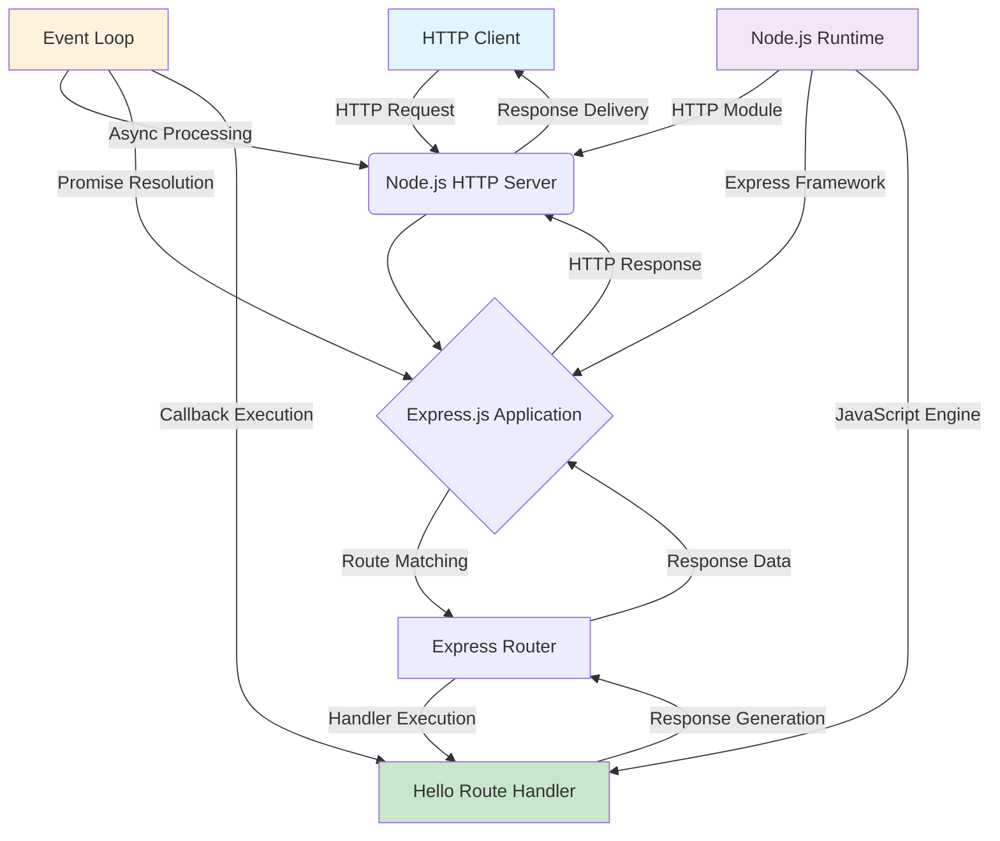
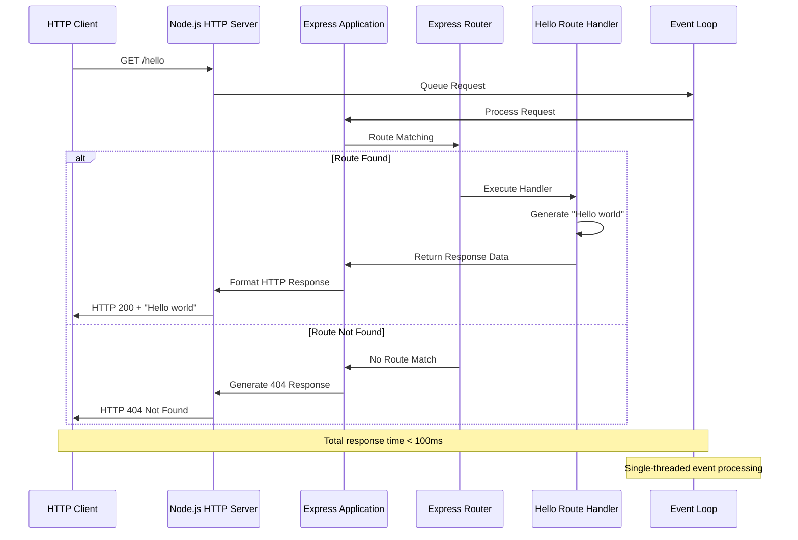

# System Architecture Overview

This document provides a comprehensive architectural overview of the Node.js tutorial application's system design. It describes the core components, their interactions, data flow patterns, and the overall architectural decisions employed in building a simple yet production-ready HTTP server using modern Node.js and Express.js frameworks.

## 1. High-Level Architecture

### 1.1. System Overview

The Node.js tutorial application employs a **Single-Threaded Event-Driven Architecture** pattern, leveraging Node.js v22 officially transitioned into Long Term Support (LTS) with the codename 'Jod'. This architectural approach is specifically designed for educational purposes, demonstrating fundamental HTTP server concepts through a minimalist implementation while maintaining production-ready patterns.

**Architectural Style and Rationale:**
The system follows a **Layered Architecture** pattern with clear separation between the HTTP transport layer, application framework layer, and business logic layer. Node.js employs a "Single Threaded Event Loop" design where the JavaScript event-based model and JavaScript callback mechanism are utilized in the Node.js Processing Model. This design choice optimizes for simplicity and educational clarity while maintaining scalable patterns.

**Key Architectural Principles:**
- **Event-Driven Processing**: Single-threaded event loop design with JavaScript event-based model and callback mechanisms
- **Non-Blocking I/O**: Asynchronous request handling for optimal performance and educational demonstration
- **Modular Design**: Clear separation of concerns between HTTP handling, routing, and application logic
- **Stateless Operation**: No persistent state management required, enabling simple horizontal scaling patterns

**System Boundaries and Major Interfaces:**
The system operates within a single Node.js process boundary, exposing one primary interface: an HTTP endpoint accessible via standard HTTP/1.1 protocol. The Node.js server accepts user requests, processes them through the Express.js framework, and returns results to users through the standardized request-response cycle.

### 1.2. Architectural Diagram

The following diagram illustrates the high-level component interactions and data flow within the system:



This architecture demonstrates the flow from HTTP client requests through the Node.js runtime environment, Express.js framework processing, and route handler execution, all coordinated by the single-threaded event loop mechanism.

## 2. Core Components

### 2.1. HTTP Server (`server.js`)

The HTTP Server component serves as the foundational entry point of the application, responsible for initializing the Node.js HTTP server, binding to a network port, and handling basic server lifecycle events. This component leverages Node.js v22.16.0 LTS for stability and long-term support.

**Primary Responsibilities:**
- Network socket management and TCP connection handling using Node.js built-in HTTP module
- HTTP request parsing and initial validation according to HTTP/1.1 protocol standards
- Response formatting and delivery to HTTP clients
- Integration with Express.js framework layer for application logic processing
- Server lifecycle management including startup, shutdown, and error handling

**Technical Specifications:**
- **Runtime Environment**: Node.js v22.16.0 LTS with 'Jod' codename for critical updates and security support
- **Port Configuration**: Default port 3000, configurable via environment variables for deployment flexibility
- **Performance Characteristics**: Server startup time < 5 seconds, request processing latency < 50ms
- **Memory Management**: Base allocation < 30MB, efficient garbage collection for request objects

### 2.2. Express Application (`app.js`)

The Express Application component orchestrates the web framework functionality using Express.js 5.1.0, the latest stable release published within the last two months. This component provides the middleware architecture, routing capabilities, and request/response processing pipeline essential for HTTP request handling.

**Core Functionality:**
- **Middleware Stack Management**: Sequential request processing through configurable middleware pipeline
- **Route Registration and Matching**: URL pattern matching using path-to-regexp 8.x for enhanced security
- **Request/Response Object Management**: HTTP request and response object enhancement and manipulation
- **Error Handling Coordination**: Automatic promise rejection handling and error middleware forwarding

**Framework Integration Details:**
Express 5.1.0 introduces significant improvements including middleware that can return rejected promises (automatically caught by the router as errors), enhanced security through ReDoS attack mitigation, and improved performance optimizations. The framework dropped support for Node.js versions before v18, ensuring compatibility with modern JavaScript features and security standards.

**Architectural Patterns:**
- **Middleware Pattern**: Sequential processing pipeline for request transformation and validation
- **Router Pattern**: Hierarchical route organization with exact path matching for the `/hello` endpoint
- **Promise-Based Error Handling**: Modern error propagation using async/await patterns and automatic error forwarding

### 2.3. Route Handler (`routes/hello.js`)

The Hello Route Handler implements the core business logic for the `/hello` endpoint, demonstrating fundamental HTTP endpoint implementation patterns and response generation techniques. This component represents the simplest possible RESTful API endpoint while maintaining production-ready code quality.

**Implementation Specifications:**
- **Route Pattern**: `/hello` with exact path matching and case-sensitive route handling
- **HTTP Method Support**: GET method only, with proper 405 Method Not Allowed responses for other methods
- **Response Format**: Plain text content with "Hello world" static response
- **Content-Type Header**: Properly set text/plain header for client content type negotiation

**Business Logic Pattern:**
The handler follows a stateless design pattern where each request is processed independently without maintaining session state or persistent data. This approach demonstrates scalable API design principles while keeping the implementation simple for educational purposes.

**Error Handling Integration:**
The route handler integrates with Express 5.1.0's enhanced error handling system, where promise rejections are automatically forwarded to error handling middleware. This provides a robust foundation for handling both synchronous and asynchronous errors in a consistent manner.

## 3. Data Flow

The application implements a streamlined **Request-Response Pipeline** where HTTP requests flow through a series of well-defined processing stages. This data flow pattern leverages Node.js event-driven architecture for efficient request processing while maintaining clear separation of concerns.

### 3.1. Primary Data Flow Pattern

**Request Processing Pipeline:**
1. **HTTP Request Reception**: Raw HTTP requests received by Node.js HTTP server and parsed according to HTTP/1.1 protocol
2. **Express Framework Processing**: Request objects enhanced with Express.js methods and middleware processing
3. **Route Matching**: URL path `/hello` matched against registered route patterns using path-to-regexp engine
4. **Handler Execution**: Business logic execution in the hello route handler with response generation
5. **Response Delivery**: HTTP response formatted and delivered to client with appropriate status codes and headers

**Data Transformation Points:**
- **HTTP Parsing**: Raw network data transformed into Express request objects with enhanced properties
- **Route Resolution**: URL paths processed through Express router for handler identification
- **Response Generation**: Static "Hello world" content formatted into complete HTTP response format
- **Content Serialization**: JavaScript string content properly encoded for HTTP transmission

### 3.2. Data Flow Diagram

The following sequence diagram shows the end-to-end data flow for a typical request:



**Performance Characteristics:**
The data flow is optimized for minimal latency with target response times under 100ms for the complete request-response cycle. The single-threaded event loop processes requests asynchronously, allowing efficient handling of concurrent connections without the overhead of thread management.

**State Management:**
The system maintains a stateless design where no persistent data is stored between requests. All request-specific data exists only during the request lifecycle and is automatically garbage collected upon completion, ensuring efficient memory usage and preventing memory leaks.

## 4. Cross-Cutting Concerns

### 4.1. Logging

The application implements a structured logging strategy using built-in Node.js console methods enhanced with request correlation and timing information. Logging is implemented as middleware to provide consistent request tracking and debugging capabilities.

**Logging Implementation:**
- **Request Logging**: Each incoming HTTP request is logged with timestamp, method, path, and client information
- **Response Logging**: Response status codes and processing times are captured for performance monitoring
- **Error Logging**: Errors are logged with full stack traces and contextual information for debugging
- **Performance Logging**: Response time measurements help identify performance bottlenecks and optimization opportunities

**Log Format Structure:**
```
[timestamp] level method path status responseTime clientIP
```

This structured format enables easy parsing for log analysis tools while remaining human-readable for development environments.

### 4.2. Error Handling

The application implements a comprehensive error handling strategy leveraging Express.js 5.1.0's enhanced promise support and automatic error forwarding capabilities. Error handling is centralized through middleware to ensure consistent error responses and prevent sensitive information disclosure.

**Error Handling Architecture:**
- **Route-Level Errors**: Errors thrown in route handlers are automatically caught by Express error middleware
- **Promise Rejection Handling**: Automatic forwarding of rejected promises to error handling middleware
- **HTTP Error Responses**: Standardized error response format with appropriate HTTP status codes
- **Error Information Security**: Generic error messages sent to clients while detailed errors are logged internally

**Error Response Categories:**
- **404 Not Found**: For requests to non-existent routes with helpful error messages
- **405 Method Not Allowed**: For unsupported HTTP methods on existing routes
- **500 Internal Server Error**: For application errors with generic error messages to prevent information disclosure

### 4.3. Configuration

Application configuration is managed through environment variables with sensible defaults, following twelve-factor app methodology for configuration management. This approach enables deployment flexibility while maintaining security best practices.

**Configuration Management:**
- **Port Configuration**: Server port configurable via PORT environment variable (default: 3000)
- **Environment Detection**: NODE_ENV variable for development/production environment detection
- **Logging Configuration**: Log level configuration for different deployment environments
- **Default Values**: Comprehensive default configuration ensures application runs without external configuration

**Configuration Security:**
- No sensitive configuration values in the tutorial scope
- Environment variable validation for deployment safety
- Configuration documentation for operational teams
- Secure default values that don't expose sensitive information

**Deployment Flexibility:**
The configuration approach supports various deployment scenarios from local development to container orchestration platforms, enabling seamless promotion through development, staging, and production environments without code changes.

---

This system architecture overview provides a comprehensive foundation for understanding the Node.js tutorial application's design principles, component interactions, and architectural decisions. The design emphasizes educational clarity while demonstrating production-ready patterns that can be extended for more complex applications as requirements evolve.