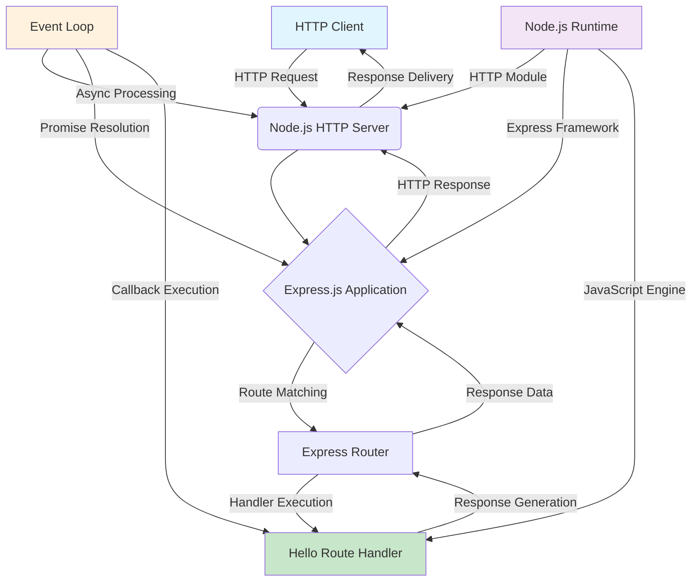
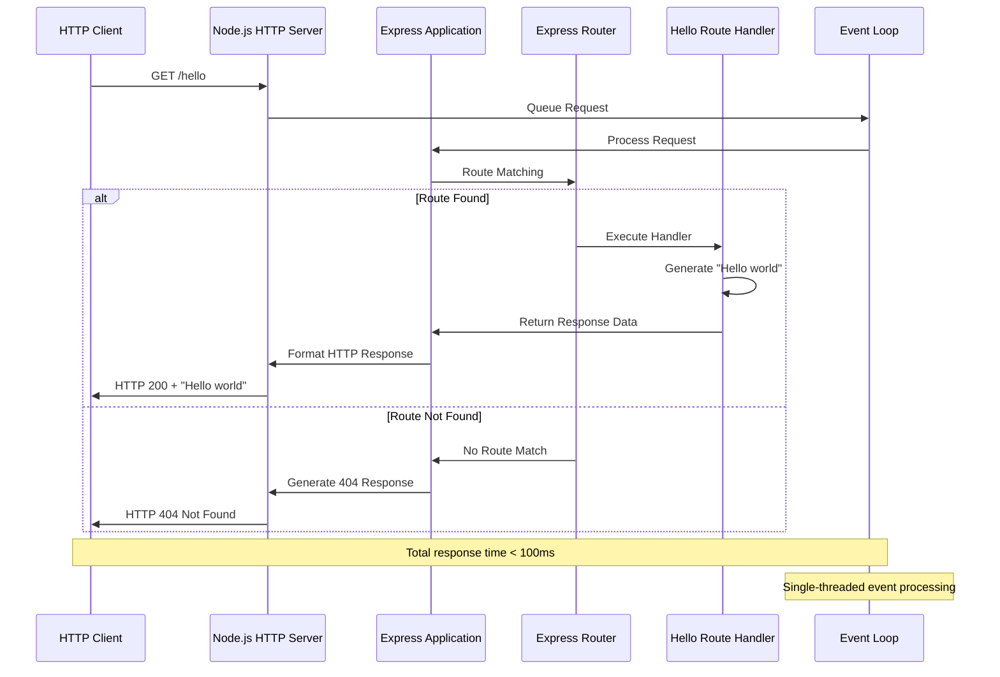

# System Architecture Overview

This document provides a comprehensive architectural overview of the Node.js tutorial application's system design. It describes the core components, their interactions, data flow patterns, and the overall architectural decisions employed in building a simple yet production-ready HTTP server using modern Node.js and Express.js frameworks.

## 1. High-Level Architecture

### 1.1. System Overview

The Node.js tutorial application employs a **Single-Threaded Event-Driven Architecture** pattern, leveraging Node.js v22 officially transitioned into Long Term Support (LTS) with the codename 'Jod'. This architectural approach is specifically designed for educational purposes, demonstrating fundamental HTTP server concepts through a minimalist implementation while maintaining production-ready patterns.

**Architectural Style and Rationale:**
The system follows a **Layered Architecture** pattern with clear separation between the HTTP transport layer, application framework layer, and business logic layer. Node.js employs a "Single Threaded Event Loop" design where the JavaScript event-based model and JavaScript callback mechanism are utilized in the Node.js Processing Model. This design choice optimizes for simplicity and educational clarity while maintaining scalable patterns.

**Key Architectural Principles:**
- **Event-Driven Processing**: Single-threaded event loop design with JavaScript event-based model and callback mechanisms
- **Non-Blocking I/O**: Asynchronous request handling for optimal performance and educational demonstration
- **Modular Design**: Clear separation of concerns between HTTP handling, routing, and application logic
- **Stateless Operation**: No persistent state management required, enabling simple horizontal scaling patterns

**System Boundaries and Major Interfaces:**
The system operates within a single Node.js process boundary, exposing one primary interface: an HTTP endpoint accessible via standard HTTP/1.1 protocol. The Node.js server accepts user requests, processes them through the Express.js framework, and returns results to users through the standardized request-response cycle.

### 1.2. Architectural Diagram

The following diagram illustrates the high-level component interactions and data flow within the system:


```mermaid
graph TD
    A[HTTP Client] -->|HTTP Request| B(Node.js HTTP Server)
    B --> C{Express.js Application}
    C -->|Route Matching| D[Express Router]
    D -->|Handler Execution| E[Hello Route Handler]
    E -->|Response Generation| D
    D -->|Response Data| C
    C -->|HTTP Response| B
    B -->|Response Delivery| A
    
    F[Event Loop] -->|Async Processing| B
    F -->|Promise Resolution| C
    F -->|Callback Execution| E
    
    G[Node.js Runtime] -->|HTTP Module| B
    G -->|Express Framework| C
    G -->|JavaScript Engine| E
    
    style A fill:#e1f5fe
    style E fill:#c8e6c9
    style F fill:#fff3e0
    style G fill:#f3e5f5
```

This architecture demonstrates the flow from HTTP client requests through the Node.js runtime environment, Express.js framework processing, and route handler execution, all coordinated by the single-threaded event loop mechanism.

## 2. Core Components

### 2.1. HTTP Server (`server.js`)

The HTTP Server component serves as the foundational entry point of the application, responsible for initializing the Node.js HTTP server, binding to a network port, and handling basic server lifecycle events. This component leverages the Node.js 22.x LTS line for stability and long-term support.

**Primary Responsibilities:**
- Network socket management and TCP connection handling using Node.js built-in HTTP module
- HTTP request parsing and initial validation according to HTTP/1.1 protocol standards
- Response formatting and delivery to HTTP clients
- Integration with Express.js framework layer for application logic processing
- Server lifecycle management including startup, shutdown, and error handling

**Technical Specifications:**
- **Runtime Environment**: the Node.js 22.x LTS line, codename 'Jod', for critical updates and security support; validated on v22.23.2
- **Port Configuration**: Default port 3000, configurable via environment variables for deployment flexibility
- **Performance Characteristics**: Server startup time < 5 seconds, request processing latency < 50ms
- **Memory Management**: ≈ 65MB resident once running (measured with `ps -o rss=`), nearly all of it the Node.js runtime itself; request objects are short-lived and garbage-collected

### 2.2. Express Application (`app.js`)

The Express Application component orchestrates the web framework functionality using Express 5.x - the committed lockfile resolves the declared `^5.1.0` range to 5.2.1, published on 2025-12-01 according to the npm registry. This component provides the middleware architecture, routing capabilities, and request/response processing pipeline essential for HTTP request handling.

**Core Functionality:**
- **Middleware Stack Management**: Sequential request processing through configurable middleware pipeline
- **Route Registration and Matching**: URL pattern matching using path-to-regexp 8.x for enhanced security
- **Request/Response Object Management**: HTTP request and response object enhancement and manipulation
- **Error Handling Coordination**: Automatic promise rejection handling and error middleware forwarding

**Framework Integration Details:**
Express 5 introduces significant improvements including middleware that can return rejected promises (automatically caught by the router as errors), enhanced security through ReDoS attack mitigation, and improved performance optimizations. The framework dropped support for Node.js versions before v18, ensuring compatibility with modern JavaScript features and security standards.

**Architectural Patterns:**
- **Middleware Pattern**: Sequential processing pipeline for request transformation and validation
- **Router Pattern**: Hierarchical route organization with one registered `/hello` route; Express's default case-insensitive and non-strict matching also accepts case variants and a trailing slash
- **Promise-Based Error Handling**: Modern error propagation using async/await patterns and automatic error forwarding

### 2.3. Route Handler (`routes/hello.js`)

The Hello Route Handler implements the core business logic for the `/hello` endpoint, demonstrating fundamental HTTP endpoint implementation patterns and response generation techniques. This component represents the simplest possible RESTful API endpoint while maintaining production-ready code quality.

**Implementation Specifications:**
- **Route Pattern**: One route is registered at `/hello`; Express's default case-insensitive and non-strict matching also accepts case variants and a trailing slash without registering additional routes
- **HTTP Method Support**: `GET` is the only method registered for this route and returns 200; Express additionally generates the standard `HEAD /hello` (200, headers only) and `OPTIONS /hello` (200 with `Allow: GET, HEAD`) responses for that handler, while `POST`, `PUT`, `PATCH`, `DELETE`, and `TRACE` match no route/method pair and fall through to Express's default 404 handling
- **Response Body**: The static string `Hello world` — 11 bytes, no punctuation, no envelope and no trailing newline
- **Content-Type Header**: `text/html; charset=utf-8`, which Express sets automatically because `res.send()` is called with a string; the handler sets no content type header itself

**Business Logic Pattern:**
The handler follows a stateless design pattern where each request is processed independently without maintaining session state or persistent data. This approach demonstrates scalable API design principles while keeping the implementation simple for educational purposes.

**Error Handling Integration:**
The route handler integrates with Express 5's enhanced error handling system, where promise rejections are automatically forwarded to error handling middleware. This provides a robust foundation for handling both synchronous and asynchronous errors in a consistent manner.

## 3. Data Flow

The application implements a streamlined **Request-Response Pipeline** where HTTP requests flow through a series of well-defined processing stages. This data flow pattern leverages Node.js event-driven architecture for efficient request processing while maintaining clear separation of concerns.

### 3.1. Primary Data Flow Pattern

**Request Processing Pipeline:**
1. **HTTP Request Reception**: Raw HTTP requests received by Node.js HTTP server and parsed according to HTTP/1.1 protocol
2. **Express Framework Processing**: Request objects enhanced with Express.js methods and middleware processing
3. **Route Matching**: URL path `/hello` matched against registered route patterns using path-to-regexp engine
4. **Handler Execution**: Business logic execution in the hello route handler with response generation
5. **Response Delivery**: HTTP response formatted and delivered to client with appropriate status codes and headers

**Data Transformation Points:**
- **HTTP Parsing**: Raw network data transformed into Express request objects with enhanced properties
- **Route Resolution**: URL paths processed through Express router for handler identification
- **Response Generation**: Static "Hello world" content formatted into complete HTTP response format
- **Content Serialization**: JavaScript string content properly encoded for HTTP transmission

### 3.2. Data Flow Diagram

The following sequence diagram shows the end-to-end data flow for a typical request:


```mermaid
sequenceDiagram
    participant Client as HTTP Client
    participant Server as Node.js HTTP Server
    participant ExpressApp as Express Application
    participant Router as Express Router
    participant HelloHandler as Hello Route Handler
    participant EventLoop as Event Loop

    Client->>Server: GET /hello
    Server->>EventLoop: Queue Request
    EventLoop->>ExpressApp: Process Request
    ExpressApp->>Router: Route Matching
    
    alt Route Found
        Router->>HelloHandler: Execute Handler
        HelloHandler->>HelloHandler: Generate "Hello world"
        HelloHandler->>ExpressApp: Return Response Data
        ExpressApp->>Server: Format HTTP Response
        Server->>Client: HTTP 200 + "Hello world"
    else Route Not Found
        Router->>ExpressApp: No Route Match
        ExpressApp->>Server: Generate 404 Response
        Server->>Client: HTTP 404 Not Found
    end
    
    Note over Client,EventLoop: Total response time < 100ms
    Note over EventLoop: Single-threaded event processing
```

**Performance Characteristics:**
The data flow is optimized for minimal latency with target response times under 100ms for the complete request-response cycle. The single-threaded event loop processes requests asynchronously, allowing efficient handling of concurrent connections without the overhead of thread management.

**State Management:**
The system maintains a stateless design where no persistent data is stored between requests. All request-specific data exists only during the request lifecycle and is automatically garbage collected upon completion, ensuring efficient memory usage and preventing memory leaks.

## 4. Cross-Cutting Concerns

### 4.1. Logging

The application implements a console-based logging strategy using the built-in Node.js `console` methods behind a small logger utility that exposes exactly two levels. Request logging is implemented as middleware mounted ahead of the routes, so each request produces a single request log line on arrival, before routing.

**Logging Implementation:**
- **Request Logging**: Each incoming HTTP request is logged once on arrival by the `requestLogger` middleware, which records three values only: the method (`req.method`), the pathname of the target (`req.originalUrl` up to the first `?` or `#`), and the request body. No timestamp, response status, client IP, or user agent is captured
- **Request Body Handling**: Object bodies are serialized with `JSON.stringify`, primitive bodies are converted with `String`, and requests carrying no body (the normal `GET /hello` case) are logged as `{}`. If serialization throws, the body is logged as `[Object - Unable to serialize]` and an additional error entry records the failure
- **Log Output Neutralization**: Every value either middleware writes is treated as untrusted, because every value in a log line came from the client. Three rules apply: the query string and fragment are cut off the target, so a caller's values never reach the log (CWE-532); anything outside printable ASCII is replaced with inert `\uXXXX` text, so no request can forge a second log entry, drive the terminal reading the log, or reverse how a line displays; and every value is bounded to 256 characters with the number of dropped characters stated, so one request cannot cost an unbounded amount of log
- **Error Logging**: Errors are logged with full stack traces and contextual information for debugging
- **Response and Timing Logging**: Not implemented. The request logger never reads or modifies the response object, so response status codes, processing times, and request correlation identifiers are neither measured nor logged
- **Log Levels**: Exactly two levels exist: `info` writes to stdout through `console.log` and `error` writes to stderr through `console.error`. Each is prefixed with `[INFO]:` or `[ERROR]:` only when `NODE_ENV` is `development`

**Log Format Structure:**
```
HTTP Request - Method: <METHOD> Path: <PATH> Body: <BODY>     (every environment)
[INFO]: HTTP Request - Method: GET Path: /hello Body: {}      (development adds the level prefix)
```

The logger passes its arguments straight to `console`, which joins them with spaces, so a development-mode `GET /hello` prints `[INFO]: HTTP Request - Method: GET Path: /hello Body: {}` and the same line appears without the prefix in other environments. The fixed field order keeps this single-line output readable during development and straightforward to grep.

### 4.2. Error Handling

The application implements a comprehensive error handling strategy leveraging Express 5's enhanced promise support and automatic error forwarding capabilities. Error handling is centralized through middleware so that every forwarded error produces the same response shape and the error's own detail — its message, name and stack — stays server-side. That centralization is not by itself a guarantee of non-disclosure: the envelope still returns the request's own target, and the server-side diagnostic records the request's pathname and client address, so both are described precisely below. What the diagnostic deliberately does not record is anything the caller chose: its headers come from a fixed allow-list rather than from `req.headers` wholesale, the query string is reduced to a parameter count, and every value it does record is escaped to printable ASCII and bounded.

**Error Handling Architecture:**
- **Route-Level Errors**: Errors thrown in route handlers are automatically caught by Express error middleware
- **Promise Rejection Handling**: Automatic forwarding of rejected promises to error handling middleware
- **HTTP Error Responses**: Standardized error response format with appropriate HTTP status codes
- **Error Information Security**: Generic error messages sent to clients while detailed errors are logged internally

**Error Response Categories:**
- **404 Not Found**: Express's default 404 response, produced for requests to non-existent paths and equally for unmatched method/route pairs such as `POST /hello`; it is served as `text/html; charset=utf-8` with Express's default HTML error page (for example `Cannot POST /hello`)
- **500 Internal Server Error**: Produced by the `errorHandler` middleware for application errors forwarded to it. The `error` string is always the generic `Internal Server Error`, so the failure's own detail is never disclosed; the accompanying `path` field is not generic, because it repeats the request's target including any query string — deliberately, since the caller already has that value and it is what lets the caller correlate the failure. The server-side log records only the pathname of the same target

**Error Handler Behavior (`middleware/errorHandler.js`):**
- **Registration**: A named export (`module.exports = { errorHandler }`) using the four-argument Express error signature `(err, req, res, next)`, mounted last in `app.js` so it receives errors forwarded from every preceding layer
- **Diagnostic Logging**: One error log entry records the error message and name together with the request pathname (`requestPath`), method, route params, and the number of query parameters the target carried (`requestQueryParameterCount`), plus an ISO timestamp, the client IP, and the request's `host`, `content-type` and `accept` headers — those three by name from a fixed allow-list (`RECORDED_REQUEST_HEADERS`), so an `Authorization` header, a `Cookie` or an API-key header is not written to the log (CWE-532). The query values themselves are not recorded at all: Express percent-decodes them into `req.query`, so recording them would put both a live secret and a genuine control character in the log. Every value that is recorded is escaped to printable ASCII and bounded to 256 characters. The error's stack is added in development only, because every frame in a stack names an absolute filesystem path
- **Client Response**: Status `500` with a JSON envelope of exactly four fields: `error` (the generic string `Internal Server Error`), `status`, `timestamp`, and `path` (`req.originalUrl || req.url`). The detail stays in the log: the client is told that the request failed and which path failed, and nothing about how the server is built. The response also carries `X-Content-Type-Options: nosniff`, set by the handler itself: because `path` repeats the caller's target verbatim, a target carrying raw markup ends up inside a JSON body, and the header is what stops a content-sniffing client rendering that body as HTML — the same header Express's own not-found response sends. It is the only header this application sets on a response, and it is set on the 500 alone
- **Termination**: The handler deliberately does not call `next()`, ending the request-response cycle; it never produces a 404, because unmatched routes fall through to Express's default 404 handling instead

### 4.3. Configuration

Application configuration is managed through environment variables with sensible defaults, following twelve-factor app methodology for configuration management. This approach enables deployment flexibility while maintaining security best practices.

**Configuration Management:**
- **Port Configuration**: Server port configurable via PORT environment variable (default: 3000)
- **Environment Detection**: NODE_ENV variable for development/production environment detection
- **Logging Configuration**: There is no log-level setting. `config/index.js` defines no `LOG_LEVEL`, and the logger exposes both of its levels — `info` and `error` — in every environment. What `NODE_ENV` changes is presentation only: when it is `development` the two levels prefix their output with `[INFO]:` and `[ERROR]:`, and in every other environment the arguments are forwarded to `console` unprefixed
- **Default Values**: Comprehensive default configuration ensures application runs without external configuration

**Configuration Security:**
- No sensitive configuration values in the tutorial scope
- Environment variable validation for deployment safety
- Configuration documentation for operational teams
- Secure default values that don't expose sensitive information

**Deployment Flexibility:**
The configuration approach supports various deployment scenarios from local development to container orchestration platforms, enabling seamless promotion through development, staging, and production environments without code changes.

---

This system architecture overview provides a comprehensive foundation for understanding the Node.js tutorial application's design principles, component interactions, and architectural decisions. The design emphasizes educational clarity while demonstrating production-ready patterns that can be extended for more complex applications as requirements evolve.