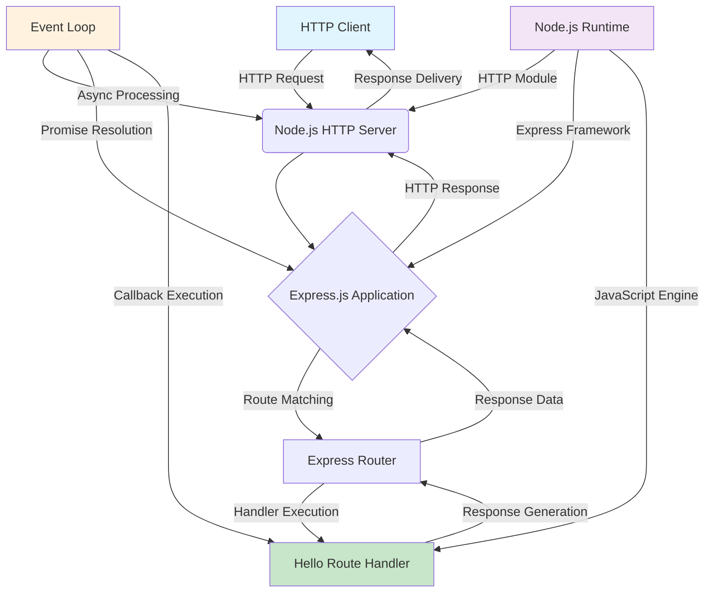
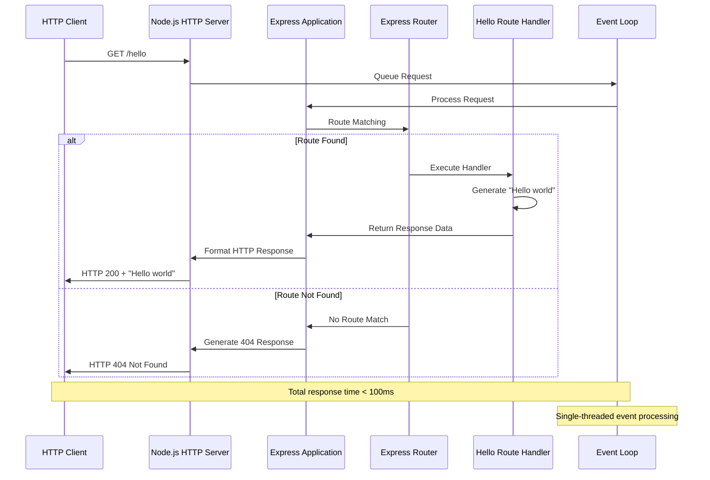

# System Architecture Overview

This document provides a comprehensive architectural overview of the Node.js tutorial application's system design. It describes the core components, their interactions, data flow patterns, and the overall architectural decisions employed in building a simple yet production-ready HTTP server using modern Node.js and Express.js frameworks.

## 1. High-Level Architecture

### 1.1. System Overview

The Node.js tutorial application employs a **Single-Threaded Event-Driven Architecture** pattern, leveraging Node.js v22 officially transitioned into Long Term Support (LTS) with the codename 'Jod'. This architectural approach is specifically designed for educational purposes, demonstrating fundamental HTTP server concepts through a minimalist implementation while maintaining production-ready patterns.

**Architectural Style and Rationale:**
The system follows a **Layered Architecture** pattern with clear separation between the HTTP transport layer, application framework layer, and business logic layer. Node.js employs a "Single Threaded Event Loop" design where the JavaScript event-based model and JavaScript callback mechanism are utilized in the Node.js Processing Model. This design choice optimizes for simplicity and educational clarity while maintaining scalable patterns.

**Key Architectural Principles:**
- **Event-Driven Processing**: Single-threaded event loop design with JavaScript event-based model and callback mechanisms
- **Non-Blocking I/O**: Asynchronous request handling for optimal performance and educational demonstration
- **Modular Design**: Clear separation of concerns between HTTP handling, routing, and application logic
- **Stateless Operation**: No persistent state management required, enabling simple horizontal scaling patterns

**System Boundaries and Major Interfaces:**
The system operates within a single Node.js process boundary, exposing one primary interface: an HTTP endpoint accessible via standard HTTP/1.1 protocol. The Node.js server accepts user requests, processes them through the Express.js framework, and returns results to users through the standardized request-response cycle.

### 1.2. Architectural Diagram

The following diagram illustrates the high-level component interactions and data flow within the system:


```mermaid
graph TD
    A[HTTP Client] -->|HTTP Request| B(Node.js HTTP Server)
    B --> C{Express.js Application}
    C -->|Route Matching| D[Express Router]
    D -->|Handler Execution| E[Hello Route Handler]
    E -->|Response Generation| D
    D -->|Response Data| C
    C -->|HTTP Response| B
    B -->|Response Delivery| A
    
    F[Event Loop] -->|Async Processing| B
    F -->|Promise Resolution| C
    F -->|Callback Execution| E
    
    G[Node.js Runtime] -->|HTTP Module| B
    G -->|Express Framework| C
    G -->|JavaScript Engine| E
    
    style A fill:#e1f5fe
    style E fill:#c8e6c9
    style F fill:#fff3e0
    style G fill:#f3e5f5
```

This architecture demonstrates the flow from HTTP client requests through the Node.js runtime environment, Express.js framework processing, and route handler execution, all coordinated by the single-threaded event loop mechanism.

## 2. Core Components

### 2.1. HTTP Server (`server.js`)

The HTTP Server component serves as the foundational entry point of the application, responsible for initializing the Node.js HTTP server, binding to a network port, and handling basic server lifecycle events. This component leverages Node.js v22.16.0 LTS for stability and long-term support.

**Primary Responsibilities:**
- Network socket management and TCP connection handling using Node.js built-in HTTP module
- HTTP request parsing and initial validation according to HTTP/1.1 protocol standards
- Response formatting and delivery to HTTP clients
- Integration with Express.js framework layer for application logic processing
- Server lifecycle management including startup, shutdown, and error handling

**Technical Specifications:**
- **Runtime Environment**: Node.js v22.16.0 LTS with 'Jod' codename for critical updates and security support
- **Port Configuration**: Default port 3000, configurable via environment variables for deployment flexibility
- **Performance Characteristics**: Server startup time < 5 seconds, request processing latency < 50ms
- **Memory Management**: Base allocation < 30MB, efficient garbage collection for request objects

### 2.2. Express Application (`app.js`)

The Express Application component orchestrates the web framework functionality using Express.js 5.1.0, the latest stable release published within the last two months. This component provides the middleware architecture, routing capabilities, and request/response processing pipeline essential for HTTP request handling.

**Core Functionality:**
- **Middleware Stack Management**: Sequential request processing through configurable middleware pipeline
- **Route Registration and Matching**: URL pattern matching using path-to-regexp 8.x for enhanced security
- **Request/Response Object Management**: HTTP request and response object enhancement and manipulation
- **Error Handling Coordination**: Automatic promise rejection handling and error middleware forwarding

**Framework Integration Details:**
Express 5.1.0 introduces significant improvements including middleware that can return rejected promises (automatically caught by the router as errors), enhanced security through ReDoS attack mitigation, and improved performance optimizations. The framework dropped support for Node.js versions before v18, ensuring compatibility with modern JavaScript features and security standards.

**Architectural Patterns:**
- **Middleware Pattern**: Sequential processing pipeline for request transformation and validation
- **Router Pattern**: Hierarchical route organization with one registered `/hello` route; Express's default case-insensitive and non-strict matching also accepts case variants and a trailing slash
- **Promise-Based Error Handling**: Modern error propagation using async/await patterns and automatic error forwarding

### 2.3. Route Handler (`routes/hello.js`)

The Hello Route Handler implements the core business logic for the `/hello` endpoint, demonstrating fundamental HTTP endpoint implementation patterns and response generation techniques. This component represents the simplest possible RESTful API endpoint while maintaining production-ready code quality.

**Implementation Specifications:**
- **Route Pattern**: One route is registered at `/hello`; Express's default case-insensitive and non-strict matching also accepts case variants and a trailing slash without registering additional routes
- **HTTP Method Support**: `GET` is the only method registered for this route and returns 200; Express additionally generates the standard `HEAD /hello` (200, headers only) and `OPTIONS /hello` (200 with `Allow: GET, HEAD`) responses for that handler, while `POST`, `PUT`, `PATCH`, `DELETE`, and `TRACE` match no route/method pair and fall through to Express's default 404 handling
- **Response Format**: Plain text content with "Hello world" static response
- **Content-Type Header**: `text/html; charset=utf-8`, which Express sets automatically because `res.send()` is called with a string; the handler sets no content type header itself

**Business Logic Pattern:**
The handler follows a stateless design pattern where each request is processed independently without maintaining session state or persistent data. This approach demonstrates scalable API design principles while keeping the implementation simple for educational purposes.

**Error Handling Integration:**
The route handler integrates with Express 5.1.0's enhanced error handling system, where promise rejections are automatically forwarded to error handling middleware. This provides a robust foundation for handling both synchronous and asynchronous errors in a consistent manner.

## 3. Data Flow

The application implements a streamlined **Request-Response Pipeline** where HTTP requests flow through a series of well-defined processing stages. This data flow pattern leverages Node.js event-driven architecture for efficient request processing while maintaining clear separation of concerns.

### 3.1. Primary Data Flow Pattern

**Request Processing Pipeline:**
1. **HTTP Request Reception**: Raw HTTP requests received by Node.js HTTP server and parsed according to HTTP/1.1 protocol
2. **Express Framework Processing**: Request objects enhanced with Express.js methods and middleware processing
3. **Route Matching**: URL path `/hello` matched against registered route patterns using path-to-regexp engine
4. **Handler Execution**: Business logic execution in the hello route handler with response generation
5. **Response Delivery**: HTTP response formatted and delivered to client with appropriate status codes and headers

**Data Transformation Points:**
- **HTTP Parsing**: Raw network data transformed into Express request objects with enhanced properties
- **Route Resolution**: URL paths processed through Express router for handler identification
- **Response Generation**: Static "Hello world" content formatted into complete HTTP response format
- **Content Serialization**: JavaScript string content properly encoded for HTTP transmission

### 3.2. Data Flow Diagram

The following sequence diagram shows the end-to-end data flow for a typical request:


```mermaid
sequenceDiagram
    participant Client as HTTP Client
    participant Server as Node.js HTTP Server
    participant ExpressApp as Express Application
    participant Router as Express Router
    participant HelloHandler as Hello Route Handler
    participant EventLoop as Event Loop

    Client->>Server: GET /hello
    Server->>EventLoop: Queue Request
    EventLoop->>ExpressApp: Process Request
    ExpressApp->>Router: Route Matching
    
    alt Route Found
        Router->>HelloHandler: Execute Handler
        HelloHandler->>HelloHandler: Generate "Hello world"
        HelloHandler->>ExpressApp: Return Response Data
        ExpressApp->>Server: Format HTTP Response
        Server->>Client: HTTP 200 + "Hello world"
    else Route Not Found
        Router->>ExpressApp: No Route Match
        ExpressApp->>Server: Generate 404 Response
        Server->>Client: HTTP 404 Not Found
    end
    
    Note over Client,EventLoop: Total response time < 100ms
    Note over EventLoop: Single-threaded event processing
```

**Performance Characteristics:**
The data flow is optimized for minimal latency with target response times under 100ms for the complete request-response cycle. The single-threaded event loop processes requests asynchronously, allowing efficient handling of concurrent connections without the overhead of thread management.

**State Management:**
The system maintains a stateless design where no persistent data is stored between requests. All request-specific data exists only during the request lifecycle and is automatically garbage collected upon completion, ensuring efficient memory usage and preventing memory leaks.

## 4. Cross-Cutting Concerns

### 4.1. Logging

The application implements a console-based logging strategy using the built-in Node.js `console` methods behind a small logger utility that exposes exactly two levels. Request logging is implemented as middleware mounted ahead of the routes, so each request produces a single request log line on arrival, before routing.

**Logging Implementation:**
- **Request Logging**: Each incoming HTTP request is logged once on arrival by the `requestLogger` middleware, which records three values only: the method, a classification of the request path, and the request body. No timestamp, response status, client IP, or user agent is captured. The method is recorded only when HTTP defines it, since it reaches the middleware as client-supplied text
- **Path Classification**: The path is taken from `req.originalUrl`, but what is logged is a classification of it, never the target itself: the route that was asked for (`/hello`), `[unmatched]` when the target names no known route, or `[omitted]` when there is no target. The label names the route only where the router would actually reach it, and it errs in one direction only: it may decline to name a route, and never names one the request did not reach. The path is derived through the same parser the router uses — Node's legacy `url.parse`, which is what Express reaches through `parseurl` — rather than through a pattern kept in step by hand. Parsing the path is necessary but not sufficient, though, because the router does not work from the parsed path alone: it also locates a protohost in the *raw* target by searching for a literal `/` and trims the mount prefix from that raw string. `http://host\hello` is where the two views diverge — the parser turns the backslash into a separator and reports `/hello`, while the router is left with `/host\hello` and never reaches the route. Rather than reimplement that raw-target handling, a target whose **host** carries one of the characters that causes the divergence (`\`, `;`, `%`, `#`) is reported `[unmatched]`. The test applies to the host and port only, never to userinfo, and that distinction is the whole of it: `;` and `%` are ordinary characters in a userinfo component and the parser resets its host scan at the last `@`, so `http://user;name@host/hello` and `http://user%3Aname@host/hello` genuinely do reach the route — the running application answers 200 for both — and declining them would withhold an attribution that exists. In the host the same characters really do move where the authority ends: `http://host;tenant/hello` and `http://user@host;tenant/hello` are answered 404, and a backslash or fragment target is rejected by Node's HTTP parser with a 400 before any middleware runs, so no request that reaches this application carries one and no log line is produced for it. Userinfo (`http://user:pw@host/hello`) and an IPv6-literal authority (`http://[::1]/hello`) are named normally. Each of these statements was checked against the running application rather than reasoned about. That choice is deliberate in both directions: WHATWG `new URL` is **not** used, because it resolves dot segments and would label `/hello/../hello` as the route although Express answers 404 for it; and a hand-written authority pattern is not used, because deciding where an authority ends is exactly where such a pattern goes wrong — `http://host;tenant/hello` looks like it addresses `/hello`, but the parser's host scan stops at the `;`, leaving the path `;tenant/hello`, so the request 404s and the label must say `[unmatched]`. On top of the parsed path, matching is case-insensitive and allows up to two trailing delimiters — the unanchored `/hello` mount and its `/` leaf each permit one — but no more, so `/hello//` is labelled `/hello` while `/hello///` is `[unmatched]`. A target the parser rejects, or one with no path component, is `[unmatched]` too. This precision matters because there is no response log: the arrival line is the only attribution a request gets, so a label naming a route the request never reached would be the one actively misleading thing in it. Everything a client puts in a URL is client-controlled and a routine hiding place for access tokens, passwords and e-mail addresses, and a log file is long lived and widely readable, so recording any of it is the exposure described by CWE-532. A query string, and a secret in a path segment with no query string at all, are both covered: `GET /hello?access_token=s3cr3t` is logged as `Path: /hello?[REDACTED]`, and `GET /A3F9K2QXOPAQUE1234567890` as `Path: [unmatched]`. Bounding such a target instead would not have helped — a truncated secret is still a secret
- **Request Body Handling**: Object bodies are serialized with `JSON.stringify`, primitive bodies are converted with `String`, and requests carrying no body (the normal `GET /hello` case) are logged as `{}`. A body that cannot be represented is logged as `[Object - Unable to serialize]`, covering both failure modes: `JSON.stringify` throwing (a circular reference) and `JSON.stringify` returning `undefined` without throwing (a `toJSON()` that yields `undefined`). The second case is checked explicitly because passing a non-string on would throw inside the logger and `next()` would never be called. When serialization throws, an additional error entry records a **fixed reason** rather than the thrown error's own message, which is itself free-form text of unknown origin
- **Length Capping**: The method and the path label are drawn from fixed vocabularies, so neither can grow. The body and the fixed serialization-failure reason are limited to 200 characters; a longer one ends with `...[truncated]` inside that limit, so one oversized request cannot flood the console. Carriage returns and newlines are collapsed to spaces, so no value can forge a second log entry. The request logger scans nothing for credentials: classification, not pattern matching, is what keeps client-supplied values out of the request log
- **Error Logging**: Errors are logged with the module name, line and column of their top stack frames and a shaped request context, described field by field under Error Handling below
- **Response and Timing Logging**: Not implemented. The request logger never reads or modifies the response object, so response status codes, processing times, and request correlation identifiers are neither measured nor logged
- **Log Levels**: Exactly two levels exist: `info` writes to stdout through `console.log` and `error` writes to stderr through `console.error`. Each is prefixed with `[INFO]:` or `[ERROR]:` only when `NODE_ENV` is `development`

**Log Format Structure:**
```
HTTP Request - Method: <METHOD> Path: <PATH> Body: <BODY>     (every environment)
[INFO]: HTTP Request - Method: GET Path: /hello Body: {}      (development adds the level prefix)
```

The logger passes its arguments straight to `console`, which joins them with spaces, so a development-mode `GET /hello` prints `[INFO]: HTTP Request - Method: GET Path: /hello Body: {}` and the same line appears without the prefix in other environments. The fixed field order keeps this single-line output readable during development and straightforward to grep.

### 4.2. Error Handling

The application implements a comprehensive error handling strategy leveraging Express.js 5.1.0's enhanced promise support and automatic error forwarding capabilities. Error handling is centralized through middleware to ensure consistent error responses and prevent sensitive information disclosure.

**Error Handling Architecture:**
- **Route-Level Errors**: Errors thrown in route handlers are automatically caught by Express error middleware
- **Promise Rejection Handling**: Automatic forwarding of rejected promises to error handling middleware
- **HTTP Error Responses**: Standardized error response format with appropriate HTTP status codes
- **Error Information Security**: Generic error messages sent to clients while detailed errors are logged internally

**Error Response Categories:**
- **404 Not Found**: Express's default 404 response, produced for requests to non-existent paths and equally for unmatched method/route pairs such as `POST /hello`; it is served as `text/html; charset=utf-8` with Express's default HTML error page (for example `Cannot POST /hello`)
- **500 Internal Server Error**: Produced by the `errorHandler` middleware for application errors forwarded to it, with a generic message that prevents information disclosure

**Error Handler Behavior (`middleware/errorHandler.js`):**
- **Registration**: A named export (`module.exports = { errorHandler }`) using the four-argument Express error signature `(err, req, res, next)`, mounted last in `app.js` so it receives errors forwarded from every preceding layer
- **Diagnostic Logging**: One error log entry records eleven fields — `errorMessage`, `errorStack`, `errorName`, `requestUrl`, `requestMethod`, `requestHeaders`, `requestParams`, `requestQuery`, `timestamp`, `userAgent` and `clientIP`. Each is shaped rather than copied, and nothing free-form is retained on the strength of having been scanned: no pattern can recognise an opaque token or an arbitrary piece of personal data, so the entry is built from allow lists, counts and omission markers instead of from filters:
  - **Admission is by list membership, never by shape.** A regular expression describes what a value looks like, and an opaque API key, licence key or session identifier can be made to look like almost anything — `/^[A-Z][A-Z0-9_]+$/` admits `A3F9K2QXOPAQUE1234567890` exactly as readily as `ENOENT`. Shape is not provenance, so every recorded value is a member of a list written in the middleware, an integer, or a fixed marker
  - **Headers, query parameters and route parameters** contribute an entry **count** and nothing else — `requestHeaders: 5` rather than any name or value. Because neither names nor values are recorded, `Authorization`, `Cookie`, `X-API-Key`, a token in the query and anything a future client invents are excluded by construction, and so is a secret smuggled in as a header *name*
  - **The error message field** records `err.code` when it is one of the codes the middleware lists (`ENOENT`, `ECONNREFUSED`, `ERR_INVALID_ARG_TYPE` and the like), otherwise `[omitted]`. The free-form `err.message` is never logged: message text routinely quotes the value that caused the failure — a connection string, a rejected token, a customer's e-mail address
  - **The error name** is recorded when it is one of the built-in error class names, otherwise `[omitted]`. A subclass names itself, so `ValidationError` and `JaneDoeError` are the same kind of value to any pattern that could be written for them
  - **The stack** contributes at most five frames, each reduced to a module name from the middleware's own list plus its line and column — `routes/hello.js:42:9` — or `[external]` for framework and Node internals. No function name or file path is copied out of the trace, because `err.stack` is writable and both are text of someone's choosing. The location is taken as the last `file:line:column` in the line, which is what makes V8's `at async fn (…)` and `at new Fn (…)` forms parse — an anchored pattern silently drops exactly the async frames an Express 5 promise rejection produces — and a line or column beyond six digits is rejected rather than allowed to carry those digits into the log
  - **The request URL** is the same classification used by the request-arrival log: the route asked for, or `[unmatched]`, with `?[REDACTED]` appended when a query was present. The query delimiter is located on the raw target before anything else happens, so a target that carried a query always reports one. No character of the received target is logged, which is what covers the unlabelled opaque segment that no credential pattern would match
  - **The method** is recorded only when HTTP defines it, otherwise `[omitted]`
  - **The User-Agent** is recorded as `[omitted]` when one was sent and is absent when none was, so its presence is known and its free-form content is not
  - **The client IP** is the one field derived from the request rather than selected from a list, and it is validated before any part of it is used. `net.isIP()` must recognise the value first; anything it rejects is recorded as `[omitted]` in full, because a string is not an address merely for containing a colon and an opaque token containing one would otherwise be split into 'segments' and copied out. A recognised address is reduced to its network portion — `203.0.113.24` → `203.0.113.x` (IPv4 /24), `2001:0db8:85a3:0000:0000:8a2e:0370:7334` → `2001:0db8:85a3:x` (IPv6 /48), `2001:db8::5` → `2001:db8:x`, `::ffff:10.0.0.7` → `10.0.0.x` — which keeps a repeated failure attributable without storing an address that identifies a person. Any zone index (`%eth0`) is dropped, and because every remaining component is a decimal octet or a hex quartet the field is at most 16 characters whatever arrived
  - **The timestamp** is generated by the handler and is the only field not derived from the request
  - **No value needs truncating**, because none is copied from the request or the error: each is a list member, an integer of at most six digits, a fixed marker, or the validated address network above, and non-strings are dropped rather than coerced. The whole entry is therefore bounded by construction. `errorStack` is the only multi-line field — at most five frames of at most 41 characters each, so 209 characters including the separators
- **Client Response**: Status `500` with a JSON envelope of exactly four fields: `error` (the generic string `Internal Server Error`), `status`, `timestamp`, and `path` (`req.originalUrl || req.url`). The `path` field keeps the caller's own request target, query string included, because the caller already holds it and needs it to correlate the failure with its request; it is the server-side log, not the response, that must not retain it
- **Termination**: The handler deliberately does not call `next()`, ending the request-response cycle; it never produces a 404, because unmatched routes fall through to Express's default 404 handling instead

### 4.3. Configuration

Application configuration is managed through environment variables with sensible defaults, following twelve-factor app methodology for configuration management. This approach enables deployment flexibility while maintaining security best practices.

**Configuration Management:**
- **Port Configuration**: Server port configurable via PORT environment variable (default: 3000)
- **Environment Detection**: NODE_ENV variable for development/production environment detection
- **Logging Configuration**: There is no log-level setting. `config/index.js` defines no `LOG_LEVEL`, and the logger exposes both of its levels — `info` and `error` — in every environment. What `NODE_ENV` changes is presentation only: when it is `development` the two levels prefix their output with `[INFO]:` and `[ERROR]:`, and in every other environment the arguments are forwarded to `console` unprefixed
- **Default Values**: Comprehensive default configuration ensures application runs without external configuration

**Configuration Security:**
- No sensitive configuration values in the tutorial scope
- Environment variable validation for deployment safety
- Configuration documentation for operational teams
- Secure default values that don't expose sensitive information

**Deployment Flexibility:**
The configuration approach supports various deployment scenarios from local development to container orchestration platforms, enabling seamless promotion through development, staging, and production environments without code changes.

---

This system architecture overview provides a comprehensive foundation for understanding the Node.js tutorial application's design principles, component interactions, and architectural decisions. The design emphasizes educational clarity while demonstrating production-ready patterns that can be extended for more complex applications as requirements evolve.